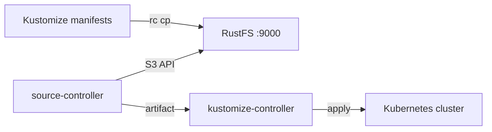

本指南将 Kubernetes 的 GitOps 工具包 [Flux CD](https://github.com/fluxcd/flux2) 通过 source-controller 的 Bucket API 连接到 **RustFS**。你将向 RustFS 存储桶播种 Kubernetes 清单，把该桶注册为 `generic` provider 的 Flux `Bucket` source，并由 Kustomization 应用其中的全部内容。整个流程使用 `flux v2.9.5`（source-controller）在 `k3s v1.36.4+k3s1` 上对 `rustfs/rustfs-x86-musl:v2.3.1` 验证通过。

你需要一个已安装 Flux（`flux install`）的 Kubernetes 集群以及 `rc` 客户端。本部署用于本地集成测试，不适用于生产环境。

## 架构



source-controller 通过 S3 API 列举并下载桶内对象，打包为工件（artifact），kustomize-controller 再应用工件中的清单。RustFS 充当集群拉取式的事实来源。

## 1. 播种存储桶

向桶内存放一个 Kustomize overlay，并替换全部连接占位符：

```yaml title="clusters/staging/kustomization.yaml"
apiVersion: kustomize.config.k8s.io/v1beta1
kind: Kustomization
resources:
  - rustfs-demo-configmap.yaml
```

```yaml title="clusters/staging/rustfs-demo-configmap.yaml"
apiVersion: v1
kind: ConfigMap
metadata:
  name: rustfs-flux-demo
  namespace: default
data:
  storage: rustfs
  source: s3-bucket
```

上传文件：

```bash
rc mb rustfs/flux-src
rc cp --recursive ./clusters rustfs/flux-src/
rc ls rustfs/flux-src/ -r
```

```text
staging/kustomization.yaml
staging/rustfs-demo-configmap.yaml
```

## 2. 创建凭证 secret

Flux 从与 source 同命名空间的 secret 中读取凭证，键名必须为小写：

```bash
kubectl -n flux-system create secret generic rustfs-creds \
  --from-literal=accesskey=<your-access-key> \
  --from-literal=secretkey=<your-secret-key>
```

字段名必须是 `accesskey` 和 `secretkey`——写成 `accessKey` 之类的大写形式会以 `AuthenticationFailed` 状态失败。

## 3. 注册 Bucket source

使用 `generic` provider 创建 Bucket source：

```bash
flux create source bucket rustfs-demo \
  --bucket-name=flux-src \
  --endpoint=<your-rustfs-endpoint>:9000 \
  --insecure \
  --secret-ref=rustfs-creds \
  --provider=generic \
  --interval=30s \
  --namespace=flux-system
```

```text
✔ Bucket source reconciliation completed
```

如果调和仍在进行，可用 `flux get sources bucket` 查看状态：

```text
NAME        REVISION       SUSPENDED READY MESSAGE
rustfs-demo sha256:481816d1 False     True  stored artifact: revision 'sha256:481816d1'
```

`generic` provider 使用路径风格请求，配合 `--insecure` 走纯 HTTP，因此 endpoint 为裸 `host:port`。

## 4. 应用清单

创建消费该工件的 Kustomization：

```bash
flux create kustomization rustfs-demo \
  --source=Bucket/rustfs-demo \
  --path="./staging" \
  --prune=true \
  --interval=30s \
  --namespace=flux-system
```

```text
✔ applied revision sha256:481816d1
```

确认清单已落到集群：

```bash
kubectl -n default get configmap rustfs-flux-demo -o jsonpath="{.data}"
```

```text
{"source":"s3-bucket","storage":"rustfs"}
```

## 5. 停止或重置

保留桶内对象、挂起或删除 Flux 资源：

```bash
flux suspend source bucket rustfs-demo --namespace=flux-system
flux delete kustomization rustfs-demo --namespace=flux-system
```

删除桶内内容：

```bash
rc rm rustfs/flux-src/ --recursive --force
```

## 故障排查

### `invalid 'rustfs-creds' secret data: required fields 'accesskey' and 'secretkey'`

secret 的键为小写。用 `accesskey` 和 `secretkey` 作为字面键名重建 secret。

### 调和一直无法就绪

确认端点可以从集群内部访问——Pod 无法使用 `localhost`，应将 source 指向发布 RustFS 端口的主机 IP 或 Docker 网桥网关（通常为 `172.17.0.1`）。纯 HTTP 必须 `--insecure`。

### 凭证有效仍报 `AuthenticationFailed`

检查 secret 是否与 Bucket source 位于同一命名空间，且键值没有多余空白或引号。

## 下一步

- 在启用更多 source 类型前，先阅读 [S3 兼容性说明](/administration/protocols/s3)。
- 使用[访问密钥管理](/security-compliance/iam/access-token)创建专用的生产凭证。
- 按照 [Flux Bucket source 文档](https://fluxcd.io/flux/components/source/buckets/)将桶 source 与 Helm release、镜像自动化组合使用。
