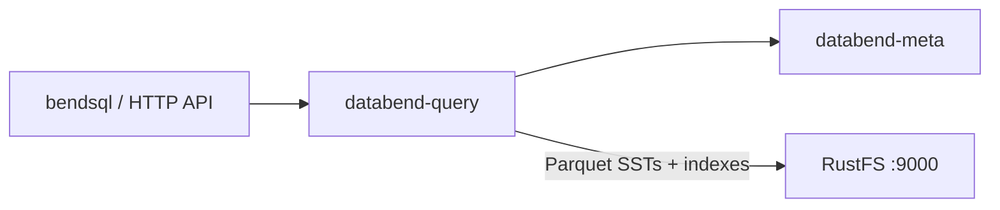
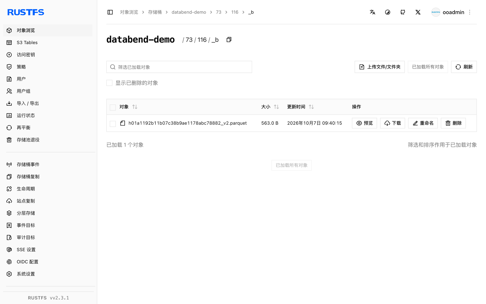

本指南将开源云数仓 [Databend](https://github.com/datafuselabs/databend) 连接到 **RustFS** 作为其对象存储后端。你将启动 meta 服务与查询节点，把存储后端指向 RustFS 桶，建库建表并验证桶内的 Parquet 文件。整个流程使用 Databend v1.2.925-patch-13 对 `rustfs/rustfs-x86-musl:v2.3.1` 验证通过。

你需要在 Linux 主机上（或 Docker 中）准备 Databend 发布包。本部署用于本地集成测试，不适用于生产环境。

## 架构



Databend 把表数据作为带布隆过滤索引的 Parquet 文件存放在对象存储中，桶即整份数据，查询节点无状态。

## 1. 下载安装

下载发布包并解压二进制：

```bash
curl -Lo /tmp/databend.tgz \
  "https://github.com/datafuselabs/databend/releases/download/v1.2.925-patch-13/databend-v1.2.925-patch-13-x86_64-unknown-linux-gnu.tar.gz"
tar -xzf /tmp/databend.tgz -C /opt
```

创建数据目录：

```bash
mkdir -p /opt/databend/data /opt/databend/logs /opt/databend/meta-logs
```

## 2. 配置 meta 服务

创建 `databend-meta.toml`——注意顶层地址与 `[raft_config]` 段的 `single = true`：

```toml title="databend-meta.toml"
admin_api_address = "0.0.0.0:28002"
grpc_api_address = "0.0.0.0:9191"
grpc_api_advertise_host = "127.0.0.1"

[log]
[log.file]
level = "INFO"
dir = "/opt/databend/meta-logs"

[raft_config]
id = 0
raft_dir = "/opt/databend/data/raft"
raft_api_port = 28004
raft_listen_host = "127.0.0.1"
raft_advertise_host = "127.0.0.1"
single = true
```

## 3. 配置查询节点

创建 `databend-query.toml`。`tenant_id` 与 `cluster_id` 必须放在 `[query]` 段内，`[storage.s3]` 指向 RustFS：

```toml title="databend-query.toml"
[query]
username = "databend"
tenant_id = "default"
cluster_id = "rustfs-demo"
flight_api_address = "127.0.0.1:9091"
metric_api_address = "127.0.0.1:7071"
admin_api_address = "127.0.0.1:8081"

[[query.users]]
name = "databend"
auth_type = "no_password"

[log]
[log.file]
dir = "/opt/databend/logs"

[meta]
endpoints = ["127.0.0.1:9191"]
username = "root"
password = "root"
client_timeout_in_second = 20
auto_sync_interval = 60

[storage]
type = "s3"

[storage.s3]
bucket = "databend-demo"
endpoint_url = "http://<your-rustfs-endpoint>:9000"
access_key_id = "<your-access-key>"
secret_access_key = "<your-secret-key>"
enable_virtual_host_style = false
```

所有键都要放在 `[[query.users]]` 数组项之前——TOML 会把该数组项之后的内容归入数组元素，键放错位置会触发莫名其妙的校验错误。

## 4. 启动服务

```bash
nohup /opt/databend/bin/databend-meta -c /opt/databend/databend-meta.toml > /opt/databend/meta.out 2>&1 &
sleep 10
nohup /opt/databend/bin/databend-query -c /opt/databend/databend-query.toml > /opt/databend/query.out 2>&1 &
sleep 20
```

## 5. 建表并查询

Databend 在 8000 端口提供 HTTP API。建库建表、插入并回读——SQL 内的字符串必须用单引号（双引号表示标识符）：

```bash
curl -s -m 90 -u databend: http://127.0.0.1:8000/v1/query \
  -H "Content-Type: application/json" \
  -d '{"sql": "CREATE DATABASE rustfs_demo; CREATE TABLE rustfs_demo.events (id INT, label STRING);"}' | head -c 120

curl -s -m 120 -u databend: http://127.0.0.1:8000/v1/query \
  -H "Content-Type: application/json" \
  -d "{\"sql\": \"INSERT INTO rustfs_demo.events VALUES (1,'alpha'),(2,'beta'),(3,'gamma')\"}" | head -c 120

curl -s -m 120 -u databend: http://127.0.0.1:8000/v1/query \
  -H "Content-Type: application/json" \
  -d "{\"sql\": \"SELECT * FROM rustfs_demo.events ORDER BY id\"}" | head -c 300
```

```text
{"id":"...","state":"Succeeded",...,"data":[["1","alpha"],["2","beta"],["3","gamma"]],...}
```

## 6. 验证 RustFS 中的对象

列举桶——表以 Parquet 块和索引文件的形式存放在数字前缀目录下：

```bash
rc ls rustfs/databend-demo/ -r | head -4
```

```text
73/116/_b/h01a1192b11b07c38b9ae1178abc78882_v2.parquet
73/116/_i_b_v2/01a1192b11b07c38b9ae1178abc78882_v4.parquet
```



## 7. 停止或重置

```bash
pkill -f databend-query; pkill -f databend-meta
rc rm rustfs/databend-demo/ --recursive --force
```

## 故障排查

### `cluster_id is empty without resources management`

`tenant_id` 和 `cluster_id` 放到了 `[query]` 段之外。TOML 中每个键都属于最近的一个段头——请把它们移回 `[query]` 之下。

### `CannotListenerPort ... 127.0.0.1:9090`

flight API 默认使用 9090 端口，常与本机其他服务冲突。在 `[query]` 内把 `flight_api_address`、`metric_api_address`、`admin_api_address` 设置为空闲端口。

### 查询返回 `Authentication error: no authorization header provided`

HTTP API 要求与 `[[query.users]]` 匹配的基本认证，例如 `auth_type = "no_password"` 时使用 `-u databend:`。

### CREATE 成功后立刻报 `Unknown table`

SQL 中的双引号字符串是标识符而非字面量。VALUES 以及 CONNECTION/LOCATION 选项请使用单引号。

## 下一步

- 在启用更多 Databend 存储选项前，先阅读 [S3 兼容性说明](/administration/protocols/s3)。
- 使用[访问密钥管理](/security-compliance/iam/access-token)创建专用的生产凭证。
- 按照 [Databend 文档](https://docs.databend.com/)在同一个桶之上部署多节点集群与共享表。
