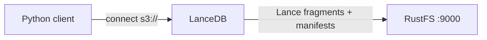
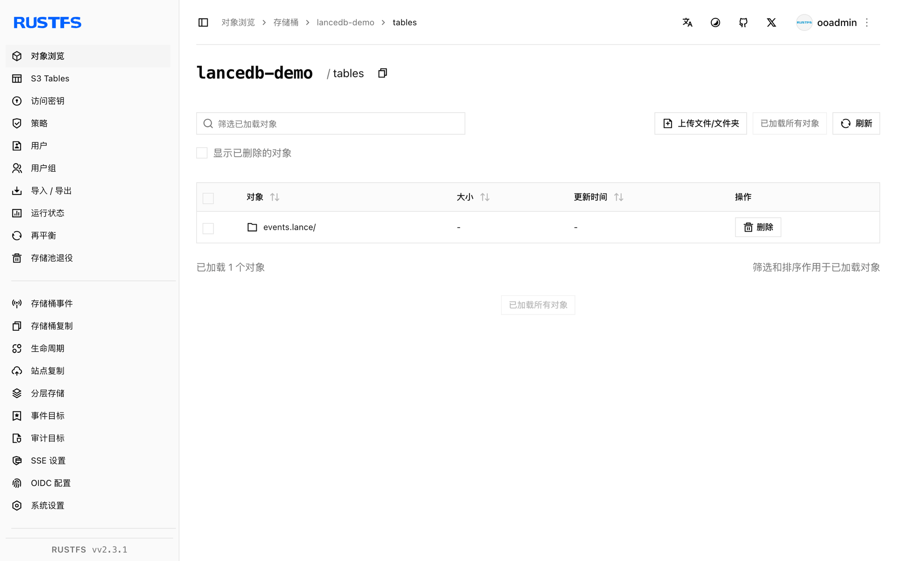

本指南将基于 Lance 列式格式的开源向量数据库 [LanceDB](https://github.com/lancedb/lancedb) 连接到 **RustFS** 作为其存储后端。你将直接在 `s3://` 位置创建向量表、追加行、执行向量检索，并确认桶内的 Lance 表文件。整个流程使用 `lancedb` Python 包对 `rustfs/rustfs-x86-musl:v2.3.1` 验证通过。

你需要 Python 3.9 或更高版本。本部署用于本地集成测试，不适用于生产环境。

## 架构



LanceDB 是嵌入式数据库：无需运行服务端。Python（或 Rust、JavaScript）客户端直接访问桶，把每张表存为一个 `*.lance` 目录（数据分件、版本 manifest 与事务日志）。

## 1. 安装客户端

```bash
pip install lancedb
```

## 2. 在 RustFS 上创建表

直接连接桶并建表，替换全部连接占位符。`storage_options` 的键遵循 Lance 的 object-store 约定；自定义端点使用路径风格寻址：

```python title="lance_s3.py"
import lancedb

storage_options = {
    "endpoint": "http://<your-rustfs-endpoint>:9000",
    "access_key_id": "<your-access-key>",
    "secret_access_key": "<your-secret-key>",
    "region": "us-east-1",
    "allow_http": "true",
}

db = lancedb.connect("s3://<your-bucket>/tables", storage_options=storage_options)

rows = [{"id": i, "label": f"row-{i}", "vector": [float(i) / 10, 0.5, 0.25, 0.1] * 2}
        for i in range(5)]
table = db.create_table("events", data=rows)
print("created:", table.count_rows(), "rows")

table.add([{"id": 99, "label": "query-target", "vector": [0.9, 0.5, 0.25, 0.1] * 2}])
print("after add:", table.count_rows(), "rows")
```

```text
created: 5 rows
after add: 6 rows
```

表 URI 使用 `s3://bucket/prefix` 形式；所有读写都通过 RustFS 的 S3 API 完成。

## 3. 执行向量检索

```python title="lance_search.py"
import lancedb

db = lancedb.connect("s3://<your-bucket>/tables", storage_options=storage_options)
table = db.open_table("events")

res = table.search([0.9, 0.5, 0.25, 0.1] * 2).limit(3).to_list()
print("top3:", [(r["id"], r["label"]) for r in res])
print("version:", table.version)
```

```text
top3: [(99, 'query-target'), (4, 'row-4'), (3, 'row-3')]
version: 2
```

最近邻正是上一步追加的行，版本号也反映了两笔提交（建表与追加）。

## 4. 验证 RustFS 中的对象

列举表前缀：

```bash
rc ls rustfs/<your-bucket>/ -r
```

每张表是一个 `.lance` 目录，内含数据分件、版本 manifest 与事务记录：

```text
tables/events.lance/_transactions/0-b93cf795-fc3d-4bc9-88c8-e37baeefdd46.txn
tables/events.lance/_versions/18446744073709551613.manifest
tables/events.lance/data/101101011110110010000100e7a149411b847dbad6ebc7d47e.lance
```

多张表共用 `tables/` 前缀下的同一个桶，因此一个桶就能承载整个 LanceDB 工作区。



## 5. 停止或重置

LanceDB 不持有服务端状态。删除表：

```bash
rc rm rustfs/<your-bucket>/tables/ --recursive --force
```

## 故障排查

### 首次使用报连接或签名错误

确认 `endpoint` 带协议前缀、纯 HTTP 端点把 `allow_http` 设置为 `"true"`，且桶已创建。虽然 RustFS 会忽略 `region`，但 S3 签名需要该值。

### 建表后报 `Table not found`

LanceDB 通过列举桶前缀来发现表。客户端缓存过期或 URI 中的 `tables/` 前缀写错都会让新表不可见；请使用与建表时相同的 URI 重新连接。

### 大批量导入很慢

Lance 每次提交写一个数据分件。大规模导入时，把行合并到更少的 `table.add` 调用中——每次调用都会在桶里生成一个新数据文件。

## 下一步

- 在启用更多 LanceDB 存储选项前，先阅读 [S3 兼容性说明](/administration/protocols/s3)。
- 使用[访问密钥管理](/security-compliance/iam/access-token)创建专用的生产凭证。
- 按照 [LanceDB 文档](https://lancedb.github.io/lancedb/)在同一个后端之上使用 ANN 索引、混合检索与多租户桶布局。
