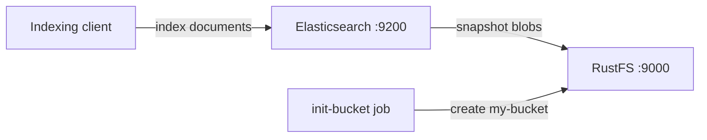
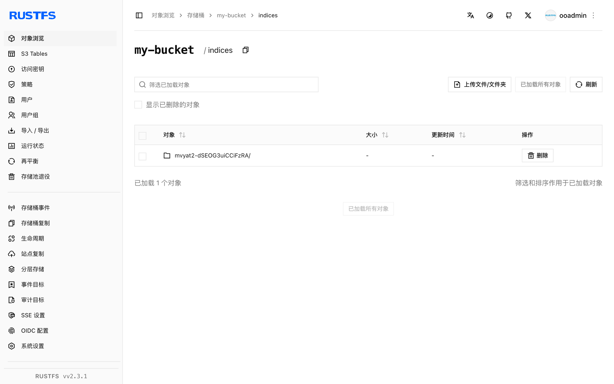

本指南将 [Elasticsearch](https://github.com/elastic/elasticsearch)——分布式搜索与分析引擎——连接到 **RustFS**，作为其索引的 S3 快照仓库。你将启动带 `repository-s3` 插件的 Elasticsearch，注册以 RustFS 为后端的快照仓库，写入文档，打快照，并通过删除索引后从 RustFS 恢复来验证完整闭环。整个流程使用 `docker.elastic.co/elasticsearch/elasticsearch:8.18.0` 和 `rustfs/rustfs-x86-musl:v2.3.1` 验证通过。

你需要安装带有 Compose 插件的 Docker。本部署用于本地集成测试，不适用于生产环境。

## 架构



Elasticsearch 的主数据存放在本地磁盘，索引备份则卸载到快照仓库。`repository-s3` 插件通过 S3 API、以纯 HTTP 上的 path-style 寻址，把快照元数据和分片数据 blob 写入 RustFS。

## 1. 创建项目文件

创建工作目录：

```bash
mkdir rustfs-elasticsearch
cd rustfs-elasticsearch
```

创建环境变量文件，并替换两个凭证占位符：

```ini title=".env"
RUSTFS_ACCESS_KEY=<your-access-key>
RUSTFS_SECRET_KEY=<your-secret-key>
```

请为桶使用专用的凭证，不要将 `.env` 提交到版本控制。

Elasticsearch 把 S3 设置分成两部分：非机密值放在 `elasticsearch.yml`，凭证放在 keystore。创建配置文件：

```yaml title="elasticsearch.yml"
discovery.type: single-node
xpack.security.enabled: false
s3.client.default.endpoint: "rustfs:9000"
s3.client.default.protocol: "http"
s3.client.default.path_style_access: "true"
s3.client.default.region: "us-east-1"
```

创建 Compose 文件：

```yaml title="compose.yaml"
services:
  rustfs:
    image: rustfs/rustfs-x86-musl:v2.3.1
    environment:
      RUSTFS_ACCESS_KEY: ${RUSTFS_ACCESS_KEY}
      RUSTFS_SECRET_KEY: ${RUSTFS_SECRET_KEY}
      RUSTFS_VOLUMES: /data
      RUSTFS_ADDRESS: ":9000"
      RUSTFS_CONSOLE_ADDRESS: ":9001"
      RUSTFS_CONSOLE_ENABLE: "true"
    volumes:
      - rustfs-data:/data
    ports:
      - "9000:9000"
      - "9001:9001"
    healthcheck:
      test: ["CMD", "curl", "-sf", "http://127.0.0.1:9000/health"]
      interval: 10s
      timeout: 5s
      retries: 6
      start_period: 10s
    networks:
      - es

  create-bucket:
    image: rustfs/rc:latest
    depends_on:
      rustfs:
        condition: service_healthy
    environment:
      RUSTFS_ACCESS_KEY: ${RUSTFS_ACCESS_KEY}
      RUSTFS_SECRET_KEY: ${RUSTFS_SECRET_KEY}
    entrypoint:
      - /bin/sh
      - -c
      - |
        until /usr/bin/rc alias set rustfs http://rustfs:9000 "$${RUSTFS_ACCESS_KEY}" "$${RUSTFS_SECRET_KEY}"; do
          echo "Waiting for RustFS..."
          sleep 2
        done
        /usr/bin/rc ls rustfs/my-bucket >/dev/null 2>&1 || /usr/bin/rc mb rustfs/my-bucket
    networks:
      - es

  elasticsearch:
    image: docker.elastic.co/elasticsearch/elasticsearch:8.18.0
    environment:
      ES_JAVA_OPTS: "-Xms512m -Xmx512m"
    volumes:
      - ./elasticsearch.yml:/usr/share/elasticsearch/config/elasticsearch.yml:ro
    entrypoint: >
      bash -c '
        bin/elasticsearch-plugin install --batch repository-s3 &&
        echo "$${RUSTFS_ACCESS_KEY}" | bin/elasticsearch-keystore add -f -x s3.client.default.access_key &&
        echo "$${RUSTFS_SECRET_KEY}" | bin/elasticsearch-keystore add -f -x s3.client.default.secret_key &&
        exec bin/elasticsearch'
    ports:
      - "9200:9200"
    depends_on:
      create-bucket:
        condition: service_completed_successfully
    networks:
      - es

networks:
  es:

volumes:
  rustfs-data:
```

`repository-s3` 是内置插件，无需联网即可安装。keystore 中只放访问密钥和私有密钥——端点等非机密设置必须写在 `elasticsearch.yml` 中，否则节点会拒绝启动。

## 2. 启动部署

启动容器前先解析 Compose 文件：

```bash
docker compose config
```

启动服务并等待 Elasticsearch 完成启动（首次启动会安装插件并创建 keystore 条目，需要一两分钟）：

```bash
docker compose up -d
curl -s http://localhost:9200
```

## 3. 注册快照仓库并写入文档

注册 RustFS 快照仓库，创建索引并写入五个文档：

```bash
curl -s -X PUT "http://localhost:9200/_snapshot/rustfs_repo" \
  -H "Content-Type: application/json" \
  -d '{"type":"s3","settings":{"bucket":"my-bucket"}}'

curl -s -X PUT "http://localhost:9200/rustfs_index" \
  -H "Content-Type: application/json" \
  -d '{"mappings":{"properties":{"label":{"type":"keyword"}}}}'

for v in 1 2 3 4 5; do
  curl -s -X POST "http://localhost:9200/rustfs_index/_doc" \
    -H "Content-Type: application/json" \
    -d "{\"label\":\"rustfs-es-doc-$v\",\"value\":$v}" > /dev/null
done
curl -s -X POST "http://localhost:9200/rustfs_index/_refresh" > /dev/null
curl -s "http://localhost:9200/rustfs_index/_count"
```

```text
{"count":5,...}
```

## 4. 打快照

使用 `wait_for_completion` 创建快照，立即得到结果：

```bash
curl -s -X PUT "http://localhost:9200/_snapshot/rustfs_repo/snap1?wait_for_completion=true"
```

```text
{"snapshot":{"snapshot":"snap1",...,"indices":["rustfs_index"],"shards":{"total":1,"failed":0,"successful":1}}}
```

## 5. 在 RustFS 中验证对象

通过桶初始化镜像列出快照对象：

```bash
docker compose run --rm --entrypoint /bin/sh create-bucket -c \
  '/usr/bin/rc alias set rustfs http://rustfs:9000 "$RUSTFS_ACCESS_KEY" "$RUSTFS_SECRET_KEY" >/dev/null && /usr/bin/rc ls rustfs/my-bucket/indices --recursive'
```

快照元数据和分片数据 blob 位于桶内 `indices/` 之下：

```text
[2026-09-21 02:58:01]   3.56 KiB indices/mvyat2-dSEOG3uiCCiFzRA/0/__LbLsSgUUTpqji_EXvqHYCg
[2026-09-21 02:58:01]   3.21 KiB indices/mvyat2-dSEOG3uiCCiFzRA/0/__VIuGNJn3RB-RBWvr4tMn7Q
[2026-09-21 02:58:01]   1.00 KiB indices/mvyat2-dSEOG3uiCCiFzRA/0/index-e9P8q6E9QhitpkiOdgjVDQ
```

你也可以在 RustFS 控制台中浏览该前缀：



## 6. 从 RustFS 恢复索引

删除索引，然后从快照恢复：

```bash
curl -s -X DELETE "http://localhost:9200/rustfs_index" > /dev/null
curl -s -X POST "http://localhost:9200/_snapshot/rustfs_repo/snap1/_restore?wait_for_completion=true" > /dev/null
curl -s "http://localhost:9200/rustfs_index/_count"
```

```text
{"count":5,...}
```

文档全部恢复，因为快照 blob 是从 RustFS 读取的。

## 7. 停止或重置环境

停止容器并保留 RustFS 数据卷：

```bash
docker compose down
```

如需删除快照并从空的 RustFS 数据卷开始，请显式加上 `--volumes`：

```bash
docker compose down --volumes
```

## 故障排除

### 节点拒绝启动并提示 "non-secure setting ... must be stored inside elasticsearch.yml"

keystore 中只允许存放 `s3.client.default.access_key` 和 `s3.client.default.secret_key`。端点、协议、path-style 和区域属于非机密设置，必须定义在 `elasticsearch.yml` 中。

### 恢复或新建的分片一直未分配

磁盘使用率超过低水位线（默认 85%）时，Elasticsearch 会停止分配分片。请释放磁盘空间，或在本地测试中关闭该检查：

```bash
curl -s -X PUT "http://localhost:9200/_cluster/settings" \
  -H "Content-Type: application/json" \
  -d '{"transient":{"cluster.routing.allocation.disk.threshold_enabled":false}}'
```

### 恢复失败并提示索引已存在

之前失败的恢复会留下索引。先执行 `DELETE /rustfs_index` 删除，再重新恢复。

### 返回 AccessDenied 或 403 响应

确认 keystore 中的凭证与 RustFS 凭证一致，并确认 `create-bucket` 任务已成功完成：

```bash
docker compose logs create-bucket
```

## 后续步骤

- 在采用其他 S3 操作前，请查看 [S3 兼容性说明](/administration/protocols/s3)。
- 通过[访问密钥管理](/security-compliance/iam/access-token)创建专用的生产凭证。
- 按照 [Elasticsearch 快照文档](https://www.elastic.co/guide/en/elasticsearch/reference/current/snapshot-restore.html)了解快照生命周期管理（SLM）。
