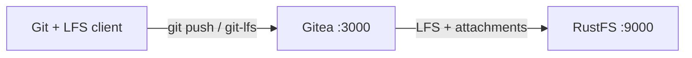
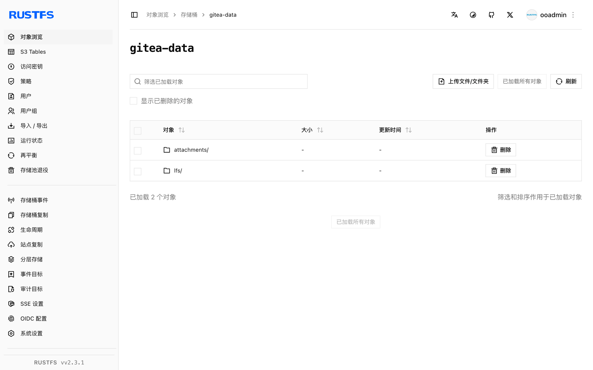

本指南将自托管 Git 服务 [Gitea](https://github.com/go-gitea/gitea) 通过其 `minio` 存储类型连接到 **RustFS**。你将使用 Docker Compose 启动 Gitea，创建仓库并推送 Git LFS 对象，在 issue 中上传附件，然后验证 LFS 对象和附件都存储在 RustFS 中。整个流程使用 `gitea/gitea:1.24.4` 和 `rustfs/rustfs-x86-musl:v2.3.1` 验证通过。

你需要安装带有 Compose 插件的 Docker，工作站上需要有 `git` 和 `git-lfs` 客户端。本部署用于本地集成测试，不适用于生产环境。

## 架构



Gitea 将 Git 仓库本身保存在本地磁盘上，而 `minio` 存储类型会把大文件——LFS 对象、issue 附件、头像、仓库归档、软件包和 Actions 制品——路由到 RustFS 的 `gitea-data` 存储桶。如果桶不存在，Gitea 会在启动时自动创建。

## 1. 创建项目文件

创建工作目录：

```bash
mkdir rustfs-gitea
cd rustfs-gitea
```

创建环境文件，并替换两个凭证占位符：

```ini title=".env"
RUSTFS_ACCESS_KEY=<your-access-key>
RUSTFS_SECRET_KEY=<your-secret-key>
```

请为 `gitea-data` 存储桶使用专用凭证。不要将 `.env` 提交到版本控制。

创建 Gitea 配置文件，并将两个凭证占位符替换为与 `.env` 相同的值——全局 `minio` 存储类型适用于 LFS、附件、头像、仓库归档、软件包和 Actions 制品：

```ini title="app.ini"
APP_NAME = RustFS Gitea
RUN_MODE = prod
WORK_PATH = /data/gitea

[server]
DOMAIN = localhost
ROOT_URL = http://localhost:3000/
HTTP_PORT = 3000
LFS_START_SERVER = true

[database]
DB_TYPE = sqlite3
PATH = /data/gitea/gitea.db

[storage]
STORAGE_TYPE = minio
MINIO_ENDPOINT = rustfs:9000
MINIO_ACCESS_KEY_ID = <your-access-key>
MINIO_SECRET_ACCESS_KEY = <your-secret-key>
MINIO_BUCKET = gitea-data
MINIO_LOCATION = us-east-1
MINIO_USE_SSL = false

[log]
MODE = console
LEVEL = info

[security]
INSTALL_LOCK = true
SECRET_KEY = change-me-to-a-random-string
```

`LFS_START_SERVER` 用于启用 Git LFS HTTP API。`MINIO_ENDPOINT` 使用 Compose 网络内的主机名 `rustfs`；该端点默认以 path-style 方式访问。

创建 Compose 文件：

```yaml title="compose.yaml"
services:
  rustfs:
    image: rustfs/rustfs-x86-musl:v2.3.1
    environment:
      RUSTFS_ACCESS_KEY: ${RUSTFS_ACCESS_KEY}
      RUSTFS_SECRET_KEY: ${RUSTFS_SECRET_KEY}
      RUSTFS_VOLUMES: /data
      RUSTFS_ADDRESS: ":9000"
      RUSTFS_CONSOLE_ADDRESS: ":9001"
      RUSTFS_CONSOLE_ENABLE: "true"
    volumes:
      - rustfs-data:/data
    ports:
      - "9000:9000"
      - "9001:9001"
    healthcheck:
      test: ["CMD", "curl", "-sf", "http://127.0.0.1:9000/health"]
      interval: 10s
      timeout: 5s
      retries: 6
      start_period: 10s
    networks:
      - gitea

  gitea:
    image: gitea/gitea:1.24.4
    depends_on:
      rustfs:
        condition: service_healthy
    environment:
      USER_UID: "1000"
      USER_GID: "1000"
    volumes:
      - gitea-data:/data
      - ./app.ini:/data/gitea/conf/app.ini:ro
    ports:
      - "3000:3000"
    networks:
      - gitea

networks:
  gitea:

volumes:
  rustfs-data:
  gitea-data:
```

由卷承载的 `/data` 目录让 SQLite 数据库和 Git 仓库在容器重启后得以保留，而 LFS 对象和附件则存放在 RustFS 中。

## 2. 校验并启动部署

启动容器前先解析 Compose 文件：

```bash
docker compose config
```

启动服务：

```bash
docker compose up -d
docker compose ps
```

观察 Gitea 日志，直到每个存储后端都报告为 Minio 类型：

```bash
docker compose logs gitea | grep "Initialising"
```

输出应列出 `Attachment`、`Avatar`、`LFS` 等存储段，每段后面跟着一行 `Creating Minio storage at rustfs:9000:gitea-data`。

打开 `http://localhost:3000` 创建管理员账号，然后打开 `http://localhost:9001` 的 RustFS 控制台——第一次存储操作后会出现 `gitea-data` 存储桶。

## 3. 推送 Git LFS 对象

在 Gitea 网页界面创建名为 `rustfs-demo` 的仓库，然后从工作站推送一个 LFS 跟踪的文件：

```bash
mkdir lfs-demo && cd lfs-demo
git init
git config user.email you@example.com
git config user.name you
git lfs install
git lfs track "*.bin"
git add .gitattributes
dd if=/dev/urandom of=dataset.bin bs=1M count=8
git add dataset.bin
git commit -m "add LFS dataset"
git remote add origin http://localhost:3000/<your-username>/rustfs-demo.git
git push origin main
```

`git push` 会通过 Gitea 的 LFS API 上传 LFS 对象，Gitea 将其写入 RustFS。把仓库克隆到另一个目录并执行 `git lfs pull`——下载的 `dataset.bin` 必须与原始文件逐字节一致：

```bash
sha256sum dataset.bin
cd ../lfs-demo-clone && git lfs pull && sha256sum dataset.bin
```

两个校验和一致，因为两个客户端都从 RustFS 读取对象。

## 4. 在 issue 中上传附件

打开 `rustfs-demo` 仓库，创建一个 issue，并通过 issue 表单上传一个小的文本文件。Gitea 会将上传内容以 `attachments/<前缀>/<uuid>` 的形式存入 `gitea-data` 存储桶，并通过 `/attachments/<uuid>` 提供下载。

## 5. 在 RustFS 中验证对象

使用 [`rc` 客户端](https://github.com/rustfs/cli)列出存储桶：

```bash
docker compose exec rustfs /usr/bin/rc ls local/gitea-data/ -r
```

输出应包含 `lfs/` 下的 LFS 对象和 `attachments/` 下的附件：

```text
attachments/9/2/92fdd48d-531c-4cba-8b3f-4e2004a10fc7
lfs/37/76/6ddfc07e803de58a69328db9a58a07cf7080ddde55c155a7531bc650a000
```

LFS 对象的键是 Git LFS 协议使用的 SHA-256 内容哈希。



## 6. 停止或重置部署

停止容器并保留所有数据：

```bash
docker compose down
```

RustFS 卷会保留 `gitea-data` 存储桶，LFS 对象和附件在重启后依然可用。若要删除包括 RustFS 中对象在内的所有数据，请追加 `--volumes`。

## 故障排查

### 显示的是 Gitea 安装页面而不是登录页面

配置文件必须存在于容器内的 `/data/gitea/conf/app.ini`。如果挂载路径不对，Gitea 会以默认配置启动并显示安装向导。按 Compose 示例挂载该文件并重启。

### 推送失败并出现 LFS 或 403 错误

确认 `app.ini` 中的凭证与 RustFS 的凭证一致，并且 `rustfs` 主机名能在 Compose 网络内解析：

```bash
docker compose logs gitea | grep -i minio
```

### 对象写进了本地存储而不是 RustFS

`GITEA__storage__STORAGE_TYPE: minio` 环境变量与 `app.ini` 的 `[storage]` 段必须一致。修改任意一处后，重启 Gitea 并重新检查 `Initialising` 日志行。

## 后续步骤

- 在采用更多 Gitea 存储目标之前，请查阅 [S3 兼容性说明](/administration/protocols/s3)。
- 通过[访问密钥管理](/security-compliance/iam/access-token)创建专用的生产凭证。
- 按照 [Gitea 存储文档](https://docs.gitea.com/administration/storage-configurations)将软件包、Actions 制品或单个存储段迁移到独立的存储桶。
