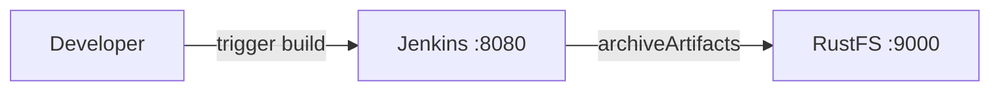
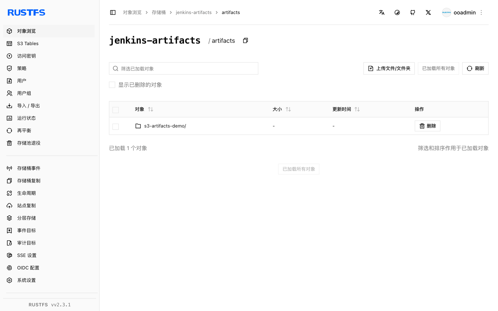

本指南通过 Artifact Manager on S3 插件，将自动化服务器 [Jenkins](https://github.com/jenkinsci/jenkins) 连接到 **RustFS**。你将启动带该插件的 Jenkins，把工件管理器指向一个 RustFS 存储桶，运行一个归档工件的任务，并验证工件已存储在 RustFS 中。整个流程使用 `jenkins/jenkins:lts-jdk17`（Jenkins 2.5xx LTS）和 `rustfs/rustfs-x86-musl:v2.3.1` 验证通过。

你需要安装 Docker。本部署用于本地集成测试，不适用于生产环境。

## 架构



插件激活后，所有通过标准 `archiveArtifacts` 步骤（或 `stash`/`unstash`）发布工件的作业，都会把工件上传到 `jenkins-artifacts` 存储桶的配置前缀下，而不是存在控制器磁盘上。

## 1. 创建项目文件

先创建存储桶——插件会校验桶但不会创建它：

```bash
rc alias set rustfs http://<your-rustfs-endpoint>:9000 <your-access-key> <your-secret-key>
rc mb rustfs/jenkins-artifacts
```

创建一个在 Jenkins LTS 镜像中安装插件的 Dockerfile：

```dockerfile title="Dockerfile"
FROM jenkins/jenkins:lts-jdk17
USER root
RUN jenkins-plugin-cli --plugins artifact-manager-s3 aws-credentials
USER jenkins
```

`artifact-manager-s3` 插件会自动带上所需的 AWS 凭证支持；显式列出 `aws-credentials` 可以确保凭证类型可用。

构建镜像，并在与 RustFS 相同的 Docker 网络中启动 Jenkins：

```bash
docker build -t jenkins-rustfs .
docker run -d --name jenkins --network oo-rustfs_default \
  -p 8080:8080 -v jenkins-home:/var/jenkins_home jenkins-rustfs
```

完成安装向导后创建 AWS 凭证：**Manage Jenkins → Credentials → global → Add Credentials**，类型选择 **AWS Credential**，ID 填 `rustfs-creds`，填入你的 RustFS 访问密钥和秘密密钥。

## 2. 配置工件管理器

打开 **Manage Jenkins → AWS Configuration**（来自 `aws-global-configuration` 插件）并设置：

- **Region name**：`us-east-1`
- **Credentials**：`rustfs-creds`

打开 **Manage Jenkins → System**，找到 **Artifact Management for Builds** 段。选择 **Cloud Provider Amazon S3**，并填写 S3 配置：

- **S3 Bucket Name**：`jenkins-artifacts`
- **S3 Bucket Region**：`us-east-1`
- **Base Prefix**：`artifacts/`
- **Custom Endpoint**：`<your-rustfs-endpoint>:9000`（Compose 网络内填 `rustfs:9000`）
- **Custom Signing Region**：`us-east-1`
- **Use Path Style URL**：启用
- **Use Insecure HTTP**：启用
- **Disable Session Token**：启用

非 AWS 且无 TLS 的端点必须使用 path-style 寻址和纯 HTTP。禁用会话令牌可阻止插件调用 AWS STS——静态访问密钥对无法响应 STS 调用。点击 **Validate S3 Bucket configuration** 确认配置无误后保存。

## 3. 运行归档工件的作业

创建一个生成文件并归档的 freestyle 作业（或流水线）：

```groovy
pipeline {
    agent any
    stages {
        stage('Build') {
            steps {
                sh 'echo "jenkins artifact stored on rustfs" > report.txt'
            }
        }
    }
    post {
        always {
            archiveArtifacts 'report.txt'
        }
    }
}
```

运行构建并等待完成。工件上传对 RustFS 完全透明——作业配置里完全不出现 S3。

## 4. 在 RustFS 中验证对象

列出存储桶：

```bash
rc ls rustfs/jenkins-artifacts/ -r
```

工件存储在前缀下，按作业和构建号组织：

```text
artifacts/s3-artifacts-demo/3/artifacts/report.txt
```



在构建页面下载工件时，读取的就是 RustFS 中的对象。

## 5. 停止或重置部署

停止 Jenkins 并保留数据：

```bash
docker rm -f jenkins
```

工件保留在 `jenkins-artifacts` 存储桶中。若要删除它们，请移除存储桶：

```bash
rc rb rustfs/jenkins-artifacts --force
```

## 故障排查

### `StsException: The security token included in the request is invalid`

插件正在调用 AWS STS 获取会话凭证。在 S3 配置中启用 **Disable Session Token**——静态访问密钥对无法响应 STS 调用。

### `UnknownHostException: jenkins-artifacts.rustfs`

插件使用了 virtual-hosted 寻址。启用 **Use Path Style URL**——RustFS 从 URL 路径而不是主机名解析桶。

### `No valid session credentials` 或空的凭证错误

确认 AWS Configuration 页面已选择凭证并**先于**使用 S3 存储桶设置保存，且凭证 ID 与你创建的一致。

## 后续步骤

- 在采用更多 Jenkins 集成之前，请查阅 [S3 兼容性说明](/administration/protocols/s3)。
- 通过[访问密钥管理](/security-compliance/iam/access-token)创建专用的生产凭证。
- 按照 [Artifact Manager on S3 插件文档](https://plugins.jenkins.io/artifact-manager-s3/)了解 stash 支持与清理选项。
