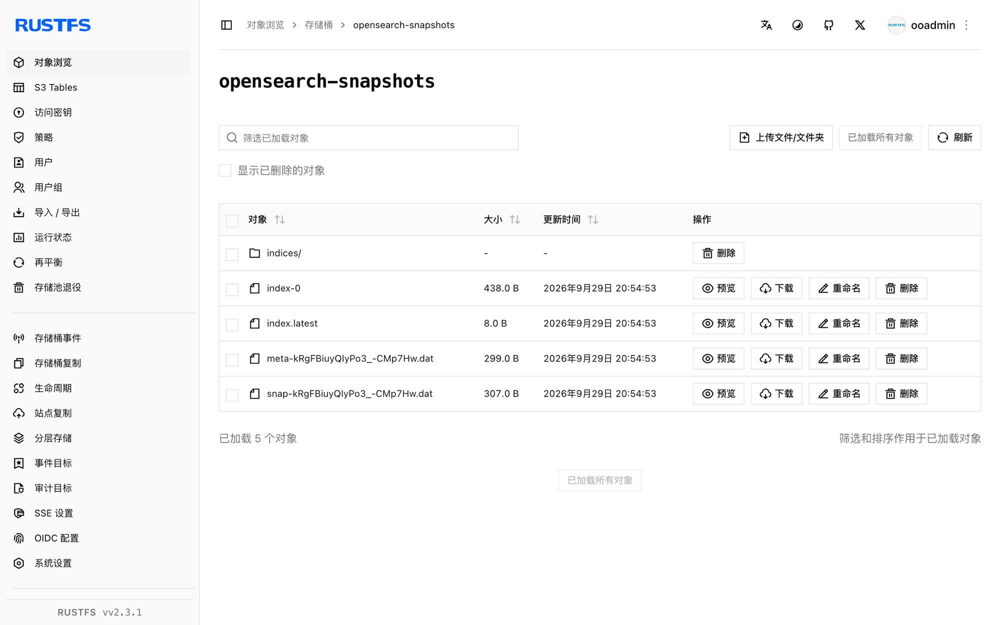

本指南将源自 Elasticsearch 的开源搜索与分析套件 [OpenSearch](https://github.com/opensearch-project/OpenSearch) 通过 `repository-s3` 插件连接到 **RustFS**。你将注册一个以 RustFS 桶为后端的 S3 快照仓库，对索引打快照并还原。整个流程使用 `opensearchproject/opensearch:3.8.0` 与自带安装的 `repository-s3` 插件对 `rustfs/rustfs-x86-musl:v2.3.1` 验证通过。

你需要安装 Docker，或一个可以安装插件并修改配置的 OpenSearch 节点。本部署用于本地集成测试，不适用于生产环境。

## 架构


`repository-s3` 插件把快照写成分片归档与元数据 blob 存入桶中。仓库注册是集群级配置，每个节点都需要该插件和相同的客户端配置。

## 1. 运行 OpenSearch

以关闭安全插件和小堆内存启动单节点：

```bash
docker run -d --name opensearch --network oo-rustfs_default -p 9200:9200 \
  -e discovery.type=single-node \
  -e OPENSEARCH_JAVA_OPTS="-Xms512m -Xmx512m" \
  -e DISABLE_SECURITY_PLUGIN=true \
  opensearchproject/opensearch:3.8.0
```

当 `curl http://localhost:9200` 返回集群信息（需一到两分钟）即表示节点就绪。

## 2. 安装 repository-s3 插件

镜像没有预装 S3 仓库插件。安装后重启节点：

```bash
docker exec opensearch bin/opensearch-plugin install --batch repository-s3
docker restart opensearch
```

## 3. 配置 S3 客户端

凭证属于安全设置：必须放进 OpenSearch keystore，不能写在仓库请求或 `opensearch.yml` 里。创建 keystore 条目并替换全部连接占位符：

```bash
docker exec opensearch sh -c \
  "printf '<your-access-key>' | bin/opensearch-keystore create 2>/dev/null; \
   printf '<your-access-key>' | bin/opensearch-keystore add -f -x s3.client.default.access_key; \
   printf '<your-secret-key>' | bin/opensearch-keystore add -f -x s3.client.default.secret_key"
```

把非敏感的客户端设置加入 `config/opensearch.yml`：

```yaml title="opensearch.yml"
network.host: 0.0.0.0
plugins.security.disabled: true
s3.client.default.endpoint: http://<your-rustfs-endpoint>:9000
s3.client.default.protocol: http
s3.client.default.path_style_access: "true"
```

再次重启节点，使其读取 keystore 与新配置：

```bash
docker restart opensearch
```

趁节点启动时创建桶：

```bash
rc mb rustfs/opensearch-snapshots
```

## 4. 注册仓库并打快照

创建测试索引和文档，然后注册仓库：

```bash
curl -sX PUT http://localhost:9200/rustfs-demo -H "Content-Type: application/json" \
  -d '{"settings":{"number_of_shards":1}}'

curl -sX PUT http://localhost:9200/rustfs-demo/_doc/1 -H "Content-Type: application/json" \
  -d '{"product":"rustfs","via":"opensearch-snapshot"}'

curl -sX PUT "http://localhost:9200/_snapshot/rustfs-repo" -H "Content-Type: application/json" \
  -d '{"type":"s3","settings":{"bucket":"opensearch-snapshots","region":"us-east-1","server_side_encryption_type":"bucket_default"}}'
```

`server_side_encryption_type: bucket_default` 这个设置很关键：不设置时插件会请求 SSE-S3，而未配置服务端加密主密钥的自托管 RustFS 会拒绝它。

打快照并等待完成：

```bash
curl -sX PUT "http://localhost:9200/_snapshot/rustfs-repo/snapshot-1?wait_for_completion=true" \
  -H "Content-Type: application/json" -d '{"indices":"rustfs-demo"}'
```

```text
{"snapshot":{"snapshot":"snapshot-1","state":"SUCCESS","indices":["rustfs-demo"],...}}
```

## 5. 验证对象并还原

列举桶：

```bash
rc ls rustfs/opensearch-snapshots/ -r
```

```text
index-0
index.latest
indices/5x1bwsWaSv2XINIbeoe-RQ/0/__GgxvoCw-TKuMMAYBq5Khag
indices/5x1bwsWaSv2XINIbeoe-RQ/0/snap-kRgFBiuyQIyPo3_-CMp7Hw.dat
meta-kRgFBiuyQIyPo3_-CMp7Hw.dat
snap-kRgFBiuyQIyPo3_-CMp7Hw.dat
```

删除索引并从快照还原：

```bash
curl -sX DELETE http://localhost:9200/rustfs-demo
curl -sX POST "http://localhost:9200/_snapshot/rustfs-repo/snapshot-1/_restore?wait_for_completion=true"
curl -s http://localhost:9200/rustfs-demo/_doc/1
```

```text
{"_index":"rustfs-demo","_id":"1","found":true,"_source":{"product":"rustfs","via":"opensearch-snapshot"}}
```



## 6. 停止或重置

保留桶内对象、仅拆除演示环境：

```bash
docker rm -f opensearch
```

删除已存储的快照：

```bash
rc rm rustfs/opensearch-snapshots/ --recursive --force
```

## 故障排查

### `Setting [access_key] is insecure, but property [allow_insecure_settings] is not set`

仓库请求里的内联凭证会被拒绝。按第 3 步把凭证存入 keystore——在 OpenSearch 中 `access_key` 与 `secret_key` 是安全设置。

### `SSE-S3 requires RUSTFS_SSE_S3_MASTER_KEY ... (Status Code: 400)`

插件默认用 SSE-S3 加密上传内容。按第 4 步以 `"server_side_encryption_type": "bucket_default"` 注册仓库，不发送加密头。

### 启动时报 `unknown setting [s3.client.default.access_key]`

这些设置依赖 repository-s3 插件。如果节点带这些配置启动失败，说明该容器里没有插件——重复第 2 步（通过 `docker exec` 安装的插件在容器重建后会丢失）。

### 仓库验证报 `path is not accessible`

节点无法访问桶：检查容器能否连通 `s3.client.default.endpoint`、`path_style_access` 是否为 `"true"`，以及 keystore 凭证是否已加载（凭证在启动时读取——添加后需要重启）。

## 下一步

- 在启用更多 OpenSearch 仓库前，先阅读 [S3 兼容性说明](/administration/protocols/s3)。
- 使用[访问密钥管理](/security-compliance/iam/access-token)创建专用的生产凭证。
- 按照 [OpenSearch 快照文档](https://docs.opensearch.org/docs/latest/tuning-your-cluster/availability-and-recovery/snapshots/index/)用 Snapshot Management（SM）策略自动执行快照。
