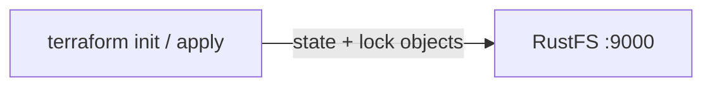
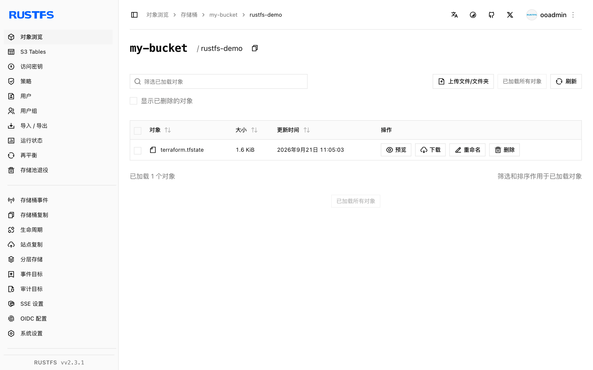

本指南将 HashiCorp 的基础设施即代码工具 [Terraform](https://github.com/hashicorp/terraform) 通过 S3 backend 连接到 **RustFS**：状态文件以及防止并发运行的状态锁都以对象形式存储在 RustFS 中。你将初始化后端、应用一个小配置，并在 RustFS 中验证状态对象。整个流程使用 `terraform 1.12.2` 和 `rustfs/rustfs-x86-musl:v2.3.1` 验证通过。

你需要一个可从工作站访问的 RustFS 部署（参见[安装](/installation)章节），以及支持通过 `use_lockfile` 实现 S3 原生锁的 Terraform 1.10 或更高版本。

## 架构



S3 backend 把状态文件存储在桶内 `key` 前缀之下。启用 `use_lockfile = true` 后，运行期间 Terraform 会写入一个 `<key>.tflock` 对象作为锁，取代本场景中基于 DynamoDB 的锁。

## 1. 创建项目文件

创建工作目录：

```bash
mkdir rustfs-terraform
cd rustfs-terraform
```

创建配置。请替换凭证占位符，并把端点指向你的 RustFS 服务器——Terraform 与其同机时使用 `localhost:9000`：

```hcl title="main.tf"
terraform {
  backend "s3" {
    bucket                      = "my-bucket"
    key                         = "rustfs-demo/terraform.tfstate"
    region                      = "us-east-1"
    endpoint                    = "http://localhost:9000"
    access_key                  = "<your-access-key>"
    secret_key                  = "<your-secret-key>"
    skip_credentials_validation = true
    skip_region_validation      = true
    skip_metadata_api_check     = true
    skip_requesting_account_id  = true
    force_path_style            = true
    insecure                    = true
    use_lockfile                = true
  }
}

provider "local" {}

resource "local_file" "demo" {
  content  = "provisioned with terraform, state stored in RustFS"
  filename = "${path.module}/demo.txt"
}
```

`force_path_style` 和 `insecure` 表示对本地端点使用纯 HTTP 上的 path-style 寻址，这正是 RustFS 所期望的。`use_lockfile` 启用 S3 原生状态锁，防止并发运行损坏状态。

## 2. 初始化后端

下载 provider 并配置 S3 后端：

```bash
terraform init -input=false
```

```text
Successfully configured the backend "s3"! Terraform will automatically
use this backend unless the backend configuration changes.
```

## 3. 应用配置

创建资源并把状态写入 RustFS：

```bash
terraform apply -auto-approve -input=false
```

```text
Apply complete! Resources: 1 added, 0 changed, 0 destroyed.
```

## 4. 在 RustFS 中验证状态

通过 `rc` CLI 列出状态对象：

```bash
docker run --rm --network <rustfs-network> -v "$PWD:/m" \
  --entrypoint /bin/sh rustfs/rc:latest \
  -c 'rc alias set rustfs http://rustfs:9000 <your-access-key> <your-secret-key> >/dev/null && rc ls rustfs/my-bucket/rustfs-demo --recursive'
```

```text
[2026-09-21 03:05:03]   1.62 KiB rustfs-demo/terraform.tfstate
```

你也可以在 RustFS 控制台中浏览该前缀：



## 5. 确认状态是从 RustFS 重新读取的

执行 plan——Terraform 会从 RustFS 读取状态并与配置比对：

```bash
terraform plan -input=false
```

```text
No changes. Your infrastructure matches the configuration.
```

plan 结果干净，说明状态是从 RustFS 读回的，而不是来自任何本地文件。

## 6. 销毁并重置

销毁资源；状态更新同样写回 RustFS：

```bash
terraform destroy -auto-approve -input=false
```

在 RustFS 控制台（或用 `rc rm`）删除状态对象即可从零开始。

## 故障排除

### "dial tcp: lookup rustfs ... server misbehaving" 或连接失败

`endpoint` 必须能被运行 Terraform 的机器访问。Compose 网络内使用 (`http://rustfs:9000`)，宿主机上使用 (`http://localhost:9000`)。

### "Bucket cannot have ACLs set" 或签名错误

对于非 AWS 端点，`skip_credentials_validation`、`skip_region_validation`、`skip_metadata_api_check`、`skip_requesting_account_id`、`force_path_style` 和 `insecure` 都必须设置；缺任何一个都会导致 backend 与 AWS 默认端点通信而不是 RustFS。

### 状态没有出现在桶里

确认桶已存在且凭证与 RustFS 凭证一致。状态对象会在第一次 `init` 或 `apply` 之后出现在 `key` 路径下（本指南为 `rustfs-demo/terraform.tfstate`）。

## 后续步骤

- 在采用其他 S3 操作前，请查看 [S3 兼容性说明](/administration/protocols/s3)。
- 通过[访问密钥管理](/security-compliance/iam/access-token)创建专用的生产凭证。
- 阅读 [Terraform S3 backend 文档](https://developer.hashicorp.com/terraform/language/backend/s3)了解 workspace 前缀、角色扮演等选项。
