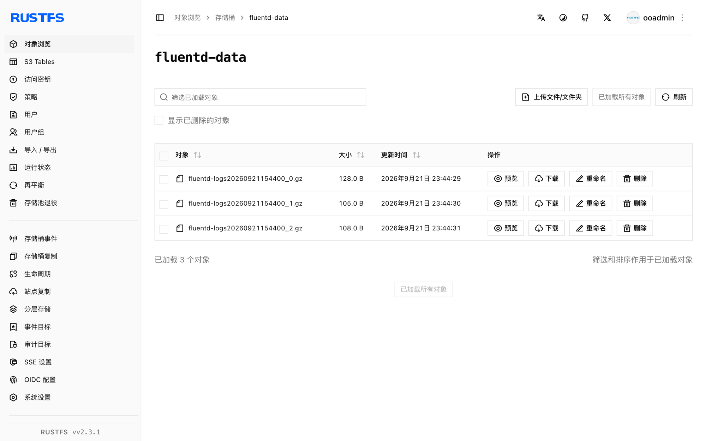

本指南通过 `out_s3` 输出插件，将开源数据采集器 [Fluentd](https://github.com/fluent/fluentd) 连接到 **RustFS**。你将运行带 tail 输入源的 Fluentd，缓冲日志事件，并验证冲刷出的对象已存储在 RustFS 中。整个流程使用 `fluent/fluentd:v1.17-1`、`fluent-plugin-s3` 1.8.6 和 `rustfs/rustfs-x86-musl:v2.3.1` 验证通过。

你需要安装 Docker。本部署用于本地集成测试，不适用于生产环境。

## 架构


tail 输入源读取 `app.log` 的新增行并交给 S3 输出，输出按时间键缓冲事件，每个冲刷窗口上传一个 gzip 对象。

## 1. 创建项目文件

先创建存储桶——Fluentd 不会创建桶：

```bash
rc alias set rustfs http://<your-rustfs-endpoint>:9000 <your-access-key> <your-secret-key>
rc mb rustfs/fluentd-data
```

官方 Fluentd 镜像以非 root 用户运行，无法在启动时安装 gem，因此构建一个带 S3 插件的小镜像：

```dockerfile title="Dockerfile"
FROM fluent/fluentd:v1.17-1
USER root
RUN gem install fluent-plugin-s3 --no-document
USER fluent
```

创建 Fluentd 配置，并替换两个凭证占位符：

```nginx title="fluent.conf"
<source>
  @type tail
  path /var/log/app.log
  pos_file /var/log/app.log.pos
  tag rustfs.demo
  <parse>
    @type none
  </parse>
</source>

<match **>
  @type s3
  aws_key_id <your-access-key>
  aws_sec_key <your-secret-key>
  s3_bucket fluentd-data
  s3_endpoint http://rustfs:9000/
  s3_region us-east-1
  force_path_style true
  path fluentd-logs
  <buffer>
    @type memory
    timekey 30s
    timekey_wait 0s
    flush_mode immediate
  </buffer>
</match>
```

`force_path_style true` 是必需的——缺少它插件会构造 `fluentd-data.rustfs` 作为主机名，所有请求都会因 DNS 错误失败。Compose 网络内主机名为 `rustfs`；宿主机上使用 (`http://localhost:9000/`)。

构建镜像，并在与 RustFS 相同的 Docker 网络中启动 Fluentd：

```bash
docker build -t fluentd-rustfs .
mkdir -p logs
docker run -d --name fluentd --network oo-rustfs_default \
  -v "$PWD/fluent.conf":/fluentd/etc/fluent.conf:ro \
  -v "$PWD/logs":/var/log fluentd-rustfs
```

## 2. 产生日志事件

向被监视的文件追加内容：

```bash
echo "rustfs fluentd demo line 1" >> logs/app.log
echo "rustfs fluentd demo line 2" >> logs/app.log
```

在 30 秒时间键和立即冲刷模式下，每个窗口关闭后不久就会上传一个 gzip 对象。等待约一分钟。

## 3. 在 RustFS 中验证对象

列出存储桶：

```bash
rc ls rustfs/fluentd-data/ -r
```

每个冲刷窗口产生一个 gzip 对象：

```text
fluentd-logs20260921154400_0.gz
fluentd-logs20260921154400_1.gz
```

读回一个对象确认事件完整：

```bash
rc cat rustfs/fluentd-data/fluentd-logs20260921154400_0.gz | gunzip
```



## 4. 停止或重置部署

停止 Fluentd 并保留数据：

```bash
docker rm -f fluentd
```

对象保留在 `fluentd-data` 存储桶中。若要删除它们，请移除存储桶：

```bash
rc rb rustfs/fluentd-data --force
```

## 故障排查

### `Unknown output plugin 's3'`

插件未安装。确认 Dockerfile 在以 `root` 身份安装 `fluent-plugin-s3` 后才切回 `fluent` 用户——以默认用户在容器启动时安装会因权限错误失败。

### `Failed to open TCP connection to fluentd-data.rustfs`

正在使用 virtual-hosted 寻址。在 `s3` 输出中添加 `force_path_style true`，让桶保留在 URL 路径中。

### worker 反复崩溃重启

桶不存在时输出会硬失败。启动 Fluentd 前先创建 `fluentd-data`，并检查启动日志：

```bash
docker logs fluentd | grep -iE "error|bucket" | tail
```

## 后续步骤

- 在采用更多 Fluentd 输出之前，请查阅 [S3 兼容性说明](/administration/protocols/s3)。
- 通过[访问密钥管理](/security-compliance/iam/access-token)创建专用的生产凭证。
- 按照 [fluent-plugin-s3 文档](https://github.com/fluent/fluent-plugin-s3)了解对象键格式与压缩选项。
