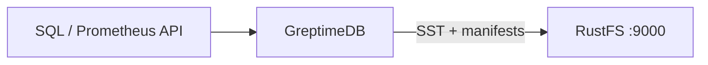
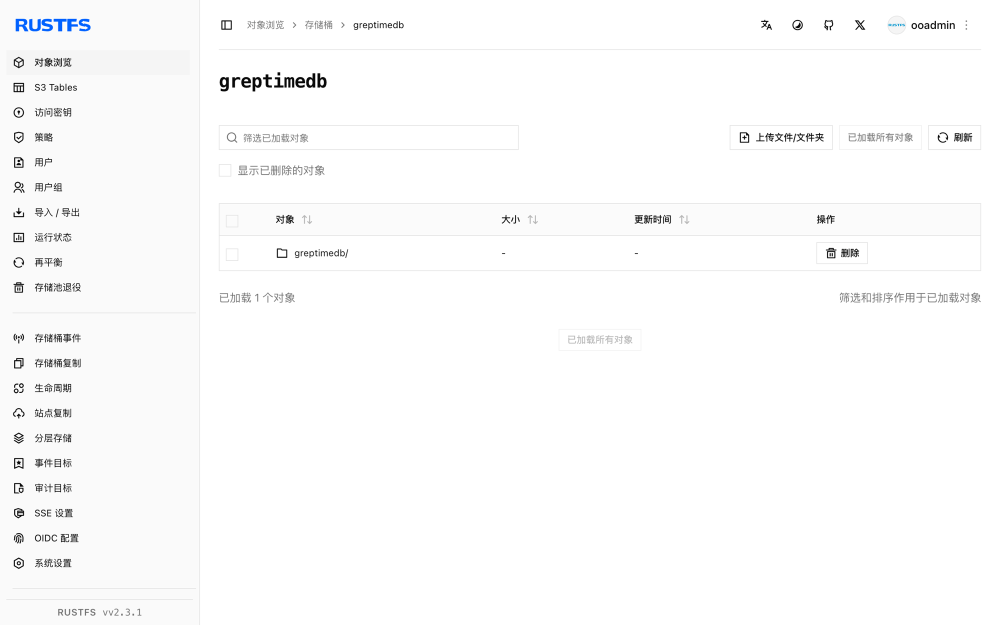

本指南将云原生开源时序数据库 [GreptimeDB](https://github.com/GreptimeTeam/greptimedb) 连接到 **RustFS** 作为其对象存储后端。你将启动一个 `[storage]` 配置指向 RustFS 桶的 standalone 实例，通过 SQL API 写入时序数据，并确认桶内的 Parquet 文件与 manifest。整个流程使用 `greptime/greptimedb`（main，commit `179ff8e5`）对 `rustfs/rustfs-x86-musl:v2.3.1` 验证通过。

你需要安装 Docker，或本地 GreptimeDB 二进制。本部署用于本地集成测试，不适用于生产环境。

## 架构



GreptimeDB 把 WAL 和最新数据保留在本地，随后将 SSTable（Parquet）与表 manifest 持久化到对象存储。把存储后端指向 RustFS 后，该桶就是所有表数据的持久化归属地。

## 1. 配置存储后端

创建桶和一个带 S3 存储段的配置文件，替换全部连接占位符：

```toml title="greptimedb.toml"
[storage]
type = "S3"
bucket = "<your-bucket>"
root = "greptimedb"
access_key_id = "<your-access-key>"
secret_access_key = "<your-secret-key>"
endpoint = "http://<your-rustfs-endpoint>:9000"
region = "us-east-1"
```

GreptimeDB 对自定义端点默认使用路径风格请求；虚拟主机风格需要显式开启 `enable_virtual_host_style`，因此对接 RustFS 无需额外参数。

## 2. 运行 GreptimeDB

以配置文件启动 standalone 实例：

```bash
docker run -d --name greptimedb --network oo-rustfs_default -p 4000:4000 -p 4002:4002 \
  -v "$PWD/greptimedb.toml":/etc/greptimedb/greptimedb.toml:ro \
  greptime/greptimedb:latest standalone start \
  --http-addr 0.0.0.0:4000 \
  --mysql-addr 0.0.0.0:4002 \
  --config-file /etc/greptimedb/greptimedb.toml
```

`4000` 端口提供 HTTP SQL 端点，`4002` 提供 MySQL 协议。

## 3. 写入并查询时序数据

建表、插入、回读。HTTP SQL 端点接受表单编码请求：

```bash
curl -s -X POST "http://localhost:4000/v1/sql" \
  --data-urlencode "sql=CREATE TABLE rustfs_demo (host STRING, cpu DOUBLE, mem DOUBLE, ts TIMESTAMP TIME INDEX)"

curl -s -X POST "http://localhost:4000/v1/sql" \
  --data-urlencode "sql=INSERT INTO rustfs_demo VALUES (\"node-1\", 0.31, 0.62, 1790681000000), (\"node-1\", 0.35, 0.63, 1790681060000), (\"node-2\", 0.51, 0.71, 1790681000000)"
```

```text
{"output":[{"affectedrows":3}],"execution_time_ms":2}
```

查询回读：

```bash
curl -s -X POST "http://localhost:4000/v1/sql" \
  --data-urlencode "sql=SELECT * FROM rustfs_demo ORDER BY ts"
```

```text
{"output":[{"records":{"rows":[["node-2",0.51,0.71,1790681000000],["node-1",0.35,0.63,1790681060000]],"total_rows":2}}]}
```

## 4. 验证 RustFS 中的对象

列举桶——memtable 刷盘后，桶内会出现 Parquet SSTable 和 JSON manifest：

```bash
rc ls rustfs/<your-bucket>/ -r
```

```text
greptimedb/data/greptime/public/1024/1024_0000000000/manifest/00000000000000000000.json
greptimedb/data/greptime/greptime_private/1025/1025_0000000000/b11e8b25-5763-4f05-bcab-b6ee0a756a69.parquet
greptimedb/data/greptime/greptime_private/1025/1025_0000000000/manifest/00000000000000000001.json
```

每个数据库在 `data/` 下有自己的目录，按 region 存放的 `manifest/*.json` 描述了查询时读回的 SSTable。



## 5. 停止或重置

保留桶内对象、仅拆除演示环境：

```bash
docker rm -f greptimedb
```

删除已存储的数据：

```bash
rc rm rustfs/<your-bucket>/ --recursive --force
```

## 故障排查

### `Form requests must have Content-Type: application/x-www-form-urlencoded`

`/v1/sql` HTTP 端点只接受表单编码请求体。请用 `curl --data-urlencode "sql=..."`（或 `application/x-www-form-urlencoded`）传 SQL，不要用 JSON 请求体。

### 桶一直是空的

GreptimeDB 异步地把 memtable 刷到对象存储。多写几条并等几秒（或手动触发 flush），再列举桶。

### 启动时报 S3 错误

确认 `endpoint` 带协议前缀、桶已创建，且 `access_key_id`/`secret_access_key` 与 RustFS 访问密钥匹配。`root` 可选，但建议保留以便所有表目录都在已知前缀下。

## 下一步

- 在启用更多 GreptimeDB 存储选项前，先阅读 [S3 兼容性说明](/administration/protocols/s3)。
- 使用[访问密钥管理](/security-compliance/iam/access-token)创建专用的生产凭证。
- 按照 [GreptimeDB 配置参考](https://docs.greptime.com/operational-guide/configure/configure-datanode/)为生产负载调整 flush 周期与缓存层。
