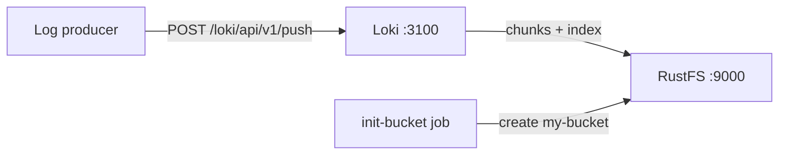
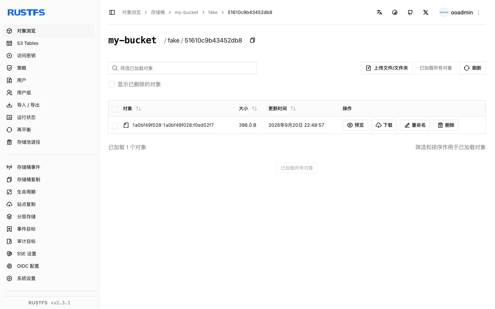

本指南运行 [Grafana Loki](https://github.com/grafana/loki)——Grafana Labs 的日志聚合系统——并以 **RustFS** 作为其对象存储后端。你将使用 Docker Compose 启动单节点 Loki，通过 HTTP API 推送日志流，查询它们，并确认日志 chunk 以对象形式存储在 RustFS 中。整个流程使用 `grafana/loki:latest`（v3.7.8）和 `rustfs/rustfs-x86-musl:v2.3.1` 验证通过。

你需要安装带有 Compose 插件的 Docker。本部署用于本地集成测试，不适用于生产环境。

## 架构



Loki 将日志流摄入内存 chunk 和预写日志（WAL），在流空闲后把压缩后的 chunk 刷写到对象存储，并把 TSDB 索引文件上传到同一个桶。查询时通过索引定位 chunk 并从对象存储读取。

## 1. 创建项目文件

创建工作目录：

```bash
mkdir rustfs-loki
cd rustfs-loki
```

创建环境变量文件，并替换两个凭证占位符：

```ini title=".env"
RUSTFS_ACCESS_KEY=<your-access-key>
RUSTFS_SECRET_KEY=<your-secret-key>
```

请为桶使用专用的凭证，不要将 `.env` 提交到版本控制。

创建 Loki 配置——采用 TSDB 模式、S3 后端指向 RustFS 的单节点配置：

```yaml title="loki.yml"
auth_enabled: false

server:
  http_listen_port: 3100

common:
  instance_addr: 127.0.0.1
  path_prefix: /loki
  storage:
    s3:
      endpoint: rustfs:9000
      insecure: true
      bucketnames: my-bucket
      access_key_id: ${RUSTFS_ACCESS_KEY}
      secret_access_key: ${RUSTFS_SECRET_KEY}
      s3forcepathstyle: true
  replication_factor: 1
  ring:
    kvstore:
      store: inmemory

schema_config:
  configs:
    - from: 2020-10-24
      store: tsdb
      object_store: s3
      schema: v13
      index:
        prefix: index_
        period: 24h

ingester:
  chunk_idle_period: 30s
  max_chunk_age: 1m

ruler:
  alertmanager_url: http://localhost:9093
```

`s3forcepathstyle: true` 和 `insecure: true` 表示对容器网络端点使用纯 HTTP 上的 path-style 寻址，这正是 RustFS 所期望的。`chunk_idle_period` 和 `max_chunk_age` 被调小了，这样验证时不必等待默认的 30 分钟才会刷写 chunk。

创建 Compose 文件：

```yaml title="compose.yaml"
services:
  rustfs:
    image: rustfs/rustfs-x86-musl:v2.3.1
    environment:
      RUSTFS_ACCESS_KEY: ${RUSTFS_ACCESS_KEY}
      RUSTFS_SECRET_KEY: ${RUSTFS_SECRET_KEY}
      RUSTFS_VOLUMES: /data
      RUSTFS_ADDRESS: ":9000"
      RUSTFS_CONSOLE_ADDRESS: ":9001"
      RUSTFS_CONSOLE_ENABLE: "true"
    volumes:
      - rustfs-data:/data
    ports:
      - "9000:9000"
      - "9001:9001"
    healthcheck:
      test: ["CMD", "curl", "-sf", "http://127.0.0.1:9000/health"]
      interval: 10s
      timeout: 5s
      retries: 6
      start_period: 10s
    networks:
      - loki

  create-bucket:
    image: rustfs/rc:latest
    depends_on:
      rustfs:
        condition: service_healthy
    environment:
      RUSTFS_ACCESS_KEY: ${RUSTFS_ACCESS_KEY}
      RUSTFS_SECRET_KEY: ${RUSTFS_SECRET_KEY}
    entrypoint:
      - /bin/sh
      - -c
      - |
        until /usr/bin/rc alias set rustfs http://rustfs:9000 "$${RUSTFS_ACCESS_KEY}" "$${RUSTFS_SECRET_KEY}"; do
          echo "Waiting for RustFS..."
          sleep 2
        done
        /usr/bin/rc ls rustfs/my-bucket >/dev/null 2>&1 || /usr/bin/rc mb rustfs/my-bucket
    networks:
      - loki

  loki:
    image: grafana/loki:latest
    command: -config.file=/etc/loki/loki-config.yml
    volumes:
      - ./loki.yml:/etc/loki/loki-config.yml:ro
    ports:
      - "3100:3100"
    depends_on:
      create-bucket:
        condition: service_completed_successfully
    networks:
      - loki

networks:
  loki:

volumes:
  rustfs-data:
```

## 2. 启动部署

启动容器前先解析 Compose 文件：

```bash
docker compose config
```

启动服务并等待桶初始化任务完成：

```bash
docker compose up -d
docker compose ps -a
```

就绪端点返回成功即表示 Loki 已就绪：

```bash
curl -s http://localhost:3100/ready
```

```text
ready
```

## 3. 推送日志流

通过推送 API 发送一批日志条目：

```bash
python3 - <<'PY'
import json, time, urllib.request

values = []
base_ns = int(time.time() * 1e9)
for i in range(20):
    values.append([
        str(base_ns - i * 1_000_000_000),
        f"[rustfs-loki-integration] log line {i} stored in RustFS object storage",
    ])

payload = {
    "streams": [{
        "stream": {"job": "rustfs-demo", "service": "loki-integration"},
        "values": values,
    }]
}

req = urllib.request.Request(
    "http://localhost:3100/loki/api/v1/push",
    data=json.dumps(payload).encode(),
    headers={"Content-Type": "application/json"},
    method="POST",
)
with urllib.request.urlopen(req, timeout=30) as r:
    print("push:", r.status)
PY
```

```text
push: 204
```

## 4. 查询日志

通过范围查询 API 把日志查询回来：

```bash
curl -sG "http://localhost:3100/loki/api/v1/query_range" \
  --data-urlencode 'query={job="rustfs-demo"}' \
  --data-urlencode "start=$(($(date +%s) - 3600))000000000" \
  --data-urlencode "end=$(($(date +%s) + 60))000000000" \
  | python3 -m json.tool | head -20
```

响应中包含推送的日志行：

```text
"values": [
    [
      "1789916564000000000",
      "[rustfs-loki-integration] log line 0 stored in RustFS object storage"
    ],
```

## 5. 在 RustFS 中验证 chunk

设置了 `chunk_idle_period: 30s` 后，ingester 会在最后一行日志大约一分钟后把流刷写到对象存储。通过桶初始化镜像列出租户前缀：

```bash
docker compose run --rm --entrypoint /bin/sh create-bucket -c \
  '/usr/bin/rc alias set rustfs http://rustfs:9000 "$RUSTFS_ACCESS_KEY" "$RUSTFS_SECRET_KEY" >/dev/null && /usr/bin/rc ls rustfs/my-bucket/fake --recursive'
```

`fake` 是 `auth_enabled` 为 `false` 时 Loki 使用的租户，每个对象即一个压缩后的日志 chunk：

```text
[2026-09-20 14:48:57]      398 B fake/51610c9b43452db8/1a0bf49f028:1a0bf49f028:f0ed52f7
[2026-09-20 14:49:33]      670 B fake/cd916b27d004a688/1a0bf4a03ca:1a0bf4a4e03:1376b308
```

你也可以在 RustFS 控制台中浏览该前缀：



## 6. 停止或重置环境

停止容器并保留 RustFS 数据卷：

```bash
docker compose down
```

如需删除已存储的日志并从空的 RustFS 数据卷开始，请显式加上 `--volumes`：

```bash
docker compose down --volumes
```

## 故障排除

### Loki 节流写入并提示 "disk usage exceeded threshold"

Loki 会监控预写日志所在磁盘，使用率超过 90% 时会对 ingester 节流。请确保 `path_prefix` 所在卷有足够的可用空间；如果机器本身健康，也可以像本指南的 Compose 文件那样为 WAL 使用 tmpfs。

### ring 报连接 8500 端口的错误

ring 的默认键值存储是 Consul。单节点部署请按上文配置设置 `common.ring.kvstore.store: inmemory`。

### 推送请求报 "Ingester is shutting down"

ingester 未能进入运行状态——通常是之前一次启动失败留下的容器。先用 `docker compose down` 移除容器再重新启动，或查看日志寻找底层存储错误。

### 返回 AccessDenied 或 403 响应

确认 `loki.yml` 中的凭证与 RustFS 凭证一致，并确认 `create-bucket` 任务已成功完成：

```bash
docker compose logs create-bucket
```

## 后续步骤

- 在采用其他 S3 操作前，请查看 [S3 兼容性说明](/administration/protocols/s3)。
- 通过[访问密钥管理](/security-compliance/iam/access-token)创建专用的生产凭证。
- 按照 [Grafana Loki 文档](https://grafana.com/docs/loki/latest/)接入 Promtail、Alloy 或 OpenTelemetry Collector 作为日志生产者。
