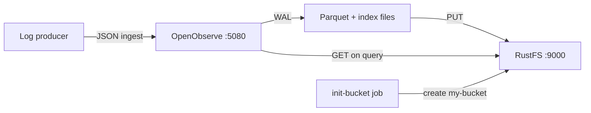
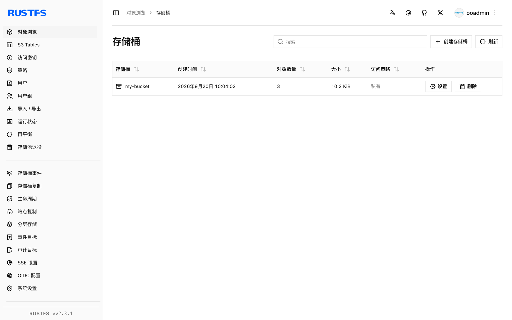
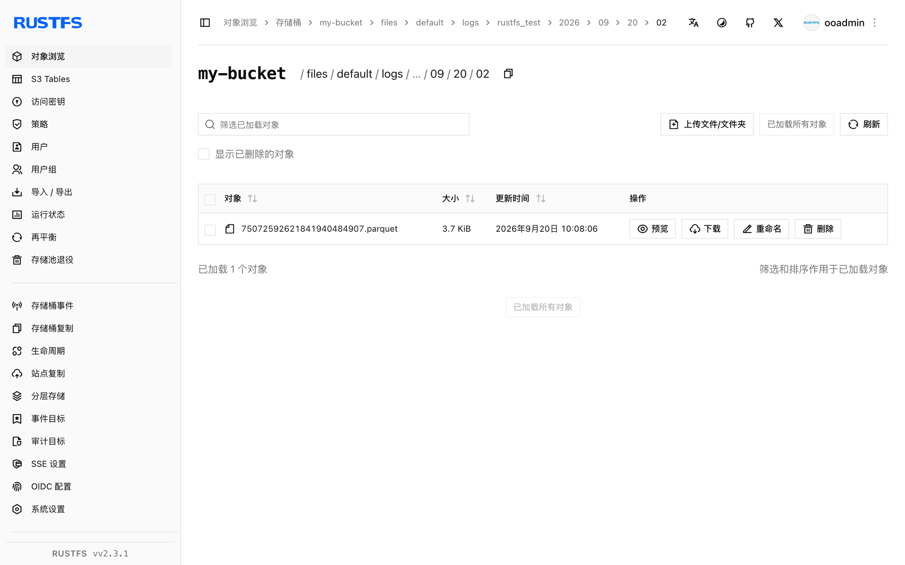
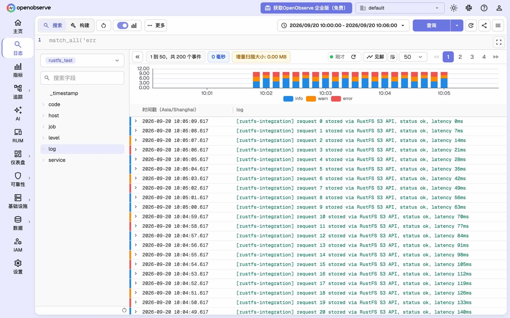
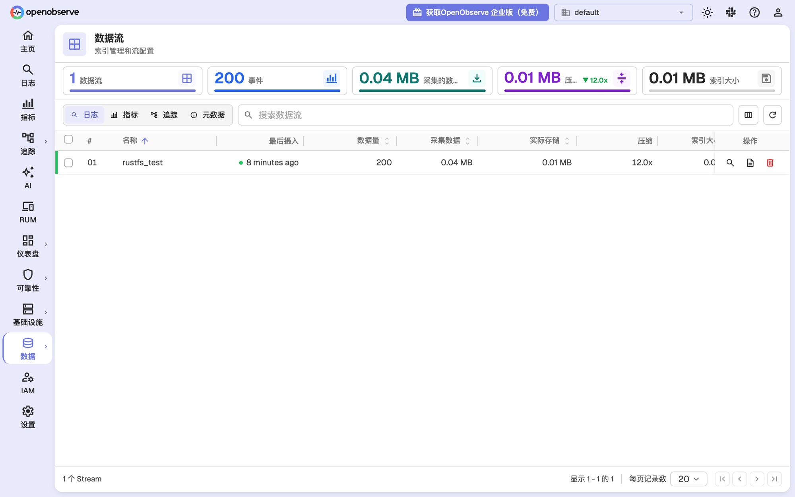

本指南以 **RustFS** 作为对象存储后端运行 **OpenObserve**。你将使用 Docker Compose 启动两个服务，向 OpenObserve 摄入日志记录，将数据刷写到对象存储，在 RustFS 中验证生成的 Parquet 文件，并通过 OpenObserve UI 和搜索 API 查询这些数据。

你需要安装带有 Compose 插件的 Docker，以及一台能够运行三个容器的机器。本部署用于本地集成测试，不适用于生产环境。

## 产品介绍

### OpenObserve

[OpenObserve](https://openobserve.ai/) 是一个开源的可观测性平台，覆盖日志、指标、链路追踪和真实用户监控。它采用存算分离架构：摄入的数据首先落入本地预写日志（WAL），随后被转换为带全文索引的 Parquet 文件并上传到对象存储——对象存储是其唯一的持久化数据层。查询时通过文件列表元数据定位远端 Parquet 文件，并按需下载到本地缓存。

OpenObserve 通过 Rust `object_store` 客户端访问对象存储，默认使用 **Path-Style** 请求和 SigV4 签名。只要提供端点 URL、区域、凭证和桶名，任何 S3 兼容端点（包括 RustFS）都可以作为其后端。

### RustFS

RustFS 是基于 Rust 构建的分布式对象存储系统，实现了 Amazon S3 API，包括 SigV4 签名、Path-Style 与 Virtual-Host Style 寻址以及分片上传，并内置 Web 控制台与多租户 IAM。RustFS 支持从单节点到多节点集群的部署，覆盖 OpenObserve 存储遥测数据所需的 S3 操作。

### 集成原理



- **写入路径**：当数据达到大小阈值或 `ZO_MAX_FILE_RETENTION_TIME`（默认 600 秒）后，OpenObserve 将 WAL 记录合并为 Parquet 文件，上传到桶的 `files/` 前缀下，并写入其文件列表元数据。
- **查询路径**：搜索 API 按时间范围解析文件列表，从 RustFS 下载文件到本地缓存后执行查询。

## 集成步骤

### 1. 创建项目文件

创建工作目录：

```bash
mkdir rustfs-openobserve
cd rustfs-openobserve
```

创建环境变量文件，并替换凭证占位符：

```ini title=".env"
RUSTFS_ACCESS_KEY=<your-access-key>
RUSTFS_SECRET_KEY=<your-secret-key>
RUSTFS_BUCKET_NAME=my-bucket
ZO_ROOT_USER_EMAIL=root@example.com
ZO_ROOT_USER_PASSWORD=Complexpass#123
```

:::note[OpenObserve 示例凭证]

`root@example.com` 和 `Complexpass#123` 是 OpenObserve 官方文档中的示例值。OpenObserve v1.0.x 强制密码策略：8 到 128 个字符，且须同时包含大写字母、小写字母、数字和特殊字符。真实部署请修改这两个值，也不要将 `.env` 提交到版本控制。

:::

创建 Compose 文件：

```yaml title="compose.yaml"
services:
  rustfs:
    image: rustfs/rustfs-x86-musl:v2.3.1
    environment:
      RUSTFS_ACCESS_KEY: ${RUSTFS_ACCESS_KEY}
      RUSTFS_SECRET_KEY: ${RUSTFS_SECRET_KEY}
      RUSTFS_VOLUMES: /data
      RUSTFS_ADDRESS: ":9000"
      RUSTFS_CONSOLE_ADDRESS: ":9001"
      RUSTFS_CONSOLE_ENABLE: "true"
    volumes:
      - rustfs-data:/data
    ports:
      - "9000:9000"
      - "9001:9001"
    healthcheck:
      test: ["CMD", "curl", "-sf", "http://127.0.0.1:9000/health"]
      interval: 10s
      timeout: 5s
      retries: 6
      start_period: 10s
    networks:
      - observability

  init-bucket:
    image: rustfs/rc:latest
    depends_on:
      rustfs:
        condition: service_healthy
    environment:
      RUSTFS_ACCESS_KEY: ${RUSTFS_ACCESS_KEY}
      RUSTFS_SECRET_KEY: ${RUSTFS_SECRET_KEY}
    entrypoint:
      - /bin/sh
      - -c
      - |
        until /usr/bin/rc alias set rustfs http://rustfs:9000 "$${RUSTFS_ACCESS_KEY}" "$${RUSTFS_SECRET_KEY}"; do
          echo "Waiting for RustFS..."
          sleep 2
        done
        /usr/bin/rc ls rustfs/my-bucket >/dev/null 2>&1 || /usr/bin/rc mb rustfs/my-bucket
    networks:
      - observability

  openobserve:
    image: openobserve/openobserve:v1.0.3
    depends_on:
      rustfs:
        condition: service_healthy
      init-bucket:
        condition: service_completed_successfully
    environment:
      ZO_ROOT_USER_EMAIL: ${ZO_ROOT_USER_EMAIL}
      ZO_ROOT_USER_PASSWORD: ${ZO_ROOT_USER_PASSWORD}
      ZO_LOCAL_MODE: "true"
      ZO_LOCAL_MODE_STORAGE: "s3"
      ZO_DATA_DIR: /data
      ZO_HTTP_PORT: "5080"
      RUST_LOG: INFO
      ZO_S3_PROVIDER: s3
      ZO_S3_SERVER_URL: http://rustfs:9000
      ZO_S3_REGION_NAME: us-east-1
      ZO_S3_ACCESS_KEY: ${RUSTFS_ACCESS_KEY}
      ZO_S3_SECRET_KEY: ${RUSTFS_SECRET_KEY}
      ZO_S3_BUCKET_NAME: ${RUSTFS_BUCKET_NAME}
      # Upload Parquet files after 60 seconds instead of the default 600.
      # Keep the default for production-like setups.
      ZO_MAX_FILE_RETENTION_TIME: "60"
    volumes:
      - oo-data:/data
    ports:
      - "5080:5080"
    networks:
      - observability

networks:
  observability:

volumes:
  rustfs-data:
  oo-data:
```

`ZO_LOCAL_MODE_STORAGE=s3` 是必需的：单节点模式下若不设置，OpenObserve 会将 Parquet 文件写入本地磁盘并忽略 `ZO_S3_*` 变量。`init-bucket` 任务使用 [`rc` 镜像](https://github.com/rustfs/cli)在 RustFS 健康检查通过后创建 `my-bucket`，若桶已存在则跳过创建。

### 2. 启动部署

解析并启动 Compose 栈：

```bash
docker compose config
docker compose up -d
docker compose ps
```

`init-bucket` 服务创建桶后应以退出码 `0` 结束：

```text
✓ Bucket 'rustfs/my-bucket' created successfully.
```

打开 `http://localhost:5080` 访问 OpenObserve UI，使用 `.env` 中的 `ZO_ROOT_USER_EMAIL` 和 `ZO_ROOT_USER_PASSWORD` 登录。通过 `http://localhost:9001/rustfs/console/` 访问 RustFS 控制台。

### 3. 确认 OpenObserve 已连接 RustFS

查看 OpenObserve 启动日志中的存储配置：

```bash
docker compose logs openobserve | grep "s3 init config"
```

```text
INFO infra::storage::remote: s3 init config: StorageConfig { name: "default", provider: "s3", server_url: "http://rustfs:9000", region_name: "us-east-1", access_key: "<your-access-key>", secret_key: "<your-secret-key>", bucket_name: "my-bucket", bucket_prefix: "" }
```

OpenObserve 启动时还会执行存储探测：向桶写入文件 `o2_test/check.txt` 并读回。在 RustFS 中看到该文件即说明写入链路正常。

### 4. 摄入日志记录

向 `default` 组织的 `rustfs_test` 流的 JSON 摄入 API 发送一批记录：

```bash
curl -u "root@example.com:Complexpass#123" \
  -X POST "http://localhost:5080/api/default/rustfs_test/_json" \
  -H "Content-Type: application/json" \
  -d '[
    {"level":"info","service":"rustfs-openobserve-demo","host":"host-1",
     "job":"integration-test","log":"[rustfs-integration] request 1 stored via RustFS S3 API","code":200},
    {"level":"error","service":"rustfs-openobserve-demo","host":"host-1",
     "job":"integration-test","log":"[rustfs-integration] request 2 stored via RustFS S3 API","code":200}
  ]'
```

```text
{"code":200,"status":[{"name":"rustfs_test","successful":2,"failed":0}]}
```

### 5. 将数据刷写到对象存储

调用节点级 flush 端点，让记录离开 WAL：

```bash
curl -s -u "root@example.com:Complexpass#123" -X PUT "http://localhost:5080/node/flush"
```

ingester 会将 WAL 记录转换为 Parquet 文件，并在文件年龄超过 `ZO_MAX_FILE_RETENTION_TIME`（本 Compose 文件中为 60 秒，默认 600 秒）后由后台任务上传到 RustFS。

## 验收结果

### 在 RustFS 中验证对象

通过桶初始化镜像列出桶内容：

```bash
docker compose run --rm --entrypoint /bin/sh init-bucket -c \
  '/usr/bin/rc alias set rustfs http://rustfs:9000 "$RUSTFS_ACCESS_KEY" "$RUSTFS_SECRET_KEY" >/dev/null && /usr/bin/rc ls rustfs/my-bucket --recursive'
```

输出应包含探测文件以及 `files/` 前缀下的 ingester 产物：

```text
      19 B o2_test/check.txt
   3.7 KiB files/default/logs/rustfs_test/2026/09/20/02/75072592621841940484907.parquet
   6.5 KiB files/default/index/rustfs_test_logs/2026/09/20/02/75072592621841940484907.ttv
```

你也可以在 RustFS 控制台中查看该桶，地址为 `http://localhost:9001/rustfs/console/`:



OpenObserve 将 Parquet 数据文件存储在 `files/<organization>/<stream type>/<stream>/<date partitions>` 之下，将全文索引文件存储在 `files/<organization>/index/` 之下：



### 在 OpenObserve 中查询日志

在 OpenObserve UI 中打开**日志**页面，选择流 `rustfs_test` 并执行查询，摄入的记录会出现在结果表中：



通过搜索 API 执行同样的查询。注意 `start_time` 和 `end_time` 的单位是**微秒**：

```bash
curl -s -u "root@example.com:Complexpass#123" \
  -X POST "http://localhost:5080/api/default/_search?type=logs" \
  -H "Content-Type: application/json" \
  -d '{"query":{"sql":"SELECT count(*) AS cnt FROM \"rustfs_test\"","start_time":1789869600000000,"end_time":1789869960000000}}'
```

```text
"hits": [{"cnt": 200}]
```

### 查看流统计

**数据 → 数据流**页面展示 `rustfs_test` 流的事件数、采集与压缩后大小以及索引大小：



### 验证数据在没有本地缓存时仍可恢复

为了确认持久层是 RustFS 而非本地磁盘，删除 OpenObserve 的缓存目录、重启容器后再次查询。OpenObserve 镜像内没有 shell，因此使用 `busybox` 删除文件：

```bash
docker compose stop openobserve
docker run --rm -v rustfs-openobserve_oo-data:/data busybox rm -rf /data/cache
docker compose start openobserve
```

等待 UI 恢复后重复上面的搜索查询，同样的记录会再次返回，因为 OpenObserve 从 RustFS 重新下载了 Parquet 文件。项目目录名（`rustfs-openobserve`）会作为卷名的前缀；如果使用了其他目录，请先执行 `docker volume ls` 确认卷名。

## 故障排除

### 数据被写入本地磁盘而不是 RustFS

单节点模式（`ZO_LOCAL_MODE=true`）下存储后端默认为 `disk`。若不设置 `ZO_LOCAL_MODE_STORAGE=s3`，OpenObserve 会忽略 `ZO_S3_*` 变量，并将 Parquet 文件保留在 `/data/wal/files/` 下。

### flush 后桶里没有出现 Parquet 文件

上传由后台任务执行，只有当 Parquet 文件的年龄超过 `ZO_MAX_FILE_RETENTION_TIME`（默认 600 秒）时才会上传。本指南将该值设置为 60 秒。如果文件仍未出现，请检查 ingester 日志：

```bash
docker compose logs openobserve | grep "INGESTER:JOB"
```

### 搜索 API 返回空结果

搜索 API 的 `start_time` 和 `end_time` 单位是微秒。形如 `1789869600000` 的毫秒时间戳选中的是 1970 年的时间范围，需要乘以 1000。

### OpenObserve 反复重启并报弱密码错误

OpenObserve v1.0.x 会拒绝不满足以下条件的 `ZO_ROOT_USER_PASSWORD`：至少包含一个大写字母、一个小写字母、一个数字和一个特殊字符。

### RustFS 控制台无法打开

RustFS v2.x 的控制台位于 `/rustfs/console/` 路径前缀下。直接访问端口 `9001` 的根路径会返回 S3 风格的 XML 拒绝访问响应，这属于正常现象。

### RustFS 启动时报权限错误

RustFS 镜像以用户和组 `10001` 运行。如果你改为 bind mount 宿主机目录（而不是本指南中的命名卷），请先执行 `chown -R 10001:10001 <host-directory>`。

## 后续步骤

- 在采用其他 S3 操作前，请查看 [S3 兼容性说明](/administration/protocols/s3)。
- 通过[访问密钥管理](/security-compliance/iam/access-token)创建专用的生产凭证。
- 按照 [OpenObserve 文档](https://openobserve.ai/docs/)接入 Fluent Bit 或 OpenTelemetry Collector 等真实的日志生产者。
