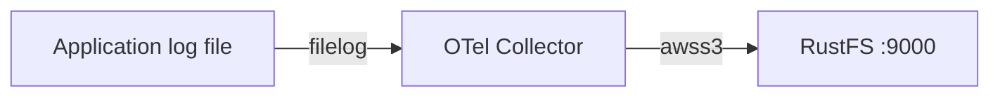
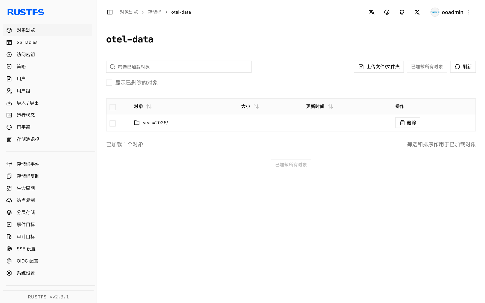

本指南通过 `awss3` 导出器，将 [OpenTelemetry Collector](https://opentelemetry.io/docs/collector/)——CNCF 遥测管道——连接到 **RustFS**。你将运行带 `filelog` 接收器的 contrib 版 Collector，把一个日志文件的内容发送到 `otel-data` 存储桶，并验证 RustFS 中的分区对象。整个流程使用 `otel/opentelemetry-collector-contrib:0.138.0` 和 `rustfs/rustfs-x86-musl:v2.3.1` 验证通过。

你需要安装 Docker。本部署用于本地集成测试，不适用于生产环境。

## 架构



`filelog` 接收器监视日志文件，`awss3` 导出器把批次上传到存储桶并按时间分区。指标和链路可以通过同一导出器走各自的管道。

## 1. 创建项目文件

先创建存储桶——导出器不会创建桶：

```bash
rc alias set rustfs http://<your-rustfs-endpoint>:9000 <your-access-key> <your-secret-key>
rc mb rustfs/otel-data
```

创建 Collector 配置，并替换两个凭证占位符：

```yaml title="config.yaml"
receivers:
  filelog:
    include: [/var/log/app.log]
    start_at: beginning

exporters:
  awss3:
    s3uploader:
      region: us-east-1
      s3_bucket: otel-data
      endpoint: http://rustfs:9000
      s3_force_path_style: true
      disable_ssl: true
      file_prefix: logs/app
    marshaler: body

service:
  pipelines:
    logs:
      receivers: [filelog]
      exporters: [awss3]
```

导出器从标准的 `AWS_ACCESS_KEY_ID`、`AWS_SECRET_ACCESS_KEY`、`AWS_REGION` 环境变量读取凭证。`marshaler: body` 把每行日志写为纯文本；省略它则存储 OTLP JSON。纯 HTTP 的非 AWS 端点必须设置 `s3_force_path_style` 和 `disable_ssl`。

创建 Compose 文件：

```yaml title="compose.yaml"
services:
  collector:
    image: otel/opentelemetry-collector-contrib:0.138.0
    command: ["--config=/etc/otelcol-contrib/config.yaml"]
    environment:
      AWS_ACCESS_KEY_ID: <your-access-key>
      AWS_SECRET_ACCESS_KEY: <your-secret-key>
      AWS_REGION: us-east-1
    volumes:
      - ./config.yaml:/etc/otelcol-contrib/config.yaml:ro
      - ./app.log:/var/log/app.log
    networks:
      - otel

networks:
  otel:
```

## 2. 启动 Collector 并产生日志

启动整个栈并向被监视的文件追加内容：

```bash
echo "otel demo log line one" > app.log
docker compose up -d
echo "second line after start" >> app.log
```

Collector 从头读取文件，在分区滚动时上传每个缓冲区，因此最后一条日志之后请等待约一分钟再检查。

## 3. 在 RustFS 中验证对象

列出存储桶：

```bash
rc ls rustfs/otel-data/ -r
```

日志记录按时间分区加上配置的文件前缀上传：

```text
year=2026/month=09/day=21/hour=15/minute=53/logs/applogs_288361608.txt
```

读回一个对象确认日志行完整到达：

```bash
rc cat rustfs/otel-data/year=2026/month=09/day=21/hour=15/minute=53/logs/applogs_288361608.txt
```

```text
otel demo log line one
second line after start
```



## 4. 停止或重置部署

停止 Collector 并保留数据：

```bash
docker compose down
```

对象保留在 `otel-data` 存储桶中。若要删除它们，请移除存储桶：

```bash
rc rb rustfs/otel-data --force
```

## 故障排查

### Collector 启动时报 `has invalid keys`

`awss3` 导出器的配置结构随 Collector 版本变化。0.138 版把上传配置嵌套在 `s3uploader` 下（如上所示），端点键名为 `endpoint`（不是 `s3_endpoint`）；更新的版本把这些键移到顶层。请核对你所用版本的 README。

### 存储桶中没有出现对象

确认 Collector 容器设置了凭证环境变量、`s3_force_path_style` 为 `true`，并且 `http://rustfs:9000` 在 Compose 网络内可达。在同一管道上启用 `debug` 导出器可以确认数据是否在流动。

## 后续步骤

- 在采用更多 Collector 操作之前，请查阅 [S3 兼容性说明](/administration/protocols/s3)。
- 通过[访问密钥管理](/security-compliance/iam/access-token)创建专用的生产凭证。
- 按照 [AWS S3 导出器文档](https://github.com/open-telemetry/opentelemetry-collector-contrib/tree/main/exporter/awss3exporter)添加指标和链路管道。
