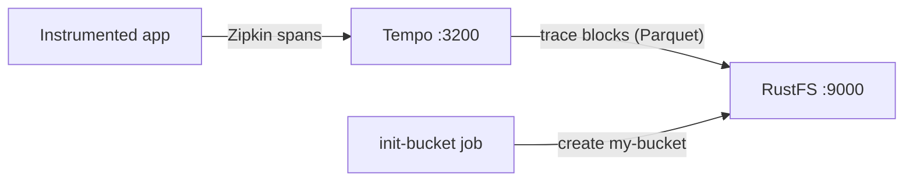
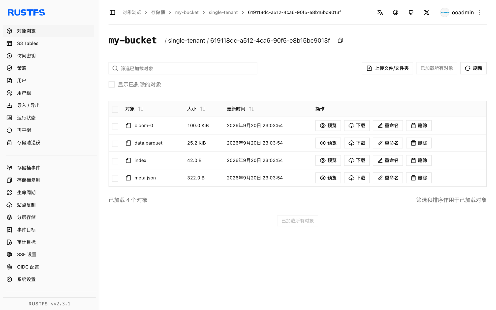

本指南运行 [Grafana Tempo](https://github.com/grafana/tempo)——Grafana Labs 的分布式追踪后端——并以 **RustFS** 作为其追踪数据存储。你将使用 Docker Compose 启动单节点 Tempo，通过 Zipkin 兼容接收器推送一条追踪，通过搜索 API 查询它，并确认追踪 block 以 Parquet 对象的形式存储在 RustFS 中。整个流程使用 `grafana/tempo:2.9.5` 和 `rustfs/rustfs-x86-musl:v2.3.1` 验证通过。

你需要安装带有 Compose 插件的 Docker。本部署用于本地集成测试，不适用于生产环境。

## 架构



Tempo 从 Zipkin 兼容端点接收 span，先缓冲到内存 block 中，再把完成的 block 以 Parquet 文件刷写到对象存储。搜索会扫描 block 索引并从对象存储读取 block 数据，因此每条追踪都能在 Tempo 重启后保留。

## 1. 创建项目文件

创建工作目录：

```bash
mkdir rustfs-tempo
cd rustfs-tempo
```

创建环境变量文件，并替换两个凭证占位符：

```ini title=".env"
RUSTFS_ACCESS_KEY=<your-access-key>
RUSTFS_SECRET_KEY=<your-secret-key>
```

请为桶使用专用的凭证，不要将 `.env` 提交到版本控制。

创建 Tempo 配置——S3 后端指向 RustFS 的单节点配置，并把 block 时长调短以便验证时无需等待默认的 30 分钟：

```yaml title="tempo.yml"
server:
  http_listen_port: 3200

distributor:
  receivers:
    zipkin:
      endpoint: 0.0.0.0:9411

ingester:
  max_block_duration: 1m

compactor:
  compaction:
    block_retention: 24h

storage:
  trace:
    backend: s3
    s3:
      endpoint: rustfs:9000
      bucket: my-bucket
      access_key: <your-access-key>
      secret_key: <your-secret-key>
      insecure: true
      forcepathstyle: true
    wal:
      path: /var/tempo/wal
    blocklist_poll: 30s
```

`forcepathstyle: true` 和 `insecure: true` 表示对容器网络端点使用纯 HTTP 上的 path-style 寻址，这正是 RustFS 所期望的。`max_block_duration: 1m` 和 `blocklist_poll: 30s` 用于加速验证时的刷写与发现周期。

创建 Compose 文件：

```yaml title="compose.yaml"
services:
  rustfs:
    image: rustfs/rustfs-x86-musl:v2.3.1
    environment:
      RUSTFS_ACCESS_KEY: ${RUSTFS_ACCESS_KEY}
      RUSTFS_SECRET_KEY: ${RUSTFS_SECRET_KEY}
      RUSTFS_VOLUMES: /data
      RUSTFS_ADDRESS: ":9000"
      RUSTFS_CONSOLE_ADDRESS: ":9001"
      RUSTFS_CONSOLE_ENABLE: "true"
    volumes:
      - rustfs-data:/data
    ports:
      - "9000:9000"
      - "9001:9001"
    healthcheck:
      test: ["CMD", "curl", "-sf", "http://127.0.0.1:9000/health"]
      interval: 10s
      timeout: 5s
      retries: 6
      start_period: 10s
    networks:
      - tempo

  create-bucket:
    image: rustfs/rc:latest
    depends_on:
      rustfs:
        condition: service_healthy
    environment:
      RUSTFS_ACCESS_KEY: ${RUSTFS_ACCESS_KEY}
      RUSTFS_SECRET_KEY: ${RUSTFS_SECRET_KEY}
    entrypoint:
      - /bin/sh
      - -c
      - |
        until /usr/bin/rc alias set rustfs http://rustfs:9000 "$${RUSTFS_ACCESS_KEY}" "$${RUSTFS_SECRET_KEY}"; do
          echo "Waiting for RustFS..."
          sleep 2
        done
        /usr/bin/rc ls rustfs/my-bucket >/dev/null 2>&1 || /usr/bin/rc mb rustfs/my-bucket
    networks:
      - tempo

  tempo:
    image: grafana/tempo:2.9.5
    command: -config.file=/tempo-local.yaml
    volumes:
      - ./tempo.yml:/tempo-local.yaml:ro
    ports:
      - "3200:3200"
      - "9411:9411"
    depends_on:
      create-bucket:
        condition: service_completed_successfully
    networks:
      - tempo

networks:
  tempo:

volumes:
  rustfs-data:
```

## 2. 启动部署

启动容器前先解析 Compose 文件：

```bash
docker compose config
```

启动服务并等待桶初始化任务完成：

```bash
docker compose up -d
docker compose ps -a
```

状态端点有响应即表示 Tempo 已启动：

```bash
curl -s http://localhost:3200/status | head -c 120
```

## 3. 推送一条追踪

向 Zipkin 兼容接收器提交一条包含五个 span 的 Zipkin 追踪：

```bash
python3 - <<'PY'
import json, time, urllib.request, random

now_us = int(time.time() * 1e6)
trace_id = "".join(random.choice("0123456789abcdef") for _ in range(32))
span_id = "".join(random.choice("0123456789abcdef") for _ in range(16))

spans = []
for i in range(5):
    spans.append({
        "traceId": trace_id,
        "id": "".join(random.choice("0123456789abcdef") for _ in range(16)),
        "name": f"rustfs-tempo-span-{i}",
        "timestamp": now_us - i * 1000,
        "duration": 1000 + i * 500,
        "localEndpoint": {"serviceName": "rustfs-tempo-demo"},
        "tags": {"job": "rustfs-integration"},
    })
spans[0]["parent_id"] = ""
for s in spans[1:]:
    s["parent_id"] = span_id

req = urllib.request.Request(
    "http://localhost:9411/api/v2/spans",
    data=json.dumps(spans).encode(),
    headers={"Content-Type": "application/json"},
    method="POST",
)
with urllib.request.urlopen(req, timeout=30) as r:
    print("push:", r.status)
print("trace_id:", trace_id)
PY
```

```text
push: 202
```

## 4. 搜索并读取追踪

大约一分钟后，ingester 会把完成的 block 刷写到 RustFS，compactor 也会发现它。按标签搜索：

```bash
curl -s "http://localhost:3200/api/search?tags=job=rustfs-integration"
```

```text
{"traces":[{"traceID":"5354809288c0d1a3de0e09ce74d06987","rootServiceName":"rustfs-tempo-demo","rootTraceName":"rustfs-tempo-span-0",...}]}
```

用推送脚本打印的追踪 ID 按 ID 获取追踪：

```bash
curl -s "http://localhost:3200/api/traces/<your-trace-id>" -o /dev/null -w "%{http_code}\n"
```

```text
200
```

## 5. 在 RustFS 中验证追踪 block

通过桶初始化镜像列出租户前缀：

```bash
docker compose run --rm --entrypoint /bin/sh create-bucket -c \
  '/usr/bin/rc alias set rustfs http://rustfs:9000 "$RUSTFS_ACCESS_KEY" "$RUSTFS_SECRET_KEY" >/dev/null && /usr/bin/rc ls rustfs/my-bucket/single-tenant --recursive'
```

`single-tenant` 是 `multitenancy_enabled` 为 `false` 时 Tempo 使用的租户，每个完成的追踪 block 都是一个 Parquet 对象：

```text
[2026-09-20 15:03:54]  25.16 KiB single-tenant/619118dc-a512-4ca6-90f5-e8b15bc9013f/data.parquet
```

你也可以在 RustFS 控制台中浏览该前缀：



由于 block 存放在 RustFS 中，Tempo 重启后追踪依然可查——重启容器并重复上面的搜索即可确认。

## 6. 停止或重置环境

停止容器并保留 RustFS 数据卷：

```bash
docker compose down
```

如需删除已存储的追踪并从空的 RustFS 数据卷开始，请显式加上 `--volumes`：

```bash
docker compose down --volumes
```

## 故障排除

### 配置文件被拒绝并提示 "field ingester not found"

Tempo 3.x 更改了配置结构。本指南锁定 `grafana/tempo:2.9.5`，其配置与上文展示的经典 `ingester`/`compactor` 块一致。

### 推送后立即搜索查不到追踪

ingester 会在 `max_block_duration`（本指南为一分钟）之后刷写完成的 block，查询端则按 `blocklist_poll`（30 秒）发现新 block。请等待刷写后再次搜索，并检查 Tempo 日志：

```bash
docker compose logs tempo
```

### 返回 AccessDenied 或 403 响应

确认 `tempo.yml` 中的凭证与 RustFS 凭证一致，并确认 `create-bucket` 任务已成功完成：

```bash
docker compose logs create-bucket
```

### 连接或证书错误

`endpoint` 不带协议；`insecure: true` 表示纯 HTTP，`forcepathstyle: true` 表示容器网络端点的 path-style 寻址。Compose 网络内使用 `rustfs:9000`，宿主机上使用 `localhost:9000`。

## 后续步骤

- 在采用其他 S3 操作前，请查看 [S3 兼容性说明](/administration/protocols/s3)。
- 通过[访问密钥管理](/security-compliance/iam/access-token)创建专用的生产凭证。
- 按照 [Grafana Tempo 文档](https://grafana.com/docs/tempo/latest/)接入 OpenTelemetry Collector 或已插桩的应用作为追踪生产者。
