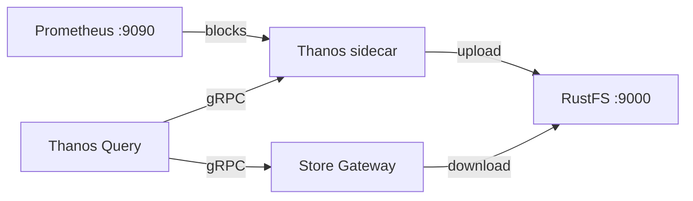
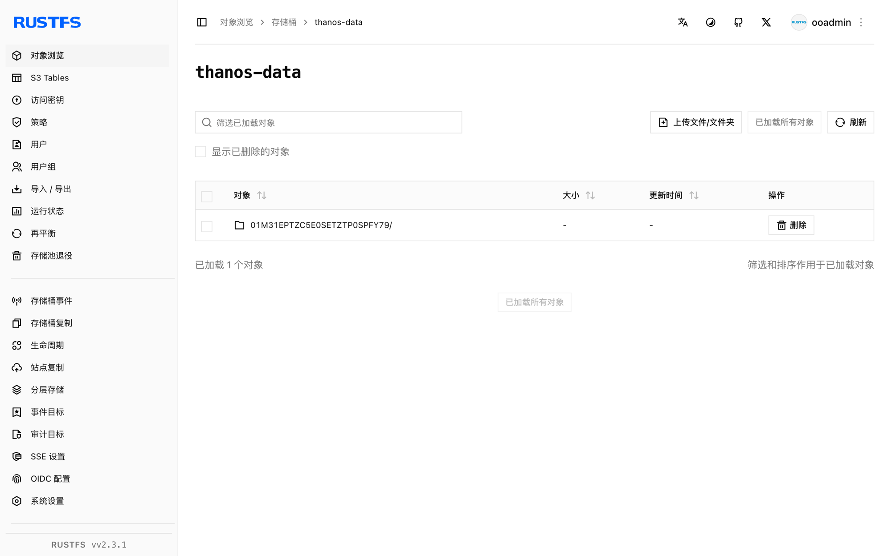

本指南将 [Thanos](https://github.com/thanos-io/thanos)——具备长期存储的高可用 Prometheus 方案——连接到 **RustFS** 作为其对象存储。你将运行带 Thanos sidecar 的 Prometheus，sidecar 会把 TSDB 块上传到 RustFS，然后通过 Store Gateway 和 Query 前端把历史数据查询回来。整个流程使用 `thanosio/thanos:v0.37.2`、`prom/prometheus:v2.53.1` 和 `rustfs/rustfs-x86-musl:v2.3.1` 验证通过。

你需要安装带有 Compose 插件的 Docker。本部署用于本地集成测试，不适用于生产环境。

## 架构



sidecar 监视 Prometheus 的 TSDB 目录，并把每个两小时的块上传到 RustFS 的 `thanos-data` 存储桶。Store Gateway 读取同一存储桶并回答针对历史块的查询，Query 因此既能通过 sidecar 解析实时数据，也能通过 Store Gateway 解析旧数据。

## 1. 创建项目文件

创建工作目录：

```bash
mkdir rustfs-thanos
cd rustfs-thanos
```

创建环境文件，并替换两个凭证占位符：

```ini title=".env"
RUSTFS_ACCESS_KEY=<your-access-key>
RUSTFS_SECRET_KEY=<your-secret-key>
```

请为 `thanos-data` 存储桶使用专用凭证。不要将 `.env` 提交到版本控制。

创建 Prometheus 配置，并设置外部标签——Thanos 依赖它对块去重：

```yaml title="prometheus.yml"
global:
  scrape_interval: 5s
  external_labels:
    monitor: rustfs-demo

scrape_configs:
  - job_name: prometheus
    static_configs:
      - targets: ["localhost:9090"]
  - job_name: rustfs
    metrics_path: /metrics
    static_configs:
      - targets: ["rustfs:9000"]
```

创建 Thanos 对象存储配置：

```yaml title="bucket.yml"
type: S3
config:
  bucket: thanos-data
  endpoint: rustfs:9000
  access_key: ${RUSTFS_ACCESS_KEY}
  secret_key: ${RUSTFS_SECRET_KEY}
  insecure: true
```

Thanos 自身不会解析 `.env` 文件。启动前，把占位符替换为与 `.env` 相同的值：

```bash
sed -i.bak "s|\${RUSTFS_ACCESS_KEY}|$(grep RUSTFS_ACCESS_KEY .env | cut -d= -f2)|;s|\${RUSTFS_SECRET_KEY}|$(grep RUSTFS_SECRET_KEY .env | cut -d= -f2)|" bucket.yml
```

创建 Compose 文件：

```yaml title="compose.yaml"
services:
  rustfs:
    image: rustfs/rustfs-x86-musl:v2.3.1
    environment:
      RUSTFS_ACCESS_KEY: ${RUSTFS_ACCESS_KEY}
      RUSTFS_SECRET_KEY: ${RUSTFS_SECRET_KEY}
      RUSTFS_VOLUMES: /data
      RUSTFS_ADDRESS: ":9000"
      RUSTFS_CONSOLE_ADDRESS: ":9001"
      RUSTFS_CONSOLE_ENABLE: "true"
    volumes:
      - rustfs-data:/data
    ports:
      - "9000:9000"
      - "9001:9001"
    healthcheck:
      test: ["CMD", "curl", "-sf", "http://127.0.0.1:9000/health"]
      interval: 10s
      timeout: 5s
      retries: 6
      start_period: 10s
    networks:
      - thanos

  create-bucket:
    image: rustfs/rc:latest
    depends_on:
      rustfs:
        condition: service_healthy
    environment:
      RUSTFS_ACCESS_KEY: ${RUSTFS_ACCESS_KEY}
      RUSTFS_SECRET_KEY: ${RUSTFS_SECRET_KEY}
    entrypoint:
      - /bin/sh
      - -c
      - |
        /usr/bin/rc alias set rustfs http://rustfs:9000 "$${RUSTFS_ACCESS_KEY}" "$${RUSTFS_SECRET_KEY}"
        /usr/bin/rc mb --ignore-existing rustfs/thanos-data
    networks:
      - thanos

  prometheus:
    image: prom/prometheus:v2.53.1
    command:
      - --config.file=/etc/prometheus/prometheus.yml
      - --storage.tsdb.path=/prometheus
      - --storage.tsdb.min-block-duration=2h
      - --storage.tsdb.max-block-duration=2h
      - --web.enable-lifecycle
    volumes:
      - ./prometheus.yml:/etc/prometheus/prometheus.yml:ro
      - prom-data:/prometheus
    ports:
      - "9090:9090"
    networks:
      - thanos

  sidecar:
    image: thanosio/thanos:v0.37.2
    command:
      - sidecar
      - --tsdb.path=/prometheus
      - --prometheus.url=http://prometheus:9090
      - --objstore.config-file=/etc/thanos/bucket.yml
    volumes:
      - ./bucket.yml:/etc/thanos/bucket.yml:ro
      - prom-data:/prometheus
    depends_on:
      create-bucket:
        condition: service_completed_successfully
    networks:
      - thanos

  store:
    image: thanosio/thanos:v0.37.2
    command:
      - store
      - --objstore.config-file=/etc/thanos/bucket.yml
      - --data-dir=/data
    volumes:
      - ./bucket.yml:/etc/thanos/bucket.yml:ro
      - store-data:/data
    depends_on:
      create-bucket:
        condition: service_completed_successfully
    networks:
      - thanos

  query:
    image: thanosio/thanos:v0.37.2
    command:
      - query
      - --http-address=0.0.0.0:9090
      - --store=sidecar:10901
      - --store=store:10901
    ports:
      - "9091:9090"
    depends_on:
      - sidecar
      - store
    networks:
      - thanos

networks:
  thanos:

volumes:
  rustfs-data:
  prom-data:
  store-data:
```

`--storage.tsdb.min-block-duration` 和 `--storage.tsdb.max-block-duration` 两个参数用于禁用 Prometheus 压缩。如果 TSDB 会本地压缩块，sidecar 会拒绝上传，因为本地块将不再与已上传的块一致。

## 2. 校验并启动部署

启动容器前先解析 Compose 文件：

```bash
docker compose config
```

启动整个栈，等待 sidecar 报告就绪：

```bash
docker compose up -d
docker compose logs sidecar | grep -m1 "status=ready"
```

确认 sidecar 已读取 Prometheus 的外部标签：

```bash
docker compose logs sidecar | grep "external labels"
```

Thanos Query UI 在 `http://localhost:9091` 上提供服务，RustFS 控制台位于 `http://localhost:9001`。

## 3. 上传一个块到 RustFS

sidecar 会在 Prometheus 压缩出块时上传，压缩发生在两小时的块边界上。要立即生成一个块，可通过管理 API 对 TSDB 做快照——在禁用压缩的情况下，sidecar 会直接上传 head 块的快照：

```bash
curl -s -XPOST http://localhost:9090/api/v1/admin/tsdb/snapshot | head -c 200
```

等待上传完成，然后查看 Prometheus 内的 shipper 状态：

```bash
sleep 60
docker compose exec prometheus cat /prometheus/thanos.shipper.json
```

`uploaded` 列表中应出现一个块 ID：

```json
{
	"version": 1,
	"uploaded": [
		"01M31EPTZC5E0SETZTP0SPFY79"
	]
}
```

## 4. 从 RustFS 查询历史数据

Store Gateway 会周期性同步存储桶。确认它已下载刚上传的块：

```bash
docker compose logs store | grep "loaded new block"
```

通过 Query 前端在该块的时间范围内查询一条序列：

```bash
START=$(date -u -d '2 hours ago' +%s)
END=$(date -u +%s)
curl -s "http://localhost:9091/api/v1/query_range?query=up%7Bjob%3D%22prometheus%22%7D&start=$START&end=$END&step=30" | head -c 300
```

Store Gateway 用它从 RustFS 下载的块来响应请求，而 sidecar 负责实时的 head 数据——两条路径都经由同一个 Query 端点解析。

## 5. 在 RustFS 中验证对象

列出存储桶：

```bash
docker compose exec rustfs /usr/bin/rc ls local/thanos-data/ -r
```

每个块保存为三个对象——chunk 文件、index 和 `meta.json`：

```text
01M31EPTZC5E0SETZTP0SPFY79/chunks/000001
01M31EPTZC5E0SETZTP0SPFY79/index
01M31EPTZC5E0SETZTP0SPFY79/meta.json
```



## 6. 停止或重置部署

停止容器并保留所有数据：

```bash
docker compose down
```

RustFS 卷会保留已上传的块，重启后 Store Gateway 依然可以回答历史查询。若要删除包括 RustFS 中块在内的所有数据，请追加 `--volumes`。

## 故障排查

### sidecar 日志出现 `Compaction needs to be disabled`

Prometheus 必须以 `--storage.tsdb.min-block-duration` 等于 `--storage.tsdb.max-block-duration` 的方式运行——如 Compose 文件所示，两者都设为 `2h`。否则 sidecar 无法保证本地块保持不变，会拒绝上传。

### `The specified bucket does not exist`

Thanos 不会创建存储桶。检查 `create-bucket` 服务是否成功完成：

```bash
docker compose logs create-bucket
```

### 查询不到历史数据

确认 Store Gateway 至少加载了一个块（`docker compose logs store | grep "loaded new block"`），并且查询时间范围落在已上传块的窗口内——可在 RustFS 控制台中查看块的 `meta.json` 里的 `minTime` 和 `maxTime`。

## 后续步骤

- 在采用更多 Thanos 组件之前，请查阅 [S3 兼容性说明](/administration/protocols/s3)。
- 通过[访问密钥管理](/security-compliance/iam/access-token)创建专用的生产凭证。
- 按照 [Thanos 文档](https://thanos.io/tip/thanos/getting-started.md)添加 Compactor、Ruler 或 Receive，搭建生产拓扑。
