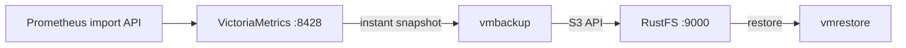
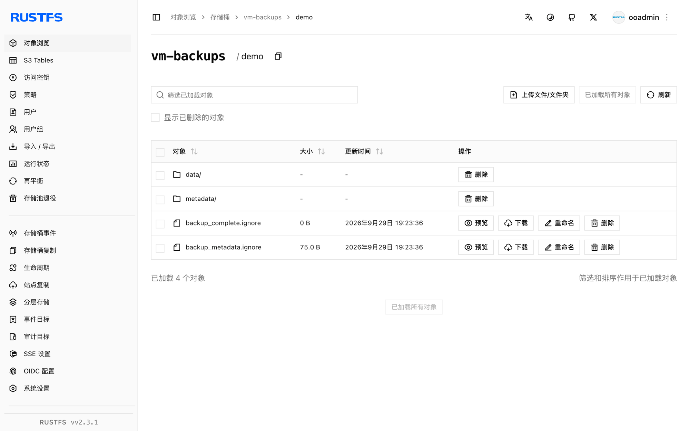

本指南将 Prometheus 兼容时序数据库 [VictoriaMetrics](https://github.com/VictoriaMetrics/VictoriaMetrics) 通过 `vmbackup` 与 `vmrestore` 连接到 **RustFS**。你将运行单节点实例、导入指标、创建即时快照、备份到 RustFS 桶，并把数据还原到全新目录。整个流程使用 `victoria-metrics`、`vmbackup` 与 `vmrestore` v1.x 镜像对 `rustfs/rustfs-x86-musl:v2.3.1` 验证通过。

你需要安装 Docker。本部署用于本地集成测试，不适用于生产环境。

## 架构



`vmbackup` 把存储目录在某一时间点的一致性快照上传到任意 S3 兼容端点。`vmrestore` 执行相反过程，产出一个 VictoriaMetrics 实例可通过 -storageDataPath 直接打开的数据目录。

## 1. 运行 VictoriaMetrics

创建桶并启动单节点实例：

```bash
rc mb rustfs/vm-backups

docker run -d --name vm --network oo-rustfs_default -p 8428:8428 \
  -v vm-data:/storage \
  victoriametrics/victoria-metrics:latest \
  -storageDataPath=/storage -retentionPeriod=100y
```

## 2. 导入指标

通过 Prometheus import API 写入两条样本：

```bash
echo "vm_demo_metric 123" | curl -s --data-binary @- http://localhost:8428/api/v1/import/prometheus
echo "vm_demo_metric 456" | curl -s --data-binary @- http://localhost:8428/api/v1/import/prometheus
```

该端点返回 `204 No Content`。确认数据可查：

```bash
curl -s "http://localhost:8428/api/v1/export?match[]=vm_demo_metric"
```

```text
{"metric":{"__name__":"vm_demo_metric"},"values":[123,456],"timestamps":[1790680894604,1790680894619]}
```

## 3. 创建快照

向 VictoriaMetrics 请求一致性快照：

```bash
curl -s http://localhost:8428/snapshot/create
```

```text
{"status":"ok","snapshot":"20260929112134-18D9C6C76704F913"}
```

## 4. 把快照备份到 RustFS

在同一个存储卷上运行 `vmbackup`，替换凭证占位符。快照名来自第 3 步：

```bash
docker run --rm --network oo-rustfs_default \
  -e AWS_ACCESS_KEY_ID=<your-access-key> \
  -e AWS_SECRET_ACCESS_KEY=<your-secret-key> \
  --volumes-from vm \
  victoriametrics/vmbackup:latest \
  -storageDataPath=/storage \
  -snapshotName=20260929112134-18D9C6C76704F913 \
  -dst=s3://vm-backups/demo \
  -customS3Endpoint=http://<your-rustfs-endpoint>:9000
```

```text
backup ... to S3{bucket: "vm-backups", dir: "demo/"} is complete; uploaded 760 bytes
```

`-customS3Endpoint` 把 AWS SDK 重定向到 RustFS；自定义端点自动使用路径风格寻址。在没有 EC2 元数据服务的主机上，建议同时设置 `AWS_EC2_METADATA_DISABLED=true`，避免凭证探测带来的延迟。

## 5. 验证与还原

列举桶内前缀：

```bash
rc ls rustfs/vm-backups/demo/
```

```text
backup_complete.ignore
backup_metadata.ignore
data/
metadata/
```

`backup_complete.ignore` 标记一次完整备份。把它还原到全新目录：

```bash
docker run --rm --network oo-rustfs_default \
  -e AWS_ACCESS_KEY_ID=<your-access-key> \
  -e AWS_SECRET_ACCESS_KEY=<your-secret-key> \
  -v /opt/vm-restore:/restore \
  victoriametrics/vmrestore:latest \
  -src=s3://vm-backups/demo \
  -storageDataPath=/restore \
  -customS3Endpoint=http://<your-rustfs-endpoint>:9000
```

```text
restored 760 bytes from backup in 0.055 seconds
```

还原出的目录包含 `data/`、`metadata/` 和锁文件——正是 VictoriaMetrics 实例在 `-storageDataPath` 处期望的内容。



## 6. 停止或重置

保留桶内对象、仅拆除演示环境：

```bash
docker rm -f vm
docker volume rm vm-data
```

删除已存储的备份：

```bash
rc rm rustfs/vm-backups/ --recursive --force
```

## 故障排查

### `vmbackup` 启动卡住或找不到凭证

缺少环境变量凭证时，AWS SDK 会探测 EC2 元数据服务。在没有 IMDS 的机器上，请在密钥变量之外导出 `AWS_EC2_METADATA_DISABLED=true`。

### 每次运行都重新上传全部备份分块

`vmbackup` 通过比对本地与远端文件的哈希做增量备份。还原到新目录后再从那里执行 `vmbackup` 会全量重传；增量运行请保留原始数据目录。

### 导入后立即查询不到数据

导入是异步接收的，繁忙的单节点上即时查询端点可能有短暂延迟。创建快照前先用 `/api/v1/export` 验证（或等几秒）。

## 下一步

- 在启用更多 VictoriaMetrics 组件前，先阅读 [S3 兼容性说明](/administration/protocols/s3)。
- 使用[访问密钥管理](/security-compliance/iam/access-token)创建专用的生产凭证。
- 按照 [vmbackup 文档](https://docs.victoriametrics.com/vmbackup/)安排备份计划并清理旧快照。
