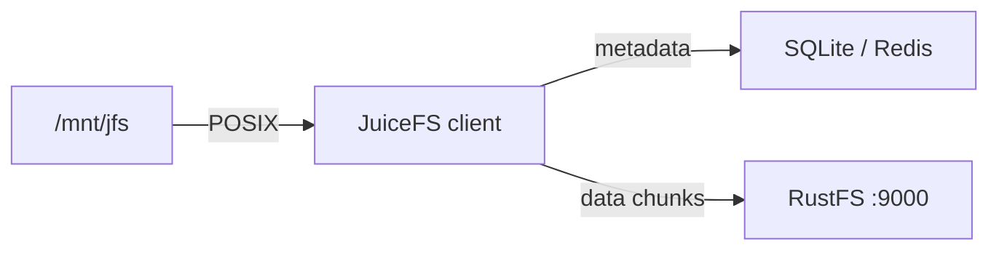
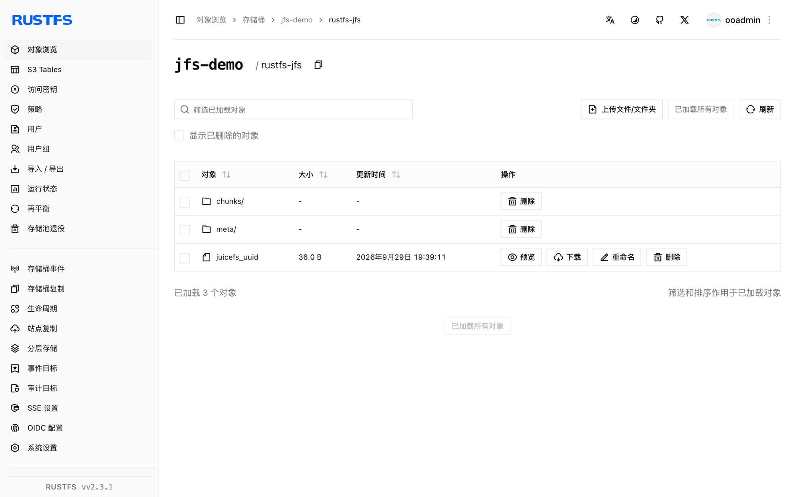

本指南将云原生分布式 POSIX 文件系统 [JuiceFS](https://github.com/juicedata/juicefs) 连接到 **RustFS** 作为其对象存储后端。你将格式化一个数据块存放在 RustFS 桶中的卷，挂载到本地，并通过挂载点读写文件。整个流程使用 `juicefs v1.3.1`（社区版，SQLite 元数据引擎）对 `rustfs/rustfs-x86-musl:v2.3.1` 验证通过。

你需要 JuiceFS 二进制、一个元数据引擎以及 FUSE（Linux 上为 `fuse3`）。本部署用于本地集成测试，不适用于生产环境。

## 架构



JuiceFS 把每个文件切成块，以对象的形式存放在桶内 `chunks/` 目录下，元数据引擎负责记录文件名、inode 与布局。文件系统表现得像本地磁盘，但不在本地保留任何数据。

## 1. 格式化卷

创建存储桶并格式化一个以 RustFS 为后端的 JuiceFS 卷，替换全部连接占位符。桶 URL 中内嵌的端点决定了使用路径风格寻址：

```bash
rc mb rustfs/jfs-demo

juicefs format \
  --storage s3 \
  --bucket http://<your-rustfs-endpoint>:9000/jfs-demo \
  --access-key <your-access-key> \
  --secret-key <your-secret-key> \
  sqlite3:///opt/juicefs/jfs.db \
  rustfs-jfs
```

```text
Data use s3://<your-rustfs-endpoint>:9000/jfs-demo/rustfs-jfs/
<STATUS> OK, rustfs-jfs is ready
```

`sqlite3:///opt/juicefs/jfs.db` 是本次测试的元数据引擎。生产环境请改用 Redis、MySQL 或 PostgreSQL，以便多个客户端挂载同一个卷。

## 2. 挂载卷

使用相同的元数据 URL 挂载文件系统：

```bash
mkdir -p /mnt/jfs
juicefs mount -d sqlite3:///opt/juicefs/jfs.db /mnt/jfs
```

```text
OK, rustfs-jfs is ready at /mnt/jfs
```

`-d` 表示后台运行。该卷现在就是一个 POSIX 文件系统。

## 3. 读写文件

像使用普通目录一样使用挂载点：

```bash
echo "hello rustfs jfs" > /mnt/jfs/hello.txt
dd if=/dev/urandom of=/mnt/jfs/blob.bin bs=1M count=3
mkdir -p /mnt/jfs/dir1 && echo nested > /mnt/jfs/dir1/nested.txt
cat /mnt/jfs/hello.txt
```

```text
hello rustfs jfs
```

用 `juicefs info` 查看卷的状态：

```text
/mnt/jfs :
  inode: 1
  files: 2
   dirs: 2
 length: 3.00 MiB
```

## 4. 验证 RustFS 中的数据块

列举桶内前缀：

```bash
rc ls rustfs/jfs-demo/ -r
```

每个文件都被切成了按内容寻址的块对象：

```text
rustfs-jfs/chunks/0/0/1_0_17
rustfs-jfs/chunks/0/0/3_0_3145728
rustfs-jfs/chunks/0/0/4_0_7
```

块名编码了 inode、块序号和大小——例如 `3_0_3145728` 就是第 3 步写入的 3 MiB 文件。



## 5. 停止或重置

卸载卷，然后可选地销毁卷元数据和桶内数据：

```bash
juicefs umount /mnt/jfs
juicefs destroy --force sqlite3:///opt/juicefs/jfs.db rustfs-jfs
rc rm rustfs/jfs-demo/ --recursive --force
```

## 故障排查

### `unknown option: --daemon`

后台运行的 flag 是短横线一个：`juicefs mount -d`。不带它运行则挂载保持在前台（便于调试）。

### `fusermount3: mount failed: Permission denied`

挂载需要 FUSE 设备。在容器内运行时加 `--device /dev/fuse --cap-add SYS_ADMIN`（或 `--privileged`）；在宿主机上安装 `fuse3` 并确认 `/dev/fuse` 存在。

### 挂载卡住或访问不到存储

客户端需要同时访问元数据引擎和桶端点。由于桶 URL 内嵌了端点，格式化之前先在挂载主机上用 `curl` 验证连通性。

## 下一步

- 在启用更多 JuiceFS 存储后端前，先阅读 [S3 兼容性说明](/administration/protocols/s3)。
- 使用[访问密钥管理](/security-compliance/iam/access-token)创建专用的生产凭证。
- 按照 [JuiceFS 文档](https://juicefs.com/docs/community/quick_start_guide/)把元数据引擎切换到 Redis，并从多个客户端挂载同一卷。
