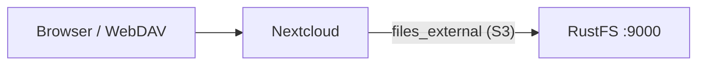
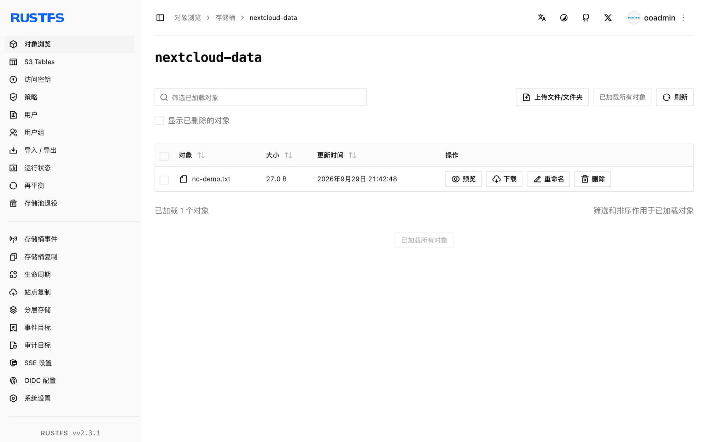

本指南将自托管内容协作平台 [Nextcloud](https://github.com/nextcloud/server) 通过其 External Storage 应用的 S3 后端连接到 **RustFS**。你将启用 `files_external`，把一个 RustFS 桶挂载到所有用户的文件视图中，并通过 WebDAV 上传一个直接落入桶内的文件。整个流程使用 `nextcloud:32.0.15`（SQLite，单容器）对 `rustfs/rustfs-x86-musl:v2.3.1` 验证通过。

你需要安装 Docker，或一个可以使用 `occ` 的现有 Nextcloud 实例。本部署用于本地集成测试，不适用于生产环境。

## 架构



Nextcloud 把挂载点上的文件操作代理到 S3 后端。对象按其在挂载内的相对路径存放，因此桶里的名称与用户看到的名称一致。

## 1. 安装 Nextcloud

带管理员账号运行 Nextcloud，并替换全部连接占位符。SQLite 让测试环境自成一体；生产环境请使用 MariaDB 或 PostgreSQL：

```bash
docker run -d --name nextcloud --network oo-rustfs_default -p 8080:80 \
  -e NEXTCLOUD_ADMIN_USER=<admin-user> \
  -e NEXTCLOUD_ADMIN_PASSWORD=<admin-password> \
  nextcloud:32.0.15
```

如果启动后网页仍显示安装向导，手动完成安装：

```bash
docker exec -u www-data nextcloud php occ maintenance:install \
  --admin-user <admin-user> --admin-password <admin-password>
```

## 2. 启用 External Storage 应用

`files_external` 应用随 Nextcloud 一起分发但默认未启用，其 `occ` 命令只有在应用启用后才存在：

```bash
docker exec -u www-data nextcloud php occ app:enable files_external
```

```text
files_external 1.24.1 enabled
```

## 3. 挂载 RustFS 桶

以后端类型 `amazons3`、认证后端 `amazons3::accesskey` 创建外部存储，并替换全部连接占位符：

```bash
docker exec -u www-data nextcloud php occ files_external:create \
  /rustfs amazons3 amazons3::accesskey \
  --user <admin-user> \
  --config bucket=<your-bucket> \
  --config hostname=<your-rustfs-endpoint> \
  --config port=9000 \
  --config use_ssl=false \
  --config use_path_style=true \
  --config key=<your-access-key> \
  --config secret=<your-secret-key>
```

```text
Storage created with id 1
```

挂载点 `/rustfs` 会出现在该用户的文件视图中。非 AWS 端点必须设置 `use_path_style=true`。使用前先检查连接：

```bash
docker exec -u www-data nextcloud php occ files_external:verify 1
```

```text
  - status: ok
  - code: 0
```

## 4. 上传文件并验证

通过 WebDAV 端点上传，写入会经由外部存储落盘：

```bash
echo "nextcloud writes to rustfs" > /tmp/nc-demo.txt

curl -u <admin-user>:<admin-password> \
  -T /tmp/nc-demo.txt \
  http://localhost:8080/remote.php/dav/files/<admin-user>/rustfs/nc-demo.txt \
  -o /dev/null -w "%{http_code}\n"
```

```text
201
```

回读该文件，然后确认 RustFS 中的对象：

```bash
rc ls rustfs/<your-bucket>/ -r
```

```text
[2026-09-29 13:42:48]       27 B nc-demo.txt
```

对象的键与挂载内的路径一致，因此通过 Nextcloud 上传的文件也可以被任何 S3 客户端直接读取。



## 5. 停止或重置

保留桶内对象、仅删除挂载：

```bash
docker exec -u www-data nextcloud php occ files_external:delete 1
```

删除桶内内容：

```bash
rc rm rustfs/<your-bucket>/ --recursive --force
```

## 故障排查

### `There are no commands defined in the "files_external" namespace`

应用尚未启用。先执行 `occ app:enable files_external`，之后 `occ files_external:*` 命令才会注册。

### `Not enough arguments (missing: "authentication_backend")`

`files_external:create` 需要分别传入存储后端与认证后端两个参数：`amazons3 amazons3::accesskey`。后端标识可通过 `occ files_external:backends` 查看。

### 挂载可见但为空，或上传失败

确认 Nextcloud 容器可以访问 `hostname`（使用容器网络名称，不要用 `localhost`）、`use_path_style` 为 `true`，且桶已存在。`occ files_external:verify <id>` 会给出具体的连接错误。

## 下一步

- 在启用更多外部存储后端前，先阅读 [S3 兼容性说明](/administration/protocols/s3)。
- 使用[访问密钥管理](/security-compliance/iam/access-token)创建专用的生产凭证。
- 按照 [Nextcloud 外部存储文档](https://docs.nextcloud.com/server/latest/admin_manual/configuration_files/external_storage_configuration_gui.html)把挂载共享给群组并启用版本管理。
