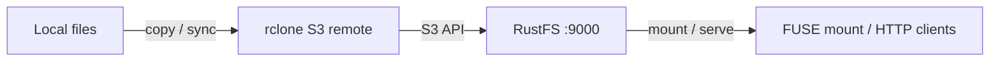

本指南将对象存储领域的命令行"瑞士军刀"[rclone](https://github.com/rclone/rclone) 通过其 S3 后端连接到 **RustFS**。你将为 RustFS 配置一个 S3 remote，复制并同步文件、回读对象、用 `rclone serve` 把桶发布为 HTTP 服务，并用 `rclone mount` 把桶挂载为本地文件系统。整个流程使用 `rclone v1.75.1` 对 `rustfs/rustfs-x86-musl:v2.3.1` 验证通过。

你需要安装 Docker，或本地 rclone 二进制。本部署用于本地集成测试，不适用于生产环境。

## 架构



一个 remote 定义即可驱动所有 rclone 命令：数据传输、挂载和发布都复用同一个 S3 连接。

## 1. 配置 remote

创建 rclone 配置文件，为 RustFS 定义一个 S3 remote，并替换全部连接占位符。`Other` provider 会关闭 AWS 特有行为，自定义端点自动使用路径风格寻址：

```ini title="rclone.conf"
[rustfs]
type = s3
provider = Other
access_key_id = <your-access-key>
secret_access_key = <your-secret-key>
endpoint = http://<your-rustfs-endpoint>:9000
region = us-east-1
```

## 2. 复制并读取对象

创建存储桶并用 `rclone copy` 上传目录：

```bash
rc mb rustfs/rclone-demo
rclone copy /data rustfs:rclone-demo/seed
```

列举并回读：

```bash
rclone ls rustfs:rclone-demo/seed
rclone cat rustfs:rclone-demo/seed/hello.txt
```

```text
  3145728 blob.bin
       18 hello.txt
hello from rclone
```

`rclone lsd rustfs:` 可以列出端点上的所有存储桶。

## 3. 同步目录

`rclone sync` 让目标与源完全一致，包括删除。删除一个本地文件后同步：

```bash
rm /data/hello.txt
rclone sync /data rustfs:rclone-demo/seed
rclone lsf rustfs:rclone-demo/seed
```

```text
blob.bin
```

`hello.txt` 从桶中消失。首次执行可先加 `--dry-run` 预览变更，不会触碰桶内数据。

## 4. 把桶发布为 HTTP 服务

把桶内容发布为 HTTP 文件服务：

```bash
rclone serve http --addr 0.0.0.0:8080 rustfs:rclone-demo/seed
```

任何 HTTP 客户端都能下载对象：

```bash
curl -s http://localhost:8080/blob.bin -o /dev/null -w "%{http_code} %{size_download} bytes\n"
```

```text
200 3145728 bytes
```

同一个 remote 还支持 `rclone serve` 的 WebDAV、SFTP 与 S3 端点。

## 5. 把桶挂载为文件系统

在有 FUSE 的环境中，把桶挂载到本地并像目录一样使用：

```bash
rclone mount rustfs:rclone-demo /mnt/rclone --daemon
ls /mnt/rclone/seed
echo test > /mnt/rclone/write-test.txt
cat /mnt/rclone/write-test.txt
```

通过挂载点写入的文件会以普通对象的形式出现在 RustFS 中：

```bash
rc ls rustfs/rclone-demo/ -r
```

```text
[2026-09-29 11:12:41]        5 B write-test.txt
```

使用完毕后执行 `fusermount -u /mnt/rclone` 卸载。

## 6. 停止或重置

rclone 不持有任何服务端状态。删除演示数据：

```bash
rclone purge rustfs:rclone-demo
```

## 故障排查

### `Access Denied` 或列表为空

确认 `endpoint` 带协议前缀，密钥对与 RustFS 访问密钥匹配。虽然 RustFS 会忽略 `region`，但 S3 签名需要该值；保持 `us-east-1` 即可。

### 挂载报 `fusermount3: mount failed: Permission denied`

挂载需要 FUSE 设备和提升的权限。在容器内运行时加 `--device /dev/fuse --cap-add SYS_ADMIN`——若挂载助手仍然失败，改用 `--privileged`。在宿主机上则确认已安装 `fuse3` 且 `/dev/fuse` 存在。

### 同步没有删除目标端的文件

`rclone copy` 从不删除。只有 `rclone sync`（或 `rclone delete`）会移除目标对象，且两者都可用 `--dry-run` 预览。

## 下一步

- 在启用更多 rclone 后端前，先阅读 [S3 兼容性说明](/administration/protocols/s3)。
- 使用[访问密钥管理](/security-compliance/iam/access-token)创建专用的生产凭证。
- 按照 [rclone S3 文档](https://rclone.org/s3/)了解 `--transfers`、带宽限制与 crypt 覆盖层等参数。
