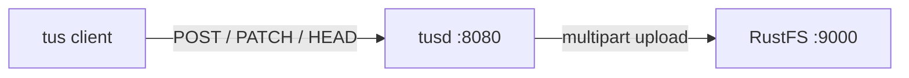
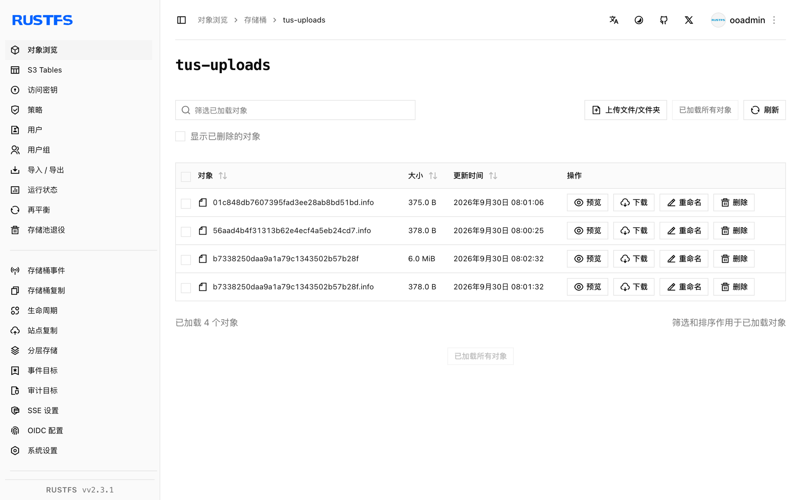

本指南将 tus 断点续传协议的官方参考实现 [tusd](https://github.com/tus/tusd) 连接到 **RustFS** 作为其 S3 存储后端。你将针对 RustFS 桶运行 tusd，用 tus 协议创建上传、分两片发送文件（中间故意中断）、从服务器上报的偏移量续传，并验证桶内组装好的对象。整个流程使用 `tusproject/tusd:v2.10.1` 对 `rustfs/rustfs-x86-musl:v2.3.1` 验证通过。

你需要安装 Docker，或本地 tusd 二进制。本部署用于本地集成测试，不适用于生产环境。

## 架构



tusd 把每个进行中的上传以 S3 分片上传的形式存入桶内。断线后的客户端用 `HEAD` 查询已提交的偏移量并从断点继续——已收到的数据永远不会重复传输。

## 1. 运行 tusd

创建桶并以 S3 后端启动 tusd，替换全部连接占位符。虽然 RustFS 会忽略 region，但 AWS 环境必须设置它：

```bash
rc mb rustfs/tus-uploads

docker run -d --name tusd --network oo-rustfs_default -p 8080:8080 \
  -e AWS_ACCESS_KEY_ID=<your-access-key> \
  -e AWS_SECRET_ACCESS_KEY=<your-secret-key> \
  -e AWS_REGION=us-east-1 \
  tusproject/tusd:latest \
  -s3-bucket tus-uploads \
  -s3-endpoint http://<your-rustfs-endpoint>:9000
```

检查服务健康：

```bash
curl -s -o /dev/null -w "%{http_code}\n" http://localhost:8080/health
```

```text
200
```

## 2. 创建上传

创建一个 6 MiB 的上传并读取 `Location` 头：

```bash
curl -s -D - -o /dev/null -X POST http://localhost:8080/files/ \
  -H "Upload-Length: 6291456" -H "Tus-Resumable: 1.0.0" \
  | grep -i "^Location:"
```

```text
Location: http://localhost:8080/files/b7338250daa9...+NGVmNDRhZjEt...
```

上传 URL 包含文件 ID 和消息认证标签。再次发送前要剥掉协议与主机部分（服务器回显收到的 `Host`，它未必是下一个客户端可达的地址）。

## 3. 分片上传并模拟中断

先发前 2.5 MB，然后停下——这正是移动客户端断网的位置：

```bash
head -c 2500000 demo.bin > part1.bin

curl -s -o /dev/null -w "%{http_code}\n" -X PATCH "http://localhost:8080${LOC}" \
  -H "Upload-Offset: 0" -H "Tus-Resumable: 1.0.0" \
  -H "Content-Type: application/offset+octet-stream" \
  --data-binary @part1.bin
```

```text
204
```

向服务器查询它实际收到了多少——这就是断点续传的核心：

```bash
curl -s -X HEAD "http://localhost:8080${LOC}" \
  -H "Tus-Resumable: 1.0.0" -D - -o /dev/null | grep -i upload-offset
```

```text
Upload-Offset: 2500000
```

## 4. 续传并完成

从偏移量 2500000 继续发送剩余字节：

```bash
tail -c 3791456 demo.bin > part2.bin

curl -s -o /dev/null -w "%{http_code}\n" -X PATCH "http://localhost:8080${LOC}" \
  -H "Upload-Offset: 2500000" -H "Tus-Resumable: 1.0.0" \
  -H "Content-Type: application/offset+octet-stream" \
  --data-binary @part2.bin
```

```text
204
```

通过 tusd 下载完成的文件，并与源文件比对校验和：

```bash
curl -s -o download.bin "http://localhost:8080${LOC}"
sha1sum demo.bin download.bin
```

```text
d9016032ced6c7515b67a0c556e006c4b25a5858  demo.bin
d9016032ced6c7515b67a0c556e006c4b25a5858  download.bin
```

## 5. 验证 RustFS 中的对象

列举桶：

```bash
rc ls rustfs/tus-uploads/ -r
```

桶内存放着组装完成的对象，以及每个上传各一个 `.info` 元数据文件——无论进行中还是已完成：

```text
b7338250daa9a1a79c1343502b57b28f       6 MiB
b7338250daa9a1a79c1343502b57b28f.info  378 B
```

对象键即上传 ID，对象内容与上传文件逐字节一致——因此任何 S3 客户端都能直接从桶中读取已完成的上传。



## 6. 停止或重置

保留桶内对象、仅拆除服务器：

```bash
docker rm -f tusd
```

删除已存储的上传：

```bash
rc rm rustfs/tus-uploads/ --recursive --force
```

## 故障排查

### `CreateMultipartUpload ... A region must be set when sending requests to S3`

tusd 从 AWS 环境构建 S3 客户端，端点解析必须提供 region。在凭证之外导出 `AWS_REGION=us-east-1`，如第 1 步所示。

### `PATCH` 返回 `404` 或连到了错误的主机

`Location` URL 回显的是创建请求的 `Host` 头。当客户端与服务器使用不同主机名（容器名对发布端口）时，应剥掉 URL 中的协议与主机，把路径发给客户端可达的地址。

### 服务器重启后上传消失了

S3 后端把 `.info` 文件保存在桶里，上传可以跨重启存活。如果有清理任务清空了桶，元数据就会丢失——请保护 `tus-uploads` 前缀不被清理任务触及。

## 下一步

- 在启用更多 tusd 后端前，先阅读 [S3 兼容性说明](/administration/protocols/s3)。
- 使用[访问密钥管理](/security-compliance/iam/access-token)创建专用的生产凭证。
- 按照 [tus 协议文档](https://tus.io/protocols/resumable-upload)了解 tusd 在核心协议之上支持的 creation-with-upload、termination 与 checksum 扩展。
