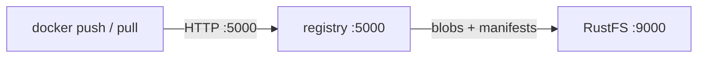
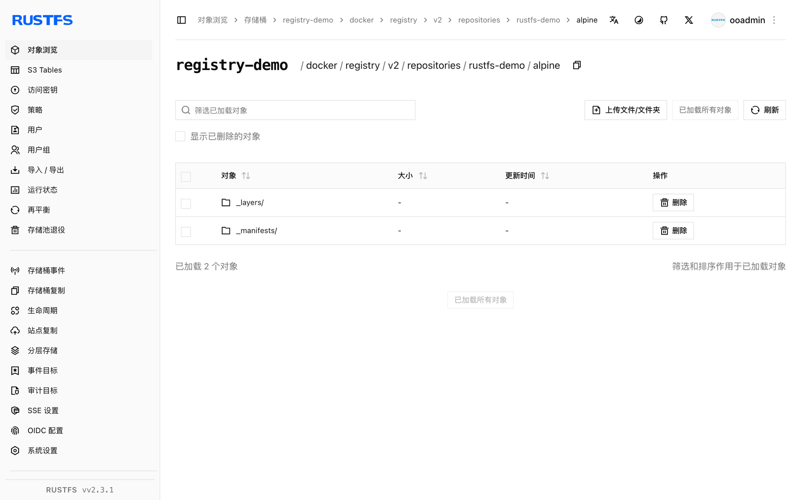

本指南将开源 [Docker Registry](https://github.com/distribution/distribution)（distribution）通过 S3 存储驱动连接到 **RustFS**。你将运行一个把所有层与清单存进 RustFS 桶的仓库，然后推送并拉取一个镜像。整个流程使用 `registry:2` 对 `rustfs/rustfs-x86-musl:v2.3.1` 验证通过。

你需要仓库所在主机上安装 Docker。

## 架构



仓库把每个 blob（层与配置）和清单作为对象存放在桶内 `docker/registry/v2/` 之下。容器本身无状态，多个仓库节点可以横向扩展并共享同一个桶。

## 1. 运行仓库

S3 驱动完全用环境变量配置。`REGISTRY_STORAGE_S3_REGIONENDPOINT` 把 AWS SDK 指向 RustFS：

```bash
docker run -d --name registry --network oo-rustfs_default -p 5000:5000 \
  -e REGISTRY_STORAGE=s3 \
  -e REGISTRY_STORAGE_S3_ACCESSKEY=<your-access-key> \
  -e REGISTRY_STORAGE_S3_SECRETKEY=<your-secret-key> \
  -e REGISTRY_STORAGE_S3_REGION=us-east-1 \
  -e REGISTRY_STORAGE_S3_BUCKET=registry-demo \
  -e REGISTRY_STORAGE_S3_REGIONENDPOINT=http://<your-rustfs-endpoint>:9000 \
  registry:2
```

确认 v2 API 已就绪：

```bash
curl -s -o /dev/null -w "%{http_code}\n" http://localhost:5000/v2/
```

```text
200
```

## 2. 推送镜像

给任意本地镜像打上仓库标签并推送：

```bash
docker pull alpine:3.20
docker tag alpine:3.20 localhost:5000/rustfs-demo/alpine:3.20
docker push localhost:5000/rustfs-demo/alpine:3.20
```

```text
3.20: digest: sha256:c64c687cbea9300178b30c95835354e34c4e4febc4badfe27102879de0483b5e
```

## 3. 验证 RustFS 中的对象

```bash
rc ls rustfs/registry-demo/docker/registry/v2/repositories/rustfs-demo/alpine/ -r | head -4
```

```text
_repositories/rustfs-demo/alpine/_layers/sha256/25f1d6b1.../link
_repositories/rustfs-demo/alpine/_manifests/revisions/sha256/c64c687c.../link
_repositories/rustfs-demo/alpine/_manifests/tags/3.20/current/link
```

每个 `_layers` 链接都指向同一桶内的 blob 对象——镜像数据本身就在 RustFS 中，而不在仓库主机上。



## 4. 拉回镜像

删除本地副本并从仓库拉取——层从 RustFS 回来：

```bash
docker rmi localhost:5000/rustfs-demo/alpine:3.20
docker pull localhost:5000/rustfs-demo/alpine:3.20
```

```text
3.20: Pulling from rustfs-demo/alpine
Digest: sha256:c64c687cbea9300178b30c95835354e34c4e4febc4badfe27102879de0483b5e
Status: Downloaded newer image for localhost:5000/rustfs-demo/alpine:3.20
```

## 5. 停止或重置

```bash
docker rm -f registry
rc rm rustfs/registry-demo/ --recursive --force
```

## 故障排查

### 推送失败且 digest 为 `unknown` 或空

确认设置了 `REGISTRY_STORAGE_S3_REGIONENDPOINT`——缺省时仓库会把请求发往真实的 AWS。同时检查桶已创建。

### 推送时报 `InvalidAccessKeyId`

访问密钥与秘密密钥必须通过 `REGISTRY_STORAGE_S3_ACCESSKEY` / `SECRETKEY` 传入；该驱动不读取 AWS 凭证环境链。

### 仓库重启后拉取报 `manifest unknown`

清单与 blob 都在桶里，重启不会丢失——检查两个仓库实例的 `REGISTRY_STORAGE_S3_BUCKET` 与 `REGIONENDPOINT` 是否一致。

## 下一步

- 需要在同一桶之上获得 UI、RBAC 或复制能力时，参考 [Harbor](/developer/integration/registry/harbor) 指南。
- 使用[访问密钥管理](/security-compliance/iam/access-token)创建专用的生产凭证。
- 按照 [distribution 文档](https://distribution.github.io/distribution/)了解存储驱动调优与代理缓存方案。
