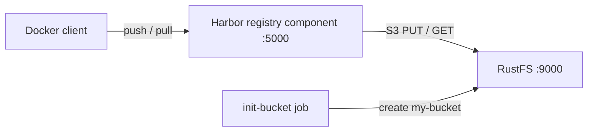
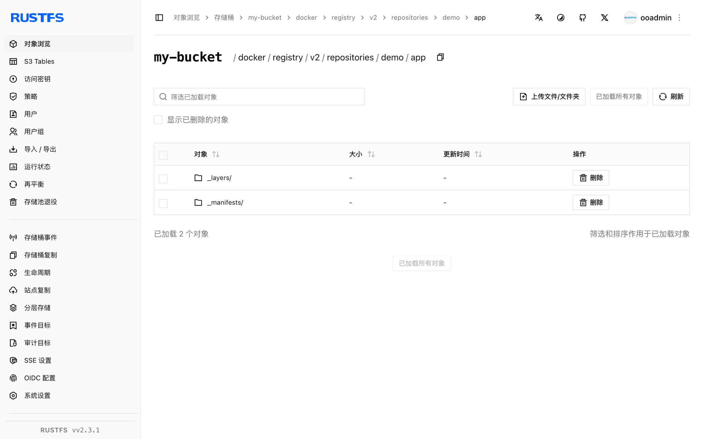

本指南将 [Harbor](https://github.com/goharbor/harbor)——CNCF 毕业的云原生镜像仓库——连接到 **RustFS**。Harbor 通过内嵌的 registry 组件持久化镜像层、清单和其他 OCI 制品，该组件实现了 [distribution](https://distribution.github.io/distribution/) 项目的 S3 存储驱动。你将使用 Docker Compose 让该 registry 组件对接 RustFS，推送一个镜像、拉回它，并在 RustFS 中验证这些对象。相同的存储设置同样适用于完整的 Harbor 部署。整个流程使用 `goharbor/registry-photon:v2.12.2` 和 `rustfs/rustfs-x86-musl:v2.3.1` 验证通过。

你需要安装带有 Compose 插件的 Docker。本部署用于本地集成测试，不适用于生产环境。

## 架构



registry 通过 S3 存储驱动，将所有 blob、清单和仓库链接存储在桶内 `docker/registry/v2/` 前缀之下。驱动设置 `regionendpoint`、`secure: false` 和 `skipverify: true` 将驱动使用的 AWS S3 客户端指向 RustFS 端点，采用纯 HTTP 上的 path-style 寻址。

## 1. 创建项目文件

创建工作目录：

```bash
mkdir rustfs-harbor
cd rustfs-harbor
```

创建环境变量文件，并替换两个凭证占位符：

```ini title=".env"
RUSTFS_ACCESS_KEY=<your-access-key>
RUSTFS_SECRET_KEY=<your-secret-key>
```

请为桶使用专用的凭证，不要将 `.env` 提交到版本控制。

创建 Harbor registry 组件所使用的 registry 配置：

```yaml title="config.yml"
version: 0.1
log:
  level: info
storage:
  s3:
    accesskey: <your-access-key>
    secretkey: <your-secret-key>
    region: us-east-1
    regionendpoint: http://rustfs:9000
    bucket: my-bucket
    secure: false
    skipverify: true
  delete:
    enabled: true
  redirect:
    disable: true
http:
  addr: 0.0.0.0:5000
health:
  storagedriver:
    enabled: true
    interval: 10s
    threshold: 3
```

`regionendpoint` 将驱动路由到 RustFS 而不是 AWS；`secure: false` 表示在 Compose 网络内使用纯 HTTP；`redirect.disable: true` 让 registry 自行提供 blob 数据——Harbor 对不支持重定向的后端也会设置同样的选项。

创建 Compose 文件：

```yaml title="compose.yaml"
services:
  rustfs:
    image: rustfs/rustfs-x86-musl:v2.3.1
    environment:
      RUSTFS_ACCESS_KEY: ${RUSTFS_ACCESS_KEY}
      RUSTFS_SECRET_KEY: ${RUSTFS_SECRET_KEY}
      RUSTFS_VOLUMES: /data
      RUSTFS_ADDRESS: ":9000"
      RUSTFS_CONSOLE_ADDRESS: ":9001"
      RUSTFS_CONSOLE_ENABLE: "true"
    volumes:
      - rustfs-data:/data
    ports:
      - "9000:9000"
      - "9001:9001"
    healthcheck:
      test: ["CMD", "curl", "-sf", "http://127.0.0.1:9000/health"]
      interval: 10s
      timeout: 5s
      retries: 6
      start_period: 10s
    networks:
      - registry

  create-bucket:
    image: rustfs/rc:latest
    depends_on:
      rustfs:
        condition: service_healthy
    environment:
      RUSTFS_ACCESS_KEY: ${RUSTFS_ACCESS_KEY}
      RUSTFS_SECRET_KEY: ${RUSTFS_SECRET_KEY}
    entrypoint:
      - /bin/sh
      - -c
      - |
        until /usr/bin/rc alias set rustfs http://rustfs:9000 "$${RUSTFS_ACCESS_KEY}" "$${RUSTFS_SECRET_KEY}"; do
          echo "Waiting for RustFS..."
          sleep 2
        done
        /usr/bin/rc ls rustfs/my-bucket >/dev/null 2>&1 || /usr/bin/rc mb rustfs/my-bucket
    networks:
      - registry

  registry:
    image: goharbor/registry-photon:v2.12.2
    volumes:
      - ./config.yml:/etc/registry/config.yml:ro
    ports:
      - "5000:5000"
    depends_on:
      create-bucket:
        condition: service_completed_successfully
    networks:
      - registry

networks:
  registry:

volumes:
  rustfs-data:
```

[`rc` 镜像](https://github.com/rustfs/cli)提供 RustFS 官方命令行客户端。初始化任务在创建前会先检查 `my-bucket` 是否存在，因此重复启动不会删除已有制品。

## 2. 启动部署

启动容器前先解析 Compose 文件：

```bash
docker compose config
```

启动服务并等待桶初始化任务完成：

```bash
docker compose up -d
docker compose ps -a
```

registry API 应返回空目录：

```bash
curl -s http://localhost:5000/v2/_catalog
```

```text
{"repositories":[]}
```

## 3. 推送镜像

拉取一个小镜像，为本地仓库重新打标签，然后推送：

```bash
docker pull busybox:latest
docker tag busybox:latest localhost:5000/demo/app:v1
docker push localhost:5000/demo/app:v1
```

```text
v1: digest: sha256:1cfa4e2b09e127b9c4ed43578d3f3c18e7d44ea47b9ea98475c0cbe9086525f8 size: 527
```

## 4. 拉回镜像

删除本地标签，再从仓库拉取镜像——层数据现在来自 RustFS：

```bash
docker rmi localhost:5000/demo/app:v1
docker pull localhost:5000/demo/app:v1
```

```text
localhost:5000/demo/app:v1
```

## 5. 在 RustFS 中验证对象

通过桶初始化镜像列出仓库前缀：

```bash
docker compose run --rm --entrypoint /bin/sh create-bucket -c \
  '/usr/bin/rc alias set rustfs http://rustfs:9000 "$RUSTFS_ACCESS_KEY" "$RUSTFS_SECRET_KEY" >/dev/null && /usr/bin/rc ls rustfs/my-bucket/docker/registry/v2/repositories/demo --recursive'
```

```text
[2026-09-20 12:11:25]       71 B docker/registry/v2/repositories/demo/app/_layers/sha256/b05093807bb0294152bb9cf86d64da722732dddaf7f8882fa1f120477dbc4db3/link
[2026-09-20 12:11:25]       71 B docker/registry/v2/repositories/demo/app/_layers/sha256/c6348fa86ba0fb2108c9334f5fe913ddc6d853313e655891f133a0127c30099f/link
[2026-09-20 12:11:25]       71 B docker/registry/v2/repositories/demo/app/_manifests/revisions/sha256/1cfa4e2b09e127b9c4ed43578d3f3c18e7d44ea47b9ea98475c0cbe9086525f8/link
[2026-09-20 12:11:25]       71 B docker/registry/v2/repositories/demo/app/_manifests/tags/v1/current/link
[2026-09-20 12:11:25]       71 B docker/registry/v2/repositories/demo/app/_manifests/tags/v1/index/sha256/1cfa4e2b09e127b9c4ed43578d3f3c18e7d44ea47b9ea98475c0cbe9086525f8/link
```

blob 数据本身存储在 `docker/registry/v2/blobs/` 之下。你也可以在 RustFS 控制台中浏览该前缀 (`http://localhost:9001/rustfs/console/`):



## 6. 在完整 Harbor 部署中使用 RustFS

上面验证的 registry 组件就是完整 Harbor 部署所运行的同一组件，因此存储设置可以直接沿用。

对于 Helm Chart，在 `persistence.imageChartStorage` 下设置 S3 选项：

```yaml title="values.yaml"
persistence:
  imageChartStorage:
    type: s3
    disableredirect: true
    s3:
      region: us-east-1
      bucket: my-bucket
      accesskey: <your-access-key>
      secretkey: <your-secret-key>
      regionendpoint: http://rustfs:9000
      secure: false
      skipverify: true
```

对于基于 `harbor.yml` 的安装器，将相同的驱动键放到 `storage_service.s3` 之下。两个文件都接受 [distribution 项目](https://distribution.github.io/distribution/about/configuration/)文档中描述的存储驱动选项，这也是本指南验证的配置面。

## 7. 停止或重置环境

停止容器并保留 RustFS 数据卷：

```bash
docker compose down
```

如需删除已存储的制品并从空的 RustFS 数据卷开始，请显式加上 `--volumes`：

```bash
docker compose down --volumes
```

## 故障排除

### registry 启动失败或报存储错误

查看 registry 日志中的 S3 驱动信息：

```bash
docker compose logs registry
```

`regionendpoint` 必须能被 registry 容器访问。Compose 网络内使用 `http://rustfs:9000`; 宿主机上的进程使用 `http://localhost:9000`.

### 纯 HTTP 端点出现 TLS 或证书错误

`secure: false` 表示 RustFS 端点使用纯 HTTP。不设置时驱动会尝试 HTTPS 并报连接或证书错误。对于自签名证书的 TLS 端点，保持 `secure: true`、设置 `skipverify: true`，并通过 Harbor 在 `harbor.yml` 中暴露的 `ca_bundle` 选项提供 CA 证书。

### 返回 AccessDenied 或 403 响应

确认 `config.yml` 中的凭证与 RustFS 凭证一致，并确认 `create-bucket` 任务已成功完成：

```bash
docker compose logs create-bucket
```

### 推送成功但对象没有出现在预期前缀

驱动会将数据写入桶内 `docker/registry/v2/` 之下。请先递归列出整个桶定位仓库目录树，再判断是否存在配置问题。

## 后续步骤

- 在采用其他 S3 操作前，请查看 [S3 兼容性说明](/administration/protocols/s3)。
- 通过[访问密钥管理](/security-compliance/iam/access-token)创建专用的生产凭证。
- 按照 [Harbor 文档](https://goharbor.io/docs/)配置带副本同步、漏洞扫描和 RBAC 的完整 Harbor 部署。
