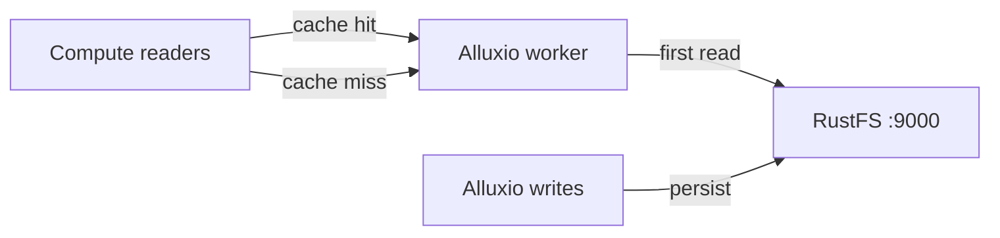
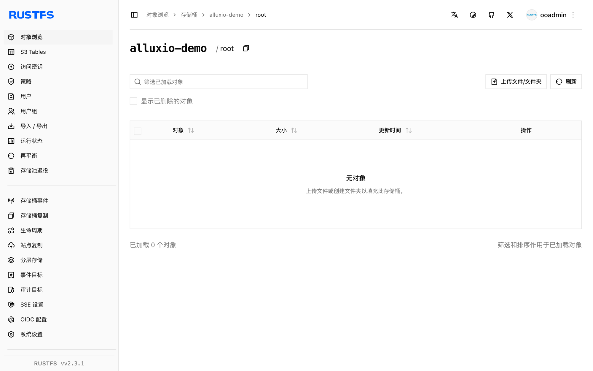

本指南将分布式数据编排层 [Alluxio](https://github.com/Alluxio/alluxio) 连接到 **RustFS** 作为其底层文件系统（UFS）。你将以 Docker 运行独立模式的 Alluxio 集群、挂载 RustFS 桶、经缓存读取对象，并把文件经 Alluxio 写回桶内。整个流程使用 Alluxio 2.9.4 对 `rustfs/rustfs-x86-musl:v2.3.1` 验证通过。

你需要支持 `--shm-size 2g` 的 Docker（worker 使用 tmpfs 内存盘）。

## 架构



读过的对象缓存在 worker 的内存盘中；重复读取直接由内存服务。经 Alluxio 的写入会作为普通对象落入桶内。

## 1. 运行 master 与 worker

独立镜像每次只启动一个进程。先启动 master，再启动 worker：

```bash
docker run -d --name alluxio-master --hostname alluxio --network oo-rustfs_default \
  -p 19998:19998 -p 19999:19999 --shm-size 2g \
  -e ALLUXIO_JAVA_OPTS="-Dalluxio.master.hostname=alluxio -Dalluxio.worker.ramdisk.size=1G" \
  alluxio/alluxio:2.9.4 master

docker exec alluxio /entrypoint.sh worker &
```

```text
Capacity information for all workers:
    Total Capacity: 1024.00MB
```

若 worker 立即退出并报 `tmpfs is smaller than the configured size`，说明容器启动时没加 `--shm-size`。

## 2. 挂载 RustFS 桶

凭证选项必须使用完整的 `alluxio.underfs.s3.*` 键名——短的 `s3a.*` 或 `aws.*` 键 CLI 会接受，但 UFS 客户端会忽略：

```bash
docker exec alluxio alluxio fs mount \
  --option alluxio.underfs.s3.accessKeyId=<your-access-key> \
  --option alluxio.underfs.s3.secretKey=<your-secret-key> \
  --option alluxio.underfs.s3.endpoint=http://<your-rustfs-endpoint>:9000 \
  --option alluxio.underfs.s3.disable.dns.buckets=true \
  --option alluxio.underfs.s3.path.style.access=true \
  /rustfs s3://alluxio-demo/
```

```text
Mounted s3://alluxio-demo/ at /rustfs
```

`disable.dns.buckets` 强制路径风格寻址，IP 形式的端点必须要它。

## 3. 经缓存读取

列举挂载点并读取一个预置对象：

```bash
docker exec alluxio alluxio fs ls /rustfs
docker exec alluxio alluxio fs cat /rustfs/rustfs-test.txt
```

```text
-rw-r--r--  rustfs  rustfs   15  PERSISTED ... /rustfs/rustfs-test.txt
hello from s3fs
```

`PERSISTED` 表示事实来源在 RustFS；worker 在首次读取后缓存数据块。

## 4. 经 Alluxio 写入

把本地文件拷入挂载点：

```bash
echo "written via alluxio cache to rustfs" > /tmp/rt.txt
docker cp /tmp/rt.txt alluxio:/tmp/rt.txt
docker exec alluxio alluxio fs copyFromLocal /tmp/rt.txt /rustfs/alluxio-write.txt
```

```text
Copied 'file:///tmp/rt.txt' to '/rustfs/alluxio-write.txt'
```

验证 RustFS 中的对象：

```bash
rc ls rustfs/alluxio-demo/
rc cat rustfs/alluxio-demo/alluxio-write.txt
```

```text
[2026-10-07 04:07:25]       36 B alluxio-write.txt
[2026-10-07 04:01:01]       15 B rustfs-test.txt
written via alluxio cache to rustfs
```



## 5. 停止或重置

```bash
docker exec alluxio alluxio fs unmount /rustfs
docker rm -f alluxio
rc rm rustfs/alluxio-demo/ --recursive --force
```

## 故障排查

### worker 报 `tmpfs is smaller than the configured size` 后退出

worker 把内存盘放在 `/dev/shm`，Docker 默认只给 64MB。用 `--shm-size 2g` 启动容器，或调低 `alluxio.worker.ramdisk.size`。

### 挂载成功但 `fs ls` 返回 `InvalidAccessKeyId`

挂载选项用了短键名（`s3a.*`、`aws.*`）。Alluxio 的 UFS 客户端只认第 2 步展示的完整 `alluxio.underfs.s3.*` 键。

### 报 `S3 client v2 does not support global bucket access`

路径风格寻址未开启。加 `--option alluxio.underfs.s3.disable.dns.buckets=true`——IP 形式的 RustFS 端点必须要它。

## 下一步

- 在启用更多 Alluxio UFS 类型前，先阅读 [S3 兼容性说明](/administration/protocols/s3)。
- 使用[访问密钥管理](/security-compliance/iam/access-token)创建专用的生产凭证。
- 按照 [Alluxio 文档](https://docs.alluxio.io/os/user/stable/ufs/S3.html)在同一桶之上配置缓存策略、TTL 与多层存储。
