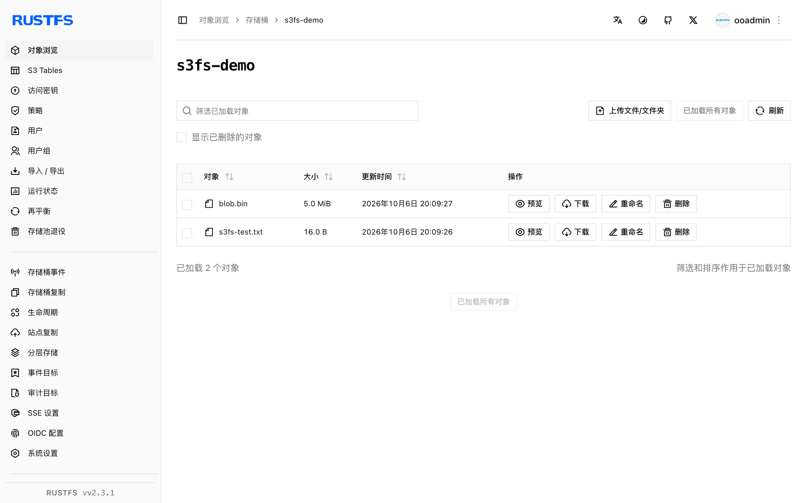

本指南将基于 FUSE 的 S3 文件系统 [s3fs-fuse](https://github.com/s3fs-fuse/s3fs-fuse) 连接到 **RustFS**。你将把一个桶挂载为本地目录、经挂载点写入文件、卸载后重挂，并确认对象持久保存在桶内。整个流程使用 s3fs v1.93 在 Ubuntu 24.04 上对 `rustfs/rustfs-x86-musl:v2.3.1` 验证通过。

你需要一台装有 FUSE（`fuse3` 包）与 `s3fs` 二进制的 Linux 主机。

## 架构


挂载点下创建的每个文件都会成为桶内对象，键即其相对路径——一层简单的 1:1 映射，没有缓存层。

## 1. 安装

```bash
apt-get install -y s3fs
s3fs --version
```

```text
Amazon Simple Storage Service File System V1.93 ...
```

## 2. 保存凭证

把访问密钥与秘密密钥写入 s3fs 要求的密码文件：

```bash
echo "<your-access-key>:<your-secret-key>" > ~/.passwd-s3fs
chmod 600 ~/.passwd-s3fs
```

## 3. 挂载桶

```bash
mkdir -p /mnt/s3fs-demo
s3fs s3fs-demo /mnt/s3fs-demo \
  -o passwd_file=~/.passwd-s3fs \
  -o url=http://<your-rustfs-endpoint>:9000 \
  -o endpoint=us-east-1 \
  -o use_path_request_style \
  -o allow_other -o umask=000
```

`use_path_request_style` 选择路径风格寻址，RustFS 即以此方式服务。`allow_other` 允许非 root 用户读取挂载点。

## 4. 读写文件

```bash
echo "hello from s3fs" > /mnt/s3fs-demo/s3fs-test.txt
dd if=/dev/urandom of=/mnt/s3fs-demo/blob.bin bs=1M count=5
cat /mnt/s3fs-demo/s3fs-test.txt
```

```text
hello from s3fs
```

## 5. 验证对象与持久化

卸载后重挂——对象持久保存在桶内：

```bash
fusermount -u /mnt/s3fs-demo
s3fs s3fs-demo /mnt/s3fs-demo -o passwd_file=~/.passwd-s3fs \
  -o url=http://<your-rustfs-endpoint>:9000 -o endpoint=us-east-1 \
  -o use_path_request_style
ls /mnt/s3fs-demo/
```

```text
blob.bin  s3fs-test.txt
```

从 S3 侧列举桶，看到同样的对象：

```bash
rc ls rustfs/s3fs-demo/
```

```text
[2026-10-06 12:09:27]      5 MiB blob.bin
[2026-10-06 12:09:26]       16 B s3fs-test.txt
```



## 6. 停止或重置

```bash
fusermount -u /mnt/s3fs-demo
rc rm rustfs/s3fs-demo/ --recursive --force
```

## 故障排查

### 容器内报 `fuse: device not found`

给 `docker run` 加 `--device /dev/fuse --cap-add SYS_ADMIN`，挂载助手仍失败时用 `--privileged`。

### 其他用户读取挂载点报 `Permission denied`

s3fs 挂载默认仅挂载者可见。挂载时加 `-o allow_other -o umask=000`（或更严格的 umask）。

### 挂载成功但另一客户端列举为空

s3fs 没有跨挂载的元数据缓存，列表操作是最终一致的。几秒后重挂或重新列举即可。

## 下一步

- 在启用更多 FUSE 选项前，先阅读 [S3 兼容性说明](/administration/protocols/s3)。
- 使用[访问密钥管理](/security-compliance/iam/access-token)创建专用的生产凭证。
- 按照 [s3fs-fuse 文档](https://github.com/s3fs-fuse/s3fs-fuse/wiki/Fuse-Over-https)了解 `-o multipart`、`-o parallel_count` 等性能调优选项。
