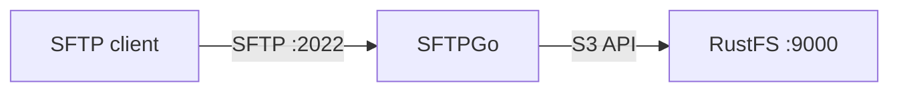
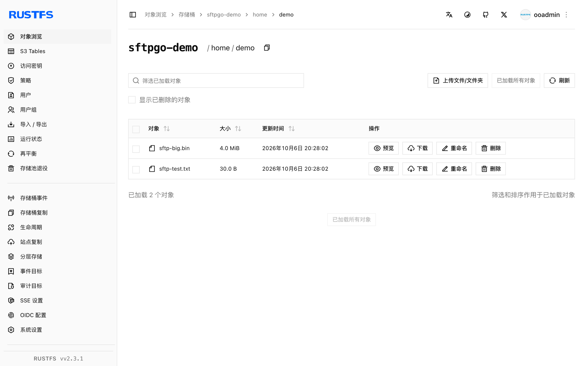

本指南将功能完备的 SFTP/WebDAV/FTP 服务器 [SFTPGo](https://github.com/drakkan/sftpgo) 连接到 **RustFS**，作为每用户的 S3 后端。你将创建一个 home 目录指向 RustFS 桶前缀的 SFTP 用户，通过 SFTP 上传文件，并验证桶内对象。整个流程使用 SFTPGo 2.7.6 对 `rustfs/rustfs-x86-musl:v2.3.1` 验证通过。

你需要 Docker 和 SFTP 客户端（OpenSSH 自带 `sftp`）。

## 架构



SFTPGo 把用户虚拟路径映射到桶前缀。经 SFTP 上传的文件会成为配置的 `key_prefix` 之下的对象——SFTPGo 主机上本身不存数据。

## 1. 运行 SFTPGo

```bash
docker run -d --name sftpgo --hostname sftpgo --network oo-rustfs_default \
  -p 2022:2022 -p 8080:8080 \
  -e SFTPGO_COMMON__TEMP_PATH=/tmp \
  drakkan/sftpgo:latest
```

`SFTPGO_COMMON__TEMP_PATH` 很关键：S3 后端的上传经由本地管道文件流转，默认临时路径可能不存在或不可写。

## 2. 创建管理员

镜像不会自动创建管理员。先打开一次 `http://localhost:8080/web/admin/setup` 提交表单，或用 curl 驱动：

```bash
FORM=$(curl -s -c /tmp/sg-cookie.txt http://localhost:8080/web/admin/setup)
FT=$(echo "$FORM" | grep -oE "name=\"_form_token\" value=\"[^\"]+\"" | sed "s/.*value=\"//;s/\"//")
curl -s -b /tmp/sg-cookie.txt -X POST http://localhost:8080/web/admin/setup \
  --data-urlencode "username=admin" \
  --data-urlencode "password=<admin-password>" \
  --data-urlencode "confirm_password=<admin-password>" \
  --data-urlencode "_form_token=$FT" \
  -o /dev/null -w "setup: %{http_code}\n"
```

```text
setup: 302
```

## 3. 创建 S3 后端用户

获取 API token 并创建用户。三个细节必须注意：`home_dir` 必须是容器内已存在的可写目录（用 `/tmp` 即可）、RustFS 必须设 `force_path_style` 为 `true`、`access_secret` 是 KMS 对象——秘密要放进 `{"status": "Plain", "payload": ...}`：

```json title="sftpgo-user.json"
{
  "username": "demo",
  "password": "<user-password>",
  "home_dir": "/tmp",
  "status": 1,
  "permissions": { "/": ["*"] },
  "filesystem": {
    "provider": 1,
    "s3config": {
      "bucket": "sftpgo-demo",
      "region": "us-east-1",
      "access_key": "<your-access-key>",
      "access_secret": { "status": "Plain", "payload": "<your-secret-key>" },
      "endpoint": "http://<your-rustfs-endpoint>:9000",
      "key_prefix": "home/demo/",
      "force_path_style": true
    }
  }
}
```

```bash
TOKEN=$(curl -s "http://localhost:8080/api/v2/token" -u "admin:<admin-password>" \
  | python3 -c "import json,sys; print(json.load(sys.stdin)['access_token'])")
curl -s -X POST http://localhost:8080/api/v2/users \
  -H "Authorization: Bearer $TOKEN" -H "Content-Type: application/json" \
  --data-binary @sftpgo-user.json -o /dev/null -w "create-user: %{http_code}\n"
```

```text
create-user: 201
```

## 4. 经 SFTP 上传并读取文件

```bash
printf "uploaded via sftpgo to rustfs\n" > /tmp/sftp-test.txt
printf "up1\n" > /tmp/sftp-batch.txt
echo "put /tmp/sftp-test.txt" >> /tmp/sftp-batch.txt
echo "ls" >> /tmp/sftp-batch.txt

sshpass -p <user-password> sftp \
  -o StrictHostKeyChecking=no -o UserKnownHostsFile=/dev/null -P 2022 \
  demo@localhost < /tmp/sftp-batch.txt
```

```text
sftp> put /tmp/sftp-test.txt
Uploading /tmp/sftp-test.txt to /sftp-test.txt
sftp> ls
sftp-big.bin    sftp-test.txt
```

## 5. 验证 RustFS 中的对象

```bash
rc ls rustfs/sftpgo-demo/home/demo/ -r
rc cat rustfs/sftpgo-demo/home/demo/sftp-test.txt
```

```text
[2026-10-06 12:28:02]      4 MiB home/demo/sftp-big.bin
[2026-10-06 12:28:02]       30 B home/demo/sftp-test.txt
uploaded via sftpgo to rustfs
```

对象键即 `key_prefix` 之下的用户虚拟路径——一层干净的映射。



## 6. 停止或重置

```bash
docker rm -f sftpgo
rc rm rustfs/sftpgo-demo/ --recursive --force
```

## 故障排查

### 上传时报 `create resource error` / `InvalidAccessKeyId`

按顺序检查三项：`force_path_style` 必须为 `true`（SFTPGo 的 AWS SDK 默认虚拟主机寻址，IP 端点会失败）、`access_secret` 必须使用 KMS 对象形式、`home_dir` 必须指向可写目录（SFTPGo 经它流转 S3 上传）。

### `unknown command init` / 管理员登录被拒

管理员账号只有在 web 安装表单提交一次后才存在。重复第 2 步，不要复用旧的浏览器 cookie。

### token 调用对 API 返回 `405 Method Not allowed`

token 端点只接受带基本认证的 `GET`：`GET /api/v2/token`。

## 下一步

- 在启用更多 SFTPGo 后端前，先阅读 [S3 兼容性说明](/administration/protocols/s3)。
- 使用[访问密钥管理](/security-compliance/iam/access-token)创建专用的生产凭证。
- 按照 [SFTPGo 文档](https://github.com/drakkan/sftpgo/blob/main/README.md)在同一桶之上添加 WebDAV/FTP 监听、每用户配额与双因素认证。
