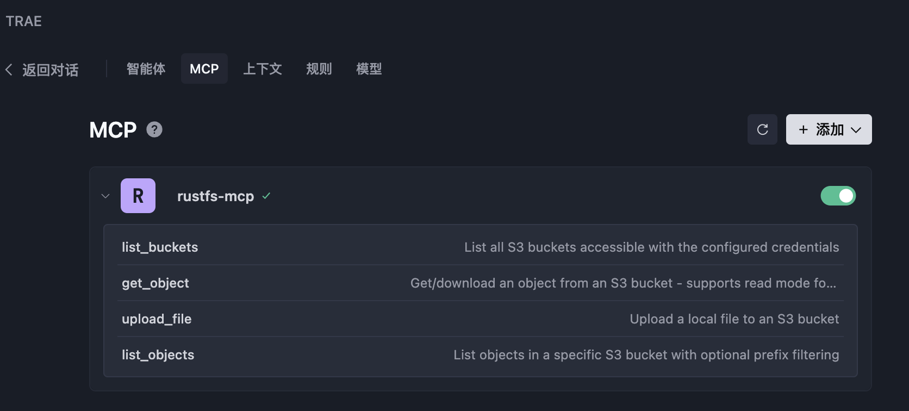
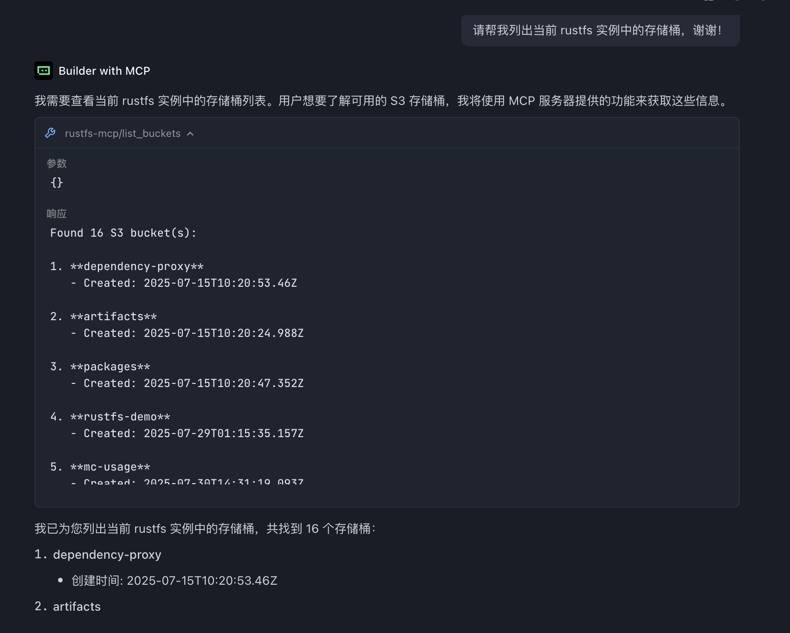

**RustFS MCP Server** 是一个高性能 [Model Context Protocol (MCP)](https://www.anthropic.com/news/model-context-protocol) 服务器，可让 AI/LLM 工具无缝访问兼容 S3 的对象存储操作。它使用 Rust 构建以实现高性能和安全性，使 Claude Desktop 等 AI 助手能够通过标准化协议与云存储交互。

### 什么是 MCP？

Model Context Protocol 是一项开放标准，使 AI 应用程序能够与外部系统建立安全、可控的连接。此服务器充当 AI 工具与兼容 S3 的存储服务之间的桥梁，在保持安全性和可观测性的同时，提供对文件操作的结构化访问。

## ✨ 功能

### 支持的 S3 操作

- **列出存储桶**：列出所有可访问的 S3 存储桶。
- **列出对象**：浏览存储桶内容，支持可选的前缀筛选。
- **上传文件**：上传本地文件，并自动检测 MIME 类型和设置缓存控制。
- **获取对象**：从 S3 存储中获取对象，支持读取或下载模式。

## 🔧 安装

:::warning[构建说明可能已过时]

`rustfs-mcp` crate 已不再属于当前 `rustfs/rustfs` 主分支，因此以下构建命令可能无法用于新克隆的仓库。从源代码构建前，请在 [RustFS GitHub 组织](https://github.com/rustfs)中确认 MCP 服务器的当前位置。

:::

### 前置要求

- Rust 1.75+（用于从源代码构建）
- 已配置的 AWS 凭证（通过环境变量、AWS CLI 或 IAM 角色）
- 能够访问兼容 S3 的存储服务

### 从源代码构建

```bash
# Clone the repository
git clone https://github.com/rustfs/rustfs.git
cd rustfs

# Build the MCP server
cargo build --release -p rustfs-mcp

# Binary will be available at
./target/release/rustfs-mcp
```

## ⚙️ 配置

### 环境变量

```bash
# AWS credentials (required)
export AWS_ACCESS_KEY_ID=your_access_key
export AWS_SECRET_ACCESS_KEY=your_secret_key
export AWS_REGION=us-east-1  # optional, defaults to us-east-1

# Optional: Custom S3 endpoint (for MinIO, etc.)
export AWS_ENDPOINT_URL=http://localhost:9000

# Log level (optional)
export RUST_LOG=info
```

### 命令行选项

```bash
rustfs-mcp --help
```

服务器支持多种命令行选项来自定义行为：

- `--access-key-id`：用于 S3 身份验证的 AWS 访问密钥 ID
- `--secret-access-key`：用于 S3 身份验证的 AWS 私有访问密钥
- `--region`：S3 操作使用的 AWS 区域（默认值：us-east-1）
- `--endpoint-url`：自定义 S3 端点 URL（用于 MinIO、LocalStack 等）
- `--log-level`：日志级别配置（默认值：rustfs_mcp_server=info）

## 🚀 使用

### 启动服务器

```bash
# Start the MCP server
rustfs-mcp

# Or with custom options
rustfs-mcp --log-level debug --region us-west-2
```

### 与聊天客户端集成

#### 选项 1：使用命令行参数

```json
{
  "mcpServers": {
    "rustfs-mcp": {
      "command": "/path/to/rustfs-mcp",
      "args": [
        "--access-key-id", "your_access_key",
        "--secret-access-key", "your_secret_key",
        "--region", "us-west-2",
        "--log-level", "info"
      ]
    }
  }
}
```

#### 选项 2：使用环境变量

```json
{
  "mcpServers": {
    "rustfs-mcp": {
      "command": "/path/to/rustfs-mcp",
      "env": {
        "AWS_ACCESS_KEY_ID": "your_access_key",
        "AWS_SECRET_ACCESS_KEY": "your_secret_key",
        "AWS_REGION": "us-east-1"
      }
    }
  }
}
```

### 使用 Docker

[RustFS MCP 官方提供了 Dockerfile](https://github.com/rustfs/rustfs/tree/main/crates/mcp)，可用于构建使用 RustFS MCP 的容器镜像。

```bash
# Clone RustFS repository code
git clone https://github.com/rustfs/rustfs.git

# Build Docker image
docker build -f crates/mcp/Dockerfile -t rustfs/rustfs-mcp .
```

构建成功后，你可以在 AI IDE 的 MCP 配置中进行配置。

#### 在 AI IDE 中配置 MCP

目前 Cursor、Windsurf、Trae 等主流 AI IDE 均支持 MCP。例如，在 Trae 中，将以下内容添加到 MCP 配置（**MCP --> Add**）：

```json
{
  "mcpServers": {
    "rustfs-mcp": {
      "command": "docker",
      "args": [
        "run",
        "--rm",
        "-i",
        "-e",
        "AWS_ACCESS_KEY_ID",
        "-e",
        "AWS_SECRET_ACCESS_KEY",
        "-e",
        "AWS_REGION",
        "-e",
        "AWS_ENDPOINT_URL",
        "rustfs/rustfs-mcp"
      ],
      "env": {
        "AWS_ACCESS_KEY_ID": "rustfs_access_key",
        "AWS_SECRET_ACCESS_KEY": "rustfs_secret_key",
        "AWS_REGION": "us-east-1",
        "AWS_ENDPOINT_URL": "rustfs_instance_url"
      }
    }
  }
}
```

> `AWS_ACCESS_KEY_ID` 和 `AWS_SECRET_ACCESS_KEY` 是 RustFS 访问密钥。你可以参考[访问密钥管理章节](../security-compliance/iam/access-token.md)进行创建。

添加成功后，你可以在 MCP 配置页面列出[可用工具](#️-available-tools)。



在 Trae 中，你可以通过输入相应的提示词使用对应工具。例如，在 Trae 的聊天对话框中输入：

```text
Please help me list the buckets in the current rustfs instance, thank you!
```

将返回以下响应：



Trae 使用 **Builder with MCP** 模式，调用 `list_buckets` 工具列出已配置 RustFS 实例中的所有存储桶。调用其他工具时同样如此。

## 🛠️ 可用工具

MCP 服务器公开以下工具供 AI 助手使用：

### `list_buckets`

列出使用已配置凭证可访问的所有 S3 存储桶。

**参数**：无

### `list_objects`

列出 S3 存储桶中的对象，支持可选的前缀筛选。

**参数**：

- `bucket_name`（字符串）：S3 存储桶名称
- `prefix`（字符串，可选）：用于筛选对象的前缀

### `upload_file`

将本地文件上传到 S3，并自动检测 MIME 类型。

**参数**：

- `local_file_path`（字符串）：本地文件路径
- `bucket_name`（字符串）：目标 S3 存储桶
- `object_key`（字符串）：S3 对象键（目标路径）
- `content_type`（字符串，可选）：内容类型（未提供时自动检测）
- `storage_class`（字符串，可选）：S3 存储类别
- `cache_control`（字符串，可选）：缓存控制标头

### `get_object`

使用两种操作模式从 S3 获取对象：直接读取内容或下载到文件。

**参数**：

- `bucket_name`（字符串）：源 S3 存储桶
- `object_key`（字符串）：S3 对象键
- `version_id`（字符串，可选）：版本化对象的版本 ID
- `mode`（字符串，可选）：操作模式，"read"（默认）直接返回内容，"download" 保存到本地文件
- `local_path`（字符串，可选）：本地文件路径（当 mode 为 "download" 时必填）
- `max_content_size`（数字，可选）：读取模式下的最大内容大小，以字节为单位（默认值：1MB）

### `create_bucket`

创建新的 RustFS 存储桶。

**参数**：

- `bucket_name`（字符串）：要创建的存储桶名称。

### `delete_bucket`

删除指定的 RustFS 存储桶。

**参数**：

- `bucket_name`（字符串）：要删除的存储桶名称。

## 架构

MCP 服务器采用模块化架构构建：

```text
rustfs-mcp/
├── src/
│   ├── main.rs          # Entry point, CLI parsing and server initialization
│   ├── server.rs        # MCP server implementation and tool handlers
│   ├── s3_client.rs     # S3 client wrapper with async operations
│   ├── config.rs        # Configuration management and CLI options
│   └── lib.rs           # Library exports and public API
└── Cargo.toml           # Dependencies, metadata and binary configuration
```