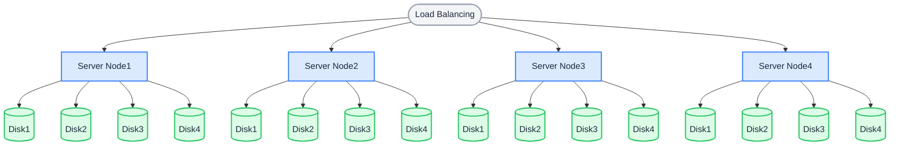

多节点多磁盘（MNMD）模式是生产工作负载的部署模式，可提供企业级性能、安全性和扩展能力。安全启动分布式对象存储集群至少需要 **4 台服务器**，每台服务器至少配备 1 块磁盘。

## 拓扑和规划

在以下架构中，请求通过负载均衡分发到服务器。采用默认的 12 + 4 纠删码布局时，每个对象会拆分为 12 个数据分片和 4 个校验分片，存储在不同服务器的不同磁盘上：

- 任意单台服务器发生故障或维护都不会影响数据安全。
- 最多 4 块磁盘损坏不会影响数据安全。



安装前，请审查[安装前检查清单](../requirement/checklists/index.md)，确保所有项目都符合生产指导要求。

## 主机名

创建 RustFS 集群需要**相同格式且连续**的主机名。可通过两种方式实现连续主机名：

**1. DNS 配置：**

配置 DNS 解析服务器以确保名称连续。

**2. HOSTS 配置：**

按如下方式修改 `/etc/hosts` 中的本地别名设置：

```bash title="/etc/hosts"
vim /etc/hosts
127.0.0.1 localhost localhost.localdomain localhost4 localhost4.localdomain4
::1 localhost localhost.localdomain localhost6 localhost6.localdomain6
192.168.1.1 node1
192.168.1.2 node2
192.168.1.3 node3
192.168.1.4 node4
```

## 前提条件和服务设置

在**每个节点**上完成[通用前提条件和服务设置](./prerequisites-and-service.md)，包括操作系统、防火墙、时间同步、磁盘格式化、服务用户、二进制文件下载和 systemd 单元，然后继续执行以下步骤。请确保所有节点使用相同的监听端口并保持时钟同步。

## 配置环境变量

1. 在每个节点上创建相同的配置文件。`RUSTFS_VOLUMES` 使用大括号展开枚举所有节点和所有磁盘挂载点（本例为 4 个节点 × 4 块磁盘）：

```ini title="/etc/default/rustfs"
# Use a unique access key and a strong, random secret (e.g. openssl rand -base64 24)
RUSTFS_ACCESS_KEY=<your-access-key>
RUSTFS_SECRET_KEY=<your-secret-key>
RUSTFS_VOLUMES="http://node{1...4}:9000/data/rustfs{0...3}"
RUSTFS_ADDRESS=":9000"
RUSTFS_CONSOLE_ENABLE=true
RUST_LOG=error
RUSTFS_OBS_LOG_DIRECTORY="/var/logs/rustfs/"
```

:::note

所有节点上的访问密钥、秘密密钥和 `RUSTFS_VOLUMES` 值必须完全相同。主机名（`node1` – `node4`）必须与上面的 DNS 或 `/etc/hosts` 配置一致。

:::

2. 在每个节点上创建存储和日志目录：

```bash
sudo mkdir -p /data/rustfs{0..3} /var/logs/rustfs /opt/tls
sudo chmod -R 750 /data/rustfs* /var/logs/rustfs
```

## 启动服务并验证

1. 在每个节点上启动服务并启用开机自启动：

```bash
sudo systemctl enable --now rustfs
```

2. 验证服务状态：

```bash
systemctl status rustfs
```

3. 检查服务端口：

```bash
netstat -ntpl
```

4. 查看日志文件：

```bash
tail -f /var/logs/rustfs/rustfs*.log
```

5. 访问控制台：在浏览器中输入任一节点的 IP 地址（或负载均衡器地址）和控制台端口（默认 9001）。你将看到：


## 后续步骤

- 在集群前部署负载均衡器，请参阅 [Nginx 集成指南](/developer/integration/reverse-proxy/nginx)。
- 为生产流量启用 TLS，请参阅 [TLS 配置](../../integration/tls-configured.md)。
- 扩容前请查看[存储池扩容](../../operations/scaling/storage-pool-expansion.md)。