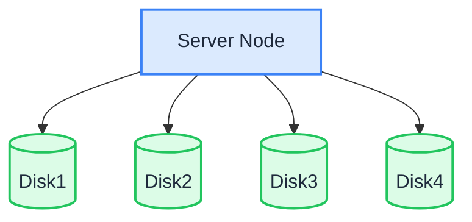
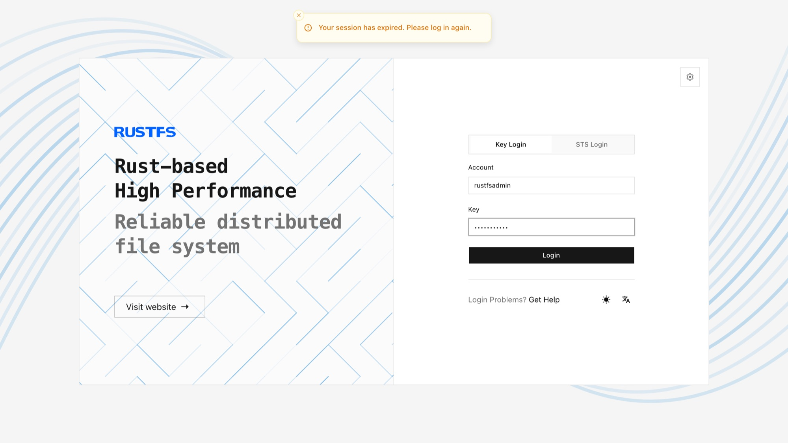

在单节点多磁盘（SNMD）模式下，一台服务器将数据以分片形式存储在多块数据盘中。每个对象会拆分为 K 个数据分片和 M 个校验分片（纠删码），因此最多丢失 M 块磁盘不会导致数据丢失。

:::warning

SNMD 适用于中等规模的非关键业务。最多 M 块磁盘损坏不会带来数据风险，但如果整台服务器发生故障或超过 M 块磁盘损坏，数据将会丢失。请备份重要数据。如需节点级容错，请使用 [MNMD](./multiple-node-multiple-disk.md)。

:::

## 拓扑和规划



- 1 台服务器和多块数据盘（本示例使用挂载到 `/data/rustfs0` 至 `/data/rustfs3` 的 4 块磁盘）。
- 纠删码将数据分片和校验分片分布到各磁盘；容错能力仅限于单节点内的磁盘故障。
- 按照前提条件页面所述，使用 XFS 格式化每块磁盘并分别挂载（例如标签 `RUSTFS0` – `RUSTFS3`）。
- 对于生产部署，还请审查[安装前检查清单](../requirement/checklists/index.md)。

## 前提条件和服务设置

完成[通用前提条件和服务设置](./prerequisites-and-service.md)，包括操作系统、防火墙、时间同步、磁盘格式化、服务用户、二进制文件下载和 systemd 单元，然后继续执行以下步骤。

## 配置环境变量

1. 创建配置文件。`RUSTFS_VOLUMES` 使用大括号展开枚举四个磁盘挂载点：

```ini title="/etc/default/rustfs"
# Use a unique access key and a strong, random secret (e.g. openssl rand -base64 24)
RUSTFS_ACCESS_KEY=<your-access-key>
RUSTFS_SECRET_KEY=<your-secret-key>
RUSTFS_VOLUMES="/data/rustfs{0...3}"
RUSTFS_ADDRESS=":9000"
RUSTFS_CONSOLE_ENABLE=true
RUSTFS_CONSOLE_ADDRESS=":9001"
RUSTFS_OBS_LOGGER_LEVEL=error
RUSTFS_OBS_LOG_DIRECTORY="/var/log/rustfs/"
```

2. 创建存储和日志目录：

```bash
sudo mkdir -p /data/rustfs{0..3} /var/log/rustfs /opt/tls
sudo chmod -R 750 /data/rustfs* /var/log/rustfs
```

## 启动服务并验证

1. 启动服务并启用开机自启动：

```bash
sudo systemctl enable --now rustfs
```

2. 验证服务状态：

```bash
systemctl status rustfs
```

3. 检查服务端口：

```bash
netstat -ntpl
```

4. 查看日志文件：

```bash
tail -f /var/log/rustfs/rustfs*.log
```

5. 访问控制台：在浏览器中输入服务器 IP 地址和控制台端口（默认 9001）。你将看到：



## 后续步骤

- 需要节点级容错和水平扩展能力？请参阅[多节点多磁盘模式（MNMD）](./multiple-node-multiple-disk.md)。
- 只想进行试验？[单节点单磁盘模式（SNSD）](./single-node-single-disk.md)设置起来更简单。