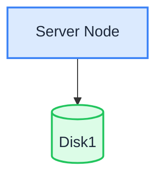

在单节点单磁盘（SNSD）模式下，一台服务器将所有数据存储在一块数据盘中。这是最简单的部署模式，也是 [Linux 快速入门](./quick-start.md)脚本设置的拓扑。

:::warning

单块磁盘不提供冗余：磁盘故障会导致数据丢失。SNSD 适用于开发、测试和低密度非关键业务。用于生产环境时，请定期备份数据，或选择 [SNMD](./single-node-multiple-disk.md)/[MNMD](./multiple-node-multiple-disk.md)。

:::

## 拓扑和规划



- 1 台服务器、1 块数据盘（例如挂载到 `/data/rustfs0` 的 XFS 格式磁盘）。
- 不跨磁盘使用纠删码，容错能力完全依赖备份。
- 对于生产部署，还请审查[安装前检查清单](../requirement/checklists/index.md)。

## 前提条件和服务设置

完成[通用前提条件和服务设置](./prerequisites-and-service.md)，包括操作系统、防火墙、时间同步、磁盘格式化、服务用户、二进制文件下载和 systemd 单元，然后继续执行以下步骤。

## 配置环境变量

1. 使用单磁盘卷路径创建配置文件：

```ini title="/etc/default/rustfs"
# Use a unique access key and a strong, random secret (e.g. openssl rand -base64 24)
RUSTFS_ACCESS_KEY=<your-access-key>
RUSTFS_SECRET_KEY=<your-secret-key>
RUSTFS_VOLUMES="/data/rustfs0"
RUSTFS_ADDRESS=":9000"
RUSTFS_CONSOLE_ENABLE=true
RUSTFS_CONSOLE_ADDRESS=":9001"
RUSTFS_OBS_LOGGER_LEVEL=error
RUSTFS_OBS_LOG_DIRECTORY="/var/log/rustfs/"
```

2. 创建存储和日志目录：

```bash
sudo mkdir -p /data/rustfs0 /var/logs/rustfs /opt/tls
sudo chmod -R 750 /data/rustfs* /var/logs/rustfs
```

## 启动服务并验证

1. 启动服务并启用开机自启动：

```bash
sudo systemctl enable --now rustfs
```

2. 验证服务状态：

```bash
systemctl status rustfs
```

3. 检查服务端口：

```bash
netstat -ntpl
```

4. 查看日志文件：

```bash
tail -f /var/logs/rustfs/rustfs*.log
```

5. 访问控制台：在浏览器中输入服务器 IP 地址和控制台端口（默认 9001）。你将看到：


## 后续步骤

- 需要在单台服务器上实现磁盘级冗余？请参阅[单节点多磁盘模式（SNMD）](./single-node-multiple-disk.md)。
- 需要生产集群？请参阅[多节点多磁盘模式（MNMD）](./multiple-node-multiple-disk.md)。