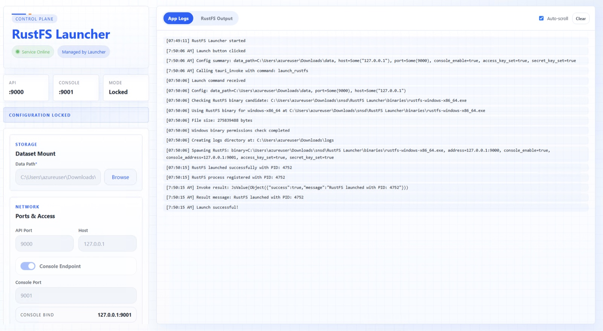
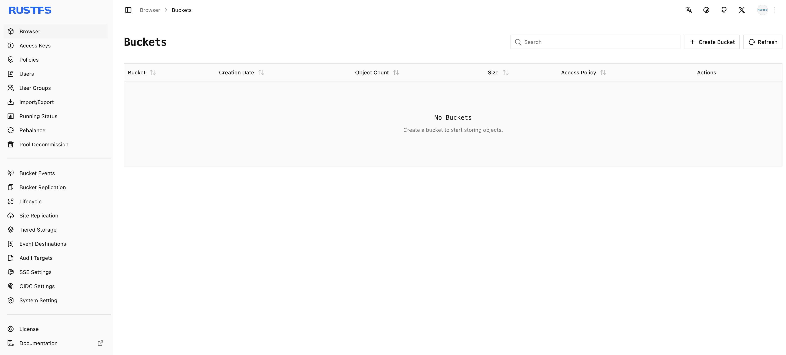

本指南提供两种在 macOS 上运行 **RustFS** 的方式：使用图形化 **RustFS Launcher**，或从终端运行独立服务器二进制文件。两种方式都会创建适合评估、开发和测试的本地单节点实例。

:::note[部署范围]

这些步骤将 RustFS 作为桌面进程运行，而不是 macOS 后台服务。对于生产或分布式部署，请使用 [Linux 安装指南](/installation/linux)。

:::

## 1. 检查 Mac 架构

RustFS 区分 Apple Silicon（`arm64`）和 Intel（`x86_64`）Mac。打开终端并运行：

```bash
uname -m
```

根据结果选择正确的软件包：

| 结果 | Mac 类型 | 当前独立二进制文件可用性 |
| --- | --- | --- |
| `arm64` | Apple Silicon | 从当前 RustFS release 下载 macOS AArch64 软件包。 |
| `x86_64` | Intel | `v1.0.0-beta.9` 之后的 RustFS release 不提供预构建 Intel macOS 软件包。请从源代码构建当前版本。 |

:::warning[Intel Mac 版本边界]

不要在 Intel Mac 上运行 Apple Silicon 二进制文件。如果需要在 Intel macOS 上使用比 `v1.0.0-beta.9` 更新的 RustFS 版本，请按照本指南的源代码构建步骤操作。旧版 beta.9 二进制文件不包含后续 release 中的修复和功能。

:::

继续前还要确保：

- 你有权安装或运行应用程序，并可写入所选数据目录。
- TCP 端口 `9000` 和 `9001` 可用，或已选择另外两个未使用的端口。
- 已创建专用数据目录，例如 `$HOME/rustfs/data`。

```bash
mkdir -p "$HOME/rustfs/data"
```

:::warning[保护数据目录]

使用具有足够可用空间的磁盘上的空目录。不要存储无关文件，也不要在服务器运行时编辑 RustFS 数据文件。

:::

## 2. 选择安装方式

| 方式 | 适用场景 | 架构说明 |
| --- | --- | --- |
| RustFS Launcher | 需要图形化设置和内置日志查看器。 | 下载与 Apple Silicon 或 Intel 匹配的 Launcher 软件包。 |
| 独立二进制文件 | 需要明确的终端命令或脚本。 | 当前 release 提供 Apple Silicon 二进制文件；Intel 用户需从源代码构建 beta.9 之后的 release。 |

## 使用 RustFS Launcher 安装

### 3. 下载并安装 Launcher

1. 打开 [RustFS Launcher Releases 页面](https://github.com/rustfs/launcher/releases)。
2. 选择最新 release 并展开 **Assets**。
3. 下载与架构匹配的 macOS 安装程序：Apple Silicon 使用 AArch64，Intel 使用 x86-64。除非要自行构建 Launcher，否则不要下载 **Source code**。
4. 打开下载的磁盘映像，将 **RustFS Launcher** 移到 **Applications**。
5. 从 **Applications** 打开 **RustFS Launcher**。

如果 macOS 阻止首次启动，请确认软件包来自官方 `rustfs/launcher` Releases 页面。然后打开 **System Settings > Privacy & Security**，允许该应用程序。不要全局禁用 Gatekeeper。

### 4. 配置 Launcher

在 Launcher 窗口中配置以下字段：

| 区域 | 字段 | 推荐值 | 说明 |
| --- | --- | --- | --- |
| Dataset Mount | Data Path | `$HOME/rustfs/data` | RustFS 存储对象数据的现有目录。 |
| Ports & Access | API Port | `9000` | S3 兼容 API 端口。 |
| Ports & Access | Host | `127.0.0.1` | 将访问限制在此 Mac。 |
| Ports & Access | Console Endpoint | Enabled | 启用 Web 控制台；Launcher 默认禁用。 |
| Ports & Access | Console Port | `9001` | 控制台端口，必须与 API 端口不同。 |
| Credentials | Access Key | `<your-access-key>` | 此实例的管理员访问密钥。 |
| Credentials | Secret Key | `<your-secret-key>` | 此实例的管理员秘密密钥。 |

使用 **Browse** 选择数据目录，或将其拖入 Launcher。启动前该目录必须已存在。macOS 文件选择器会显示展开后的路径，而不是字面量 `$HOME` 变量。

将凭证占位符替换为自己的值。Launcher 最初显示本地测试默认凭证；不要在其他用户可访问的 Mac 上保留这些凭证。

:::warning[网络暴露]

除非其他计算机必须连接 RustFS，否则请将 **Host** 保持为 `127.0.0.1`。非环回地址会在相应网络接口上公开 API 和控制台。允许远程访问前，请配置 macOS 防火墙和强凭证。

:::

### 5. 启动并验证 RustFS

1. 选择 **Launch RustFS**。
2. 等待 Launcher 报告配置的端点已在线。
3. 打开 `http://localhost:9001`，使用配置的访问密钥和秘密密钥登录。
4. 将 `http://localhost:9000` 用作 S3 兼容客户端的端点。



如果更改了主机或端口，请使用更改后的值。仅当启用 **Console Endpoint** 时，控制台 URL 才可用。

Launcher 管理运行中的进程时会锁定配置。它还会在数据目录旁创建 `logs` 目录。例如，选择 `$HOME/rustfs/data` 会将服务器日志放在 `$HOME/rustfs/logs` 下。

### 6. 停止或退出 Launcher

更改配置、断开外部数据盘或关闭 macOS 前，请选择 **Stop RustFS**。

关闭 Launcher 窗口只会将其隐藏到菜单栏，不会停止 RustFS。要停止受管进程并退出，请打开 Launcher 菜单栏图标并选择 **Quit**。选择 **Show** 或单击图标可恢复窗口。

## 安装独立二进制文件

### 7. 下载 Apple Silicon 二进制文件

当 `uname -m` 返回 `arm64` 时使用此步骤：

1. 打开 [RustFS Releases 页面](https://github.com/rustfs/rustfs/releases)。
2. 选择所需 release，从 **Assets** 下载 macOS AArch64 ZIP 压缩包。资源名称以 `rustfs-macos-aarch64` 开头。
3. 创建程序目录并解压。将 `<version>` 替换为下载文件名中的版本：

```bash
mkdir -p "$HOME/rustfs/bin"
unzip "$HOME/Downloads/rustfs-macos-aarch64-<version>.zip" -d "$HOME/rustfs/bin"
chmod +x "$HOME/rustfs/bin/rustfs"
"$HOME/rustfs/bin/rustfs" --help
```

如果压缩包包含特定于平台的二进制文件名而不是 `rustfs`，请在后续命令中使用该文件名，或将其重命名为 `$HOME/rustfs/bin/rustfs`。

### 8. 从源代码构建 Intel 二进制文件

当 `uname -m` 返回 `x86_64` 且需要比 `v1.0.0-beta.9` 更新的 release 时使用此步骤。

1. 安装 Xcode 命令行工具：

```bash
xcode-select --install
```

2. 从 [rustup.rs](https://rustup.rs/) 安装当前稳定的 Rust 工具链，然后打开新的终端会话。
3. 克隆 RustFS 并检出所需 release：

```bash
git clone https://github.com/rustfs/rustfs.git
cd rustfs
git checkout <release-tag>
```

4. 使用仓库构建脚本构建 Intel macOS 目标：

```bash
./build-rustfs.sh --platform x86_64-apple-darwin
```

构建脚本默认包含控制台资源并验证生成的二进制文件。在下一步中使用构建输出末尾报告的二进制文件。

:::note[源代码构建依赖项]

从源代码构建除 Rust 和 Xcode 命令行工具外，还需要所选 RustFS release 使用的工具。如果构建报告缺少依赖项，请遵循该 release 仓库 README 中的要求，不要替换为针对 Apple Silicon 构建的二进制文件。

:::

### 9. 启动独立服务器

为当前终端会话设置凭证，并为下载或编译的二进制文件指定路径：

```bash
export RUSTFS_ACCESS_KEY="<your-access-key>"
export RUSTFS_SECRET_KEY="<your-secret-key>"
export RUSTFS_BIN="$HOME/rustfs/bin/rustfs"

"$RUSTFS_BIN" server \
	--address "127.0.0.1:9000" \
	--console-enable true \
	--console-address "127.0.0.1:9001" \
	"$HOME/rustfs/data"
```

对于 Intel 源代码构建，请将 `RUSTFS_BIN` 替换为 `build-rustfs.sh` 输出的二进制文件路径。RustFS 运行期间请保持终端窗口打开。按 `Control+C` 可停止服务器。

:::tip[凭证处理]

会话环境变量可避免将凭证直接放在命令行中。对于重复或自动化使用，建议使用 `RUSTFS_ACCESS_KEY_FILE` 和 `RUSTFS_SECRET_KEY_FILE` 环境变量，并通过 macOS 权限保护这些文件。

:::

### 10. 验证独立服务器

打开 `http://localhost:9001` 并使用配置的凭证登录。将 `http://localhost:9000` 用作 S3 兼容客户端的端点。RustFS 默认使用路径式寻址，请相应配置客户端。

要执行端到端检查，请创建名为 `my-bucket` 的存储桶、上传 `hello.txt`，并确认该对象出现在存储桶中。

## 确认安装成功

无论使用 Launcher、Apple Silicon 二进制文件还是 Intel 源代码构建，成功登录控制台后都会打开 **Buckets** 页面。



## 故障排除

### macOS 阻止应用程序或二进制文件

验证文件来自 RustFS 官方 GitHub 组织。对于 Launcher，请在 **System Settings > Privacy & Security** 下允许该应用程序。对于被 macOS 隔离的独立二进制文件，请先检查警告并验证下载来源，再更改其安全属性。

### 二进制文件架构不匹配

运行 `uname -m` 并检查二进制文件：

```bash
uname -m
file "$RUSTFS_BIN"
```

在 Apple Silicon 上使用 AArch64 二进制文件。在 Intel Mac 上，请从源代码为 `x86_64-apple-darwin` 构建 `v1.0.0-beta.9` 之后的 release。

### 数据路径被拒绝

确认目录存在，并且 macOS 账户具有读写权限。Launcher 不会为你创建所选数据目录。

### API 或控制台端口不可用

端口必须是 `1` 到 `65535` 之间的数字，彼此不同且未被占用。检查默认端口：

```bash
lsof -nP -iTCP:9000 -iTCP:9001 -sTCP:LISTEN
```

停止冲突的应用程序或选择未使用的端口，然后重新启动 RustFS。

### 控制台无法打开

使用 Launcher 时，确认已启用 **Console Endpoint**。使用独立二进制文件时，确认进程仍在运行且包含 `--console-enable true`。

### Launcher 报告外部 RustFS 进程

另一个进程正在监听配置的 API 地址，但并非由 Launcher 启动。请停止该进程或选择其他 API 端口。Launcher 无法停止不受其管理的进程。

### RustFS 启动后退出

在 Launcher 中检查内置日志查看器的应用程序和 RustFS 选项卡。对于独立安装，请检查终端输出。常见原因包括数据目录缺失、权限不足、架构不匹配或端口冲突。

## 后续步骤

- 连接客户端前查看 [S3 API 指南](/administration/protocols/s3)。
- 了解如何[创建存储桶](/administration/data/bucket/creation)。
- 查看[状态检查](/operations/status-check)，了解其他验证方法。
- 对于面向生产的部署，请使用 [Linux 安装指南](/installation/linux)。