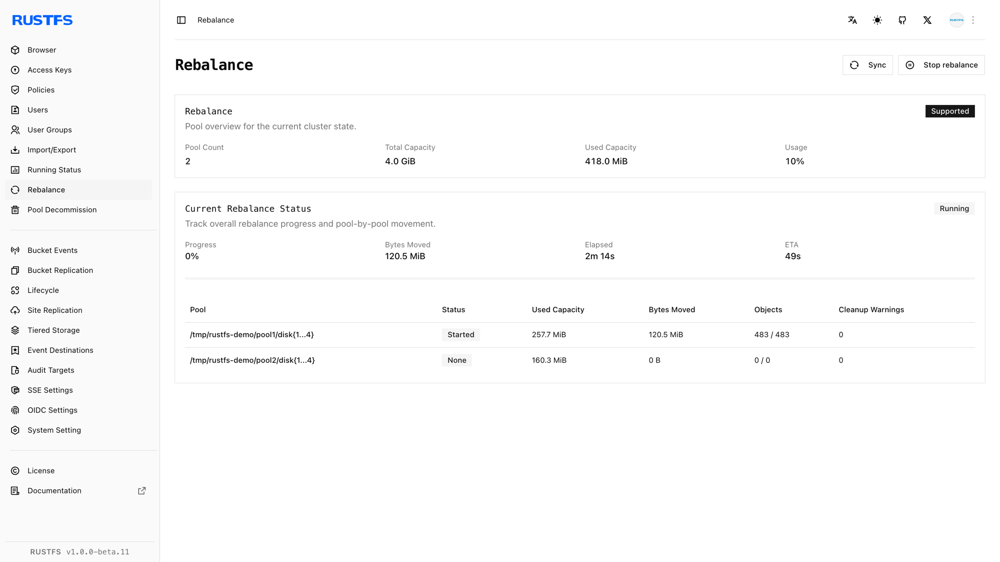
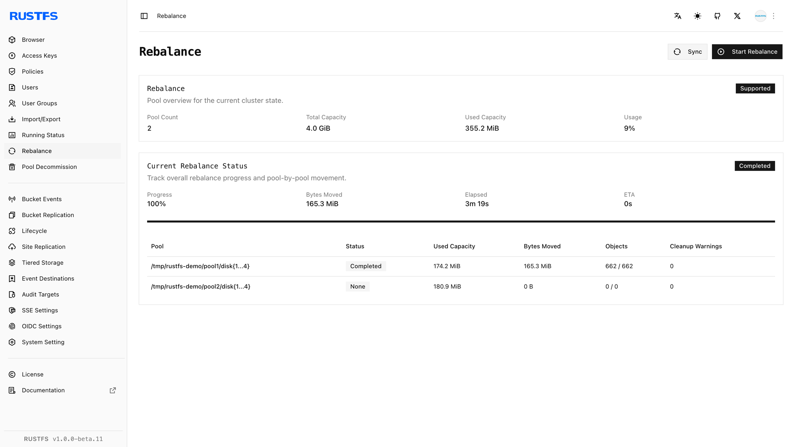

## 概述

### 要求

- 在管理主机上安装 [`rc`](/operations/rc)，然后再使用本指南中的 `rc` 工作流程。
- 配置具有再均衡管理权限的凭证。

[存储池扩容](./storage-pool-expansion.md)后，新写入可以使用新增容量，但现有对象仍保留在原存储池中。**数据再均衡**会在所有活跃存储池之间移动现有对象，使其已用容量比例趋于一致。

数据再均衡至少需要两个活跃存储池。如果已有数据再均衡或存储池退役任务正在运行，RustFS 会拒绝新的再均衡任务。停止再均衡不会将已迁移的对象移回原存储池。

开始之前，请确认所有节点和磁盘均健康、没有正在进行的退役任务，并且集群在操作期间有足够的可用容量处理正常写入。对象移动会消耗磁盘、网络和 CPU 资源，因此请安排在流量较低的时段执行。

## 操作

### 在控制台中启动数据再均衡

1. 使用具有再均衡管理权限的账户登录 RustFS 控制台。
2. 打开 **Rebalance**。
3. 查看活跃存储池及其已用容量比例。
4. 选择 **Start Rebalance** 并确认操作。
5. 保持页面打开，或定期返回页面查看各存储池的进度。
6. 仅在需要中止操作时使用 **Stop Rebalance**。已移动的数据会保留在新存储池中。



### 使用 rc 启动数据再均衡

如果尚未创建集群别名，请进行配置：

```bash
rc alias set rustfs http://<server-ip>:9000 <your-access-key> <your-secret-key>
```

启动数据再均衡：

```bash
rc admin rebalance start rustfs
```

检查进度：

```bash
rc admin rebalance status rustfs
```

状态信息包括操作 ID，以及各存储池的使用情况、已移动字节数、对象和版本数量、剩余存储桶数、已用时间，并在可用时提供预计完成时间。

停止正在运行的数据再均衡：

```bash
rc admin rebalance stop rustfs
```

`rc admin expand start|status|stop` 和 `scale` 别名提供相同的扩容后再均衡工作流程。

## 验证

### 在控制台中验证数据再均衡

等待 Rebalance 页面报告 `Completed`。确认：



- 没有存储池报告失败或已停止状态。
- 各活跃存储池的已用容量比例更为接近。
- 所有节点和磁盘保持在线。
- 正常的对象读写成功。

### 使用 rc 验证数据再均衡

运行：

```bash
rc admin rebalance status rustfs
rc admin pool list rustfs
```

确认再均衡状态为 `Completed`、剩余存储桶数为零且没有报告失败。将各存储池的使用率与操作前记录的值进行比较，然后通过 S3 端点读取现有对象并写入新的测试对象。