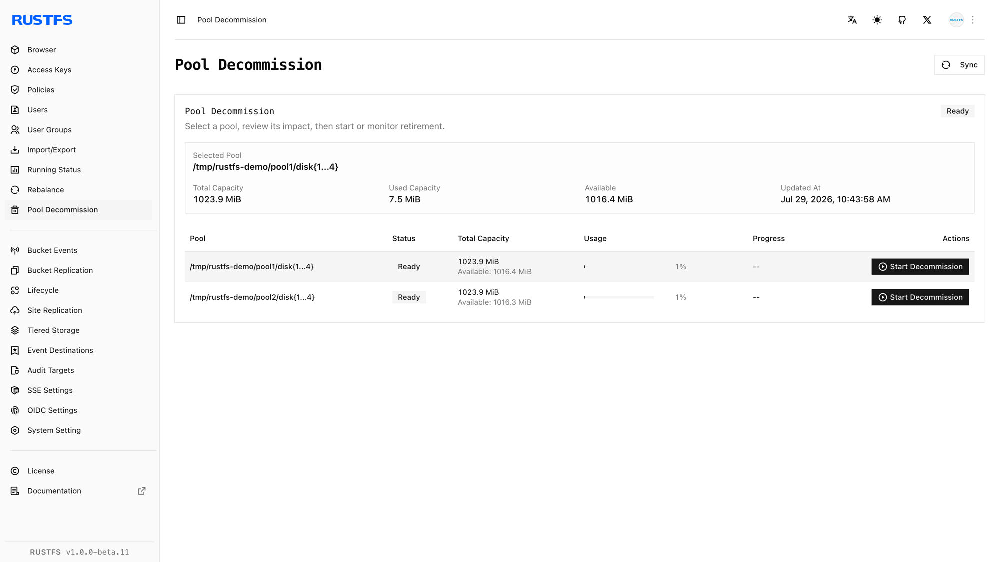
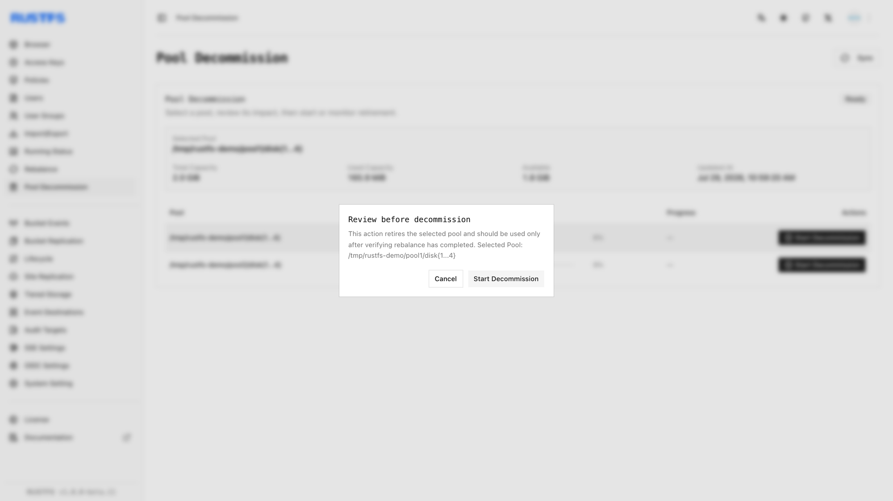
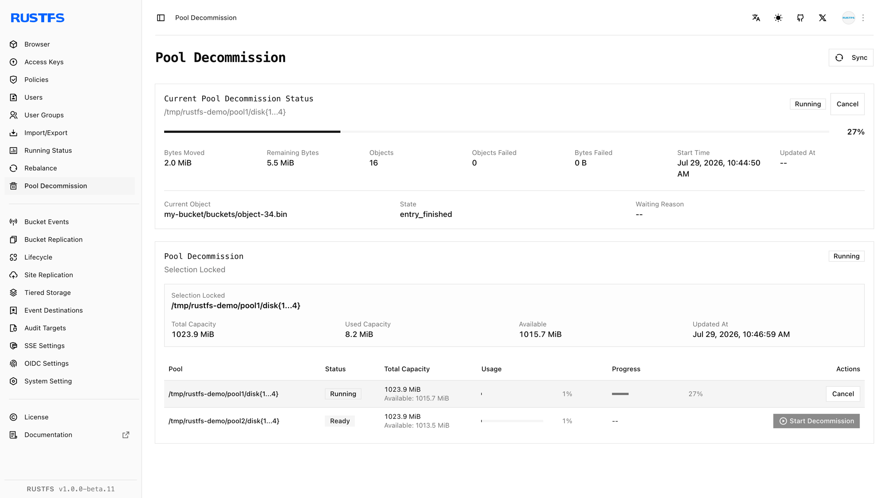
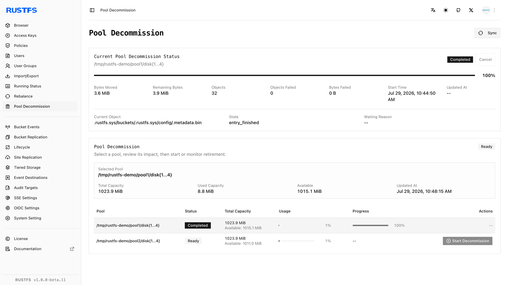
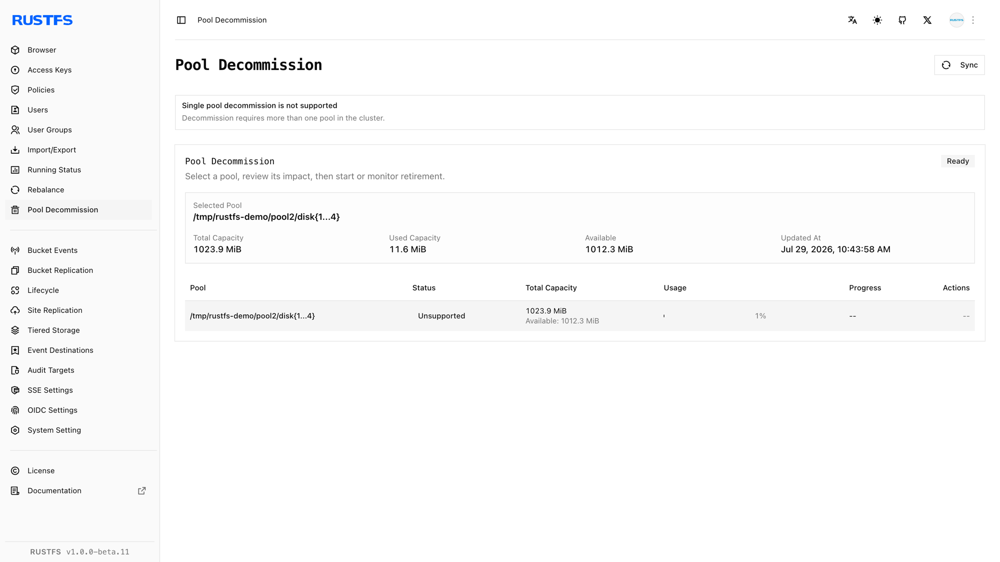

## 概述

### 要求

- 在管理主机上安装 [`rc`](/operations/rc)，然后再使用本指南中的 `rc` 工作流程。
- 配置具有退役管理权限的凭证。

**存储池退役**会将对象从选定存储池移动到其余活跃存储池，以便从部署中移除目标存储池。可在淘汰硬件、替换存储池或整合容量时使用此操作。

退役与[数据再均衡](./data-rebalancing.md)不同：再均衡会保持所有存储池活跃，而退役会排空并停用选定存储池。两项操作不能同时运行。

开始之前：

- 操作后至少保留一个活跃存储池。
- 确认其余存储池有足够的可用容量。RustFS 要求其可用空间能够容纳待排空的已用字节数，并额外保留 30% 的空间。
- 确认每个节点和磁盘均健康，且没有正在运行的数据再均衡任务。
- 备份关键数据，并安排在流量较低的时段执行。
- 选择目标前，记录准确的存储池 ID 和卷表达式。

取消退役不会回滚已经完成的移动。已迁移的对象会保留在目标存储池中。

## 操作

### 在控制台中启动退役

1. 使用具有退役管理权限的账户登录 RustFS 控制台。
2. 打开 **Pool Decommission**。
3. 找到要退役的存储池，并核对其 ID、卷表达式、已用容量和状态。

   

4. 为该存储池选择 **Start Decommission**。
5. 仔细查看确认对话框，然后选择 **Start Decommission**。

   

6. 使用 **Sync** 刷新存储池状态和移动计数器，直到操作完成。

   

完成后，从每个剩余节点的 `RUSTFS_VOLUMES` 中删除已排空的存储池表达式，并使用相同顺序的拓扑重启 RustFS。对于 Helm，请先退役存储池，再从 `pools.list` 中删除其条目；切勿删除活跃存储池条目或调整其顺序。



### 使用 rc 启动退役

根据需要配置集群别名，然后列出存储池：

```bash
rc alias set rustfs http://<server-ip>:9000 <your-access-key> <your-secret-key>
rc admin pool list rustfs
```

使用从零开始的 ID 启动存储池 `0` 的退役：

```bash
rc admin decommission start rustfs 0 --by-id
```

也可以传入准确的存储池卷表达式，而不使用 `--by-id`：

```bash
rc admin decommission start rustfs 'http://rustfs-node1:9000/data/rustfs{1...4}/mnmd'
```

监控所有存储池或仅监控目标存储池：

```bash
rc admin decommission status rustfs
rc admin decommission status rustfs 0 --by-id
```

要取消正在运行的操作，请使用：

```bash
rc admin decommission cancel rustfs 0 --by-id
```

如果退役失败或被取消，请在重试前清除其元数据：

```bash
rc admin decommission clear rustfs 0 --by-id
```

目标报告 `complete` 后，从每个剩余节点的 `RUSTFS_VOLUMES` 中删除其表达式，并使用缩减后的拓扑重启 RustFS。

## 验证

### 在控制台中验证退役

确认目标存储池报告 `Completed`，失败对象数和失败字节数均为零。从启动拓扑中删除该存储池并重启 RustFS 后，验证：



- 已退役的存储池不再显示为活跃存储池。
- 所有剩余节点和磁盘均在线。
- 剩余存储池显示已迁移的数据并具有足够的可用容量。
- 仍可列出、读取和下载现有对象。

### 使用 rc 验证退役

从拓扑中删除存储池前，运行：

```bash
rc admin decommission status rustfs 0 --by-id
```

确认状态为 `complete`，失败对象和失败字节计数器均为零。更新 `RUSTFS_VOLUMES` 并重启 RustFS 后，运行：

```bash
rc admin pool list rustfs
```

确认仅保留预期的活跃存储池。读取之前位于已退役存储池中的对象，并通过 S3 端点写入新的测试对象。