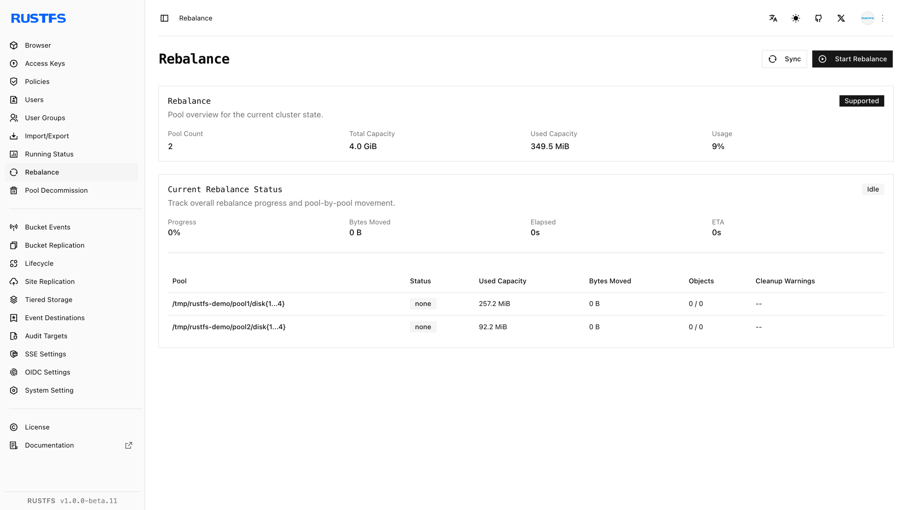

## 概述

### 要求

- 在管理主机上安装 [`rc`](/operations/rc)，然后再使用本指南中的 `rc` 工作流程。
- 配置具有读取 RustFS 集群和存储池状态权限的凭证。

RustFS 通过向集群拓扑追加**服务器池**来扩展容量。每个存储池对应 `RUSTFS_VOLUMES` 中一个以空格分隔的卷表达式。应用扩展后的拓扑后，新写入可以使用新增容量；现有对象仍保留在当前存储池中，直到您运行[数据再均衡](./data-rebalancing.md)。

本指南使用以下双存储池示例：

```ini title="/etc/default/rustfs"
RUSTFS_VOLUMES="http://rustfs-node1:9000/data/rustfs{1...4}/mnmd http://rustfs-node2:9000/data/rustfs{1...4}/mnmd"
```

扩容前：

- 备份关键数据，并在维护窗口期间执行此工作流程。
- 在每个节点上使用相同的 RustFS 版本、凭证和完整的 `RUSTFS_VOLUMES` 值。
- 验证所有新旧节点之间的名称解析、时间同步和端口 `9000` 连通性。
- 按计划的磁盘数量和存储规格准备新存储池。

:::warning[追加存储池，不要替换拓扑]

每个节点都必须使用完整且顺序一致的存储池列表启动。遗漏现有存储池，或在某个节点上使用不同的表达式，会造成拓扑不一致。

:::

## 操作

### 借助控制台扩容

控制台会显示存储池，但不会向服务器启动拓扑添加存储池。请使用以下控制台辅助工作流程：

1. 从 **Rebalance** 或 **Pool Decommission** 记录现有存储池及其使用情况。
2. 在新存储池的一个或多个节点上安装相同版本的 RustFS 和服务配置。
3. 在所有现有节点和新节点的 `RUSTFS_VOLUMES` 中追加新存储池表达式。保持现有表达式不变且顺序一致。
4. 在所有节点上重启 RustFS，使每个进程都以相同的扩展拓扑启动。
5. 等待所有节点就绪，然后在控制台中刷新存储池列表。



对于 Helm 部署，请将新条目追加到 `pools.list` 并应用 `helm upgrade`。请勿删除现有条目或调整其顺序。

### 使用 rc 检查扩容结果

使用能够读取集群和存储池状态的凭证配置别名：

```bash
rc alias set rustfs http://<server-ip>:9000 <your-access-key> <your-secret-key>
```

记录当前拓扑：

```bash
rc admin pool list rustfs
```

准备新节点，在每个节点完整的 `RUSTFS_VOLUMES` 值中追加新存储池表达式，然后在整个集群中重启 RustFS。`rc` 不会修改服务器启动拓扑。

集群恢复后，再次列出存储池：

```bash
rc admin pool list rustfs
```

使用从零开始的存储池 ID 详细检查新存储池：

```bash
rc admin pool status rustfs 1 --by-id
```

:::note[再均衡别名]

`rc admin expand start`、`status` 和 `stop` 是扩容后再均衡工作流程的别名。它们会重新分布现有数据，但不会向 `RUSTFS_VOLUMES` 追加存储池。

:::

## 验证

### 在控制台中验证扩容

确认：

- 存储池列表显示原有存储池和新存储池。
- 所有预期的节点和磁盘均在线。
- 新存储池报告预期的总容量和可用容量。
- 恢复正常流量前，集群未报告降级节点。

### 使用 rc 验证扩容

运行：

```bash
rc admin pool list rustfs
rc admin pool status rustfs 1 --by-id
```

确认新存储池具有预期的命令行表达式并处于活跃状态。开始数据再均衡前，通过正常的 S3 端点写入并读取测试对象。