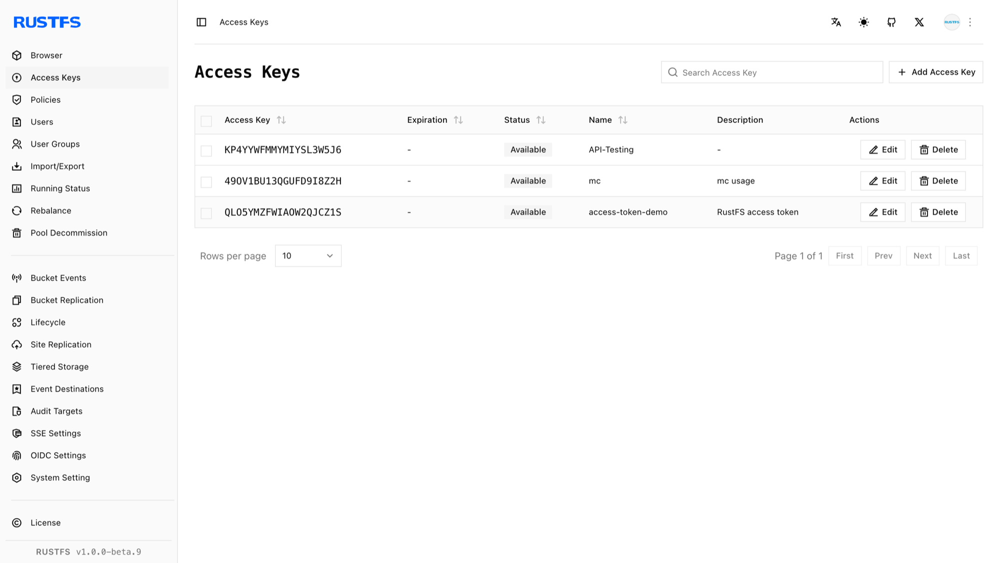
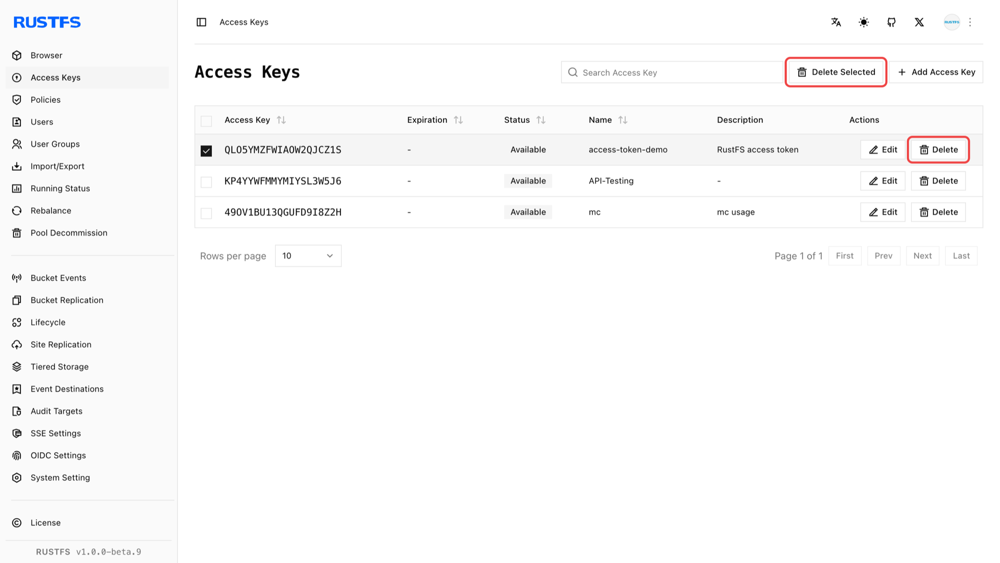

RustFS 访问密钥是 RustFS 系统的核心凭证，用于身份验证和操作授权，常用于 API 和 SDK 场景。本章介绍如何创建和删除 RustFS 访问密钥。

前提条件：

- 一个可用的 RustFS 实例。有关安装方法，请参阅[安装指南](../../installation/index.md)。

## 创建访问密钥

1. 登录 RustFS UI 控制台。
2. 在左侧导航栏中选择 **访问密钥**。
3. 在访问密钥页面的右上角，单击 **添加访问密钥**。
4. 输入密钥的**过期时间、名称和描述**，然后单击**提交**。
5. （可选但建议执行）在随后显示的访问密钥页面上，选择**复制**或**导出**，保存访问密钥以供后续使用。

## 删除访问密钥

1. 登录 RustFS UI 控制台。
2. 在左侧导航栏中选择 **访问密钥**。
3. 在访问密钥页面上，选择要删除的访问密钥。
4. 选择访问密钥右侧的**删除**按钮，或选择右上角的**删除所选项**来删除访问密钥。

