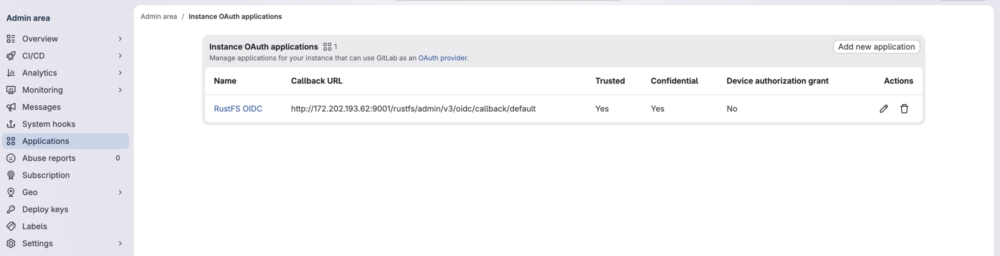

RustFS 通过 OpenID Connect（OIDC）授权码流程与 **GitLab** 集成。本页示例使用 RustFS 默认提供商 ID `default`。

## 前置条件

开始之前，请准备：

- 一个[已安装的 GitLab 实例](https://gitlab.cn/install)，以及该实例 Admin area 的访问权限。
- 一个具有公共 HTTPS 控制台源的 RustFS 部署。
- 一个分配给 GitLab 用户的 RustFS 策略。示例使用 `consoleAdmin`；在生产环境中，请使用仅包含用户所需权限的策略。

## 概述

浏览器登录流程如下：

1. RustFS 发送包含授权码交换证明（Proof Key for Code Exchange，PKCE）S256 质询的授权码请求。
2. GitLab 验证用户身份，并使用 `code` 和 `state` 将浏览器重定向到 RustFS。
3. RustFS 在 GitLab 令牌端点交换授权码。
4. RustFS 验证 ID 令牌的签名、签发者、受众、有效期和 nonce。
5. RustFS 分配已配置的本地身份与访问管理（IAM）策略，并为控制台会话签发临时凭证。

GitLab 负责验证用户身份，RustFS 策略则负责授权 S3 操作和管理操作。

示例使用以下值。请根据你的环境替换主机名和客户端密钥：

| 设置 | 示例 |
| --- | --- |
| GitLab issuer | `https://gitlab.example.com` |
| GitLab application ID | `<gitlab-application-id>` |
| Public RustFS origin | `https://rustfs.example.com` |
| RustFS callback URL | `https://rustfs.example.com/rustfs/admin/v3/oidc/callback/default` |

## 配置

### GitLab 配置

#### 创建 OAuth 应用

1. 以管理员身份登录 GitLab。
2. 打开 **Admin Area**，选择 **Applications**，然后选择 **New application**。
3. 输入应用名称 `RustFS OIDC`。
4. 将 **Redirect URI** 设置为精确的 RustFS 回调 URL：

  ```text
  https://rustfs.example.com/rustfs/admin/v3/oidc/callback/default
  ```

5. 启用 **Confidential**。
6. 启用 **Trusted**，使这个 instance-wide 应用跳过用户授权提示。
7. 选择 `openid`、`profile` 和 `email` scope。
8. 保存应用，然后复制生成的 application ID 和 secret。

有关应用管理的详细信息，请参阅 [GitLab OAuth provider 文档](https://docs.gitlab.com/integration/oauth_provider/)。



:::note[截图中的测试环境]

截图显示的是测试环境中的 HTTP 回调 URL。请为你的 RustFS 部署使用公共 HTTPS 回调 URL。

:::

### RustFS 配置

通过环境变量配置 GitLab 提供商。

#### 使用环境变量配置

将 GitLab 提供商和公共浏览器源添加到 RustFS 服务环境：

```ini title="/etc/default/rustfs"
RUSTFS_BROWSER_REDIRECT_URL="https://rustfs.example.com"

RUSTFS_IDENTITY_OPENID_ENABLE=on
RUSTFS_IDENTITY_OPENID_CONFIG_URL="https://gitlab.example.com"
RUSTFS_IDENTITY_OPENID_CLIENT_ID="<gitlab-application-id>"
RUSTFS_IDENTITY_OPENID_CLIENT_SECRET="<gitlab-application-secret>"
RUSTFS_IDENTITY_OPENID_SCOPES="openid,profile,email"
RUSTFS_IDENTITY_OPENID_REDIRECT_URI="https://rustfs.example.com/rustfs/admin/v3/oidc/callback/default"
RUSTFS_IDENTITY_OPENID_REDIRECT_URI_DYNAMIC=off
RUSTFS_IDENTITY_OPENID_DISPLAY_NAME="GitLab"
RUSTFS_IDENTITY_OPENID_EMAIL_CLAIM="email"
RUSTFS_IDENTITY_OPENID_USERNAME_CLAIM="preferred_username"
RUSTFS_IDENTITY_OPENID_ROLE_POLICY="consoleAdmin"
```

应用配置后重启 RustFS。

`RUSTFS_BROWSER_REDIRECT_URL` 必须包含不带路径的公共 scheme 和 authority。它控制控制台成功重定向和注销回退 URL。提供商回调 URL 必须与 GitLab 中注册的 URL 完全匹配。

:::warning[限制分配的策略]

`RUSTFS_IDENTITY_OPENID_ROLE_POLICY` 会向通过此提供商登录的所有用户分配同一个 RustFS 策略。请将 `consoleAdmin` 替换为仅授予 GitLab 用户所需权限的策略。

:::

使用反向代理或负载均衡器时，请保留回调查询字符串，并将授权请求和回调请求路由到同一个 RustFS 节点。进行中的 OIDC `state` 位于该节点本地。

## 验证

### 验证 GitLab 发现信息

查询 GitLab 发现文档：

```bash
curl -fsS "https://gitlab.example.com/.well-known/openid-configuration" | jq '{
  issuer,
  authorization_endpoint,
  token_endpoint,
  jwks_uri,
  scopes_supported,
  code_challenge_methods_supported
}'
```

确认：

- `issuer` 为 `https://gitlab.example.com`。
- 存在 `authorization_endpoint`、`token_endpoint` 和 `jwks_uri`。
- `scopes_supported` 包含 `openid`、`profile` 和 `email`。
- `code_challenge_methods_supported` 包含 `S256`。

### 验证 RustFS 提供商

重启 RustFS 后，检查提供商是否可用：

```bash
curl -fsS "https://rustfs.example.com/rustfs/admin/v3/oidc/providers" | jq
```

响应应包含 `default` 提供商，其显示名称为 `GitLab`。

### 测试控制台登录

打开 RustFS 控制台并选择 **GitLab**，或直接打开授权端点：

```text
https://rustfs.example.com/rustfs/admin/v3/oidc/authorize/default
```


验证完整流程：

1. 浏览器重定向到 GitLab。
2. 用户登录，并在出现提示时授权应用。
3. GitLab 使用 `code` 和 `state` 重定向到 RustFS 回调 URL。
4. RustFS 验证 ID 令牌并创建控制台会话。
5. 控制台以已配置的 RustFS 策略打开。

如果 GitLab 报告重定向 URI 不匹配，请确认 GitLab 应用中注册的 URI 与 `RUSTFS_IDENTITY_OPENID_REDIRECT_URI` 完全一致。

## 后续步骤

- 选择分配给 GitLab 用户的策略之前，请查看[用户、组和策略](../iam/policies.md)。
- 公开登录端点之前，请查看[控制台安全说明](/administration/console)。