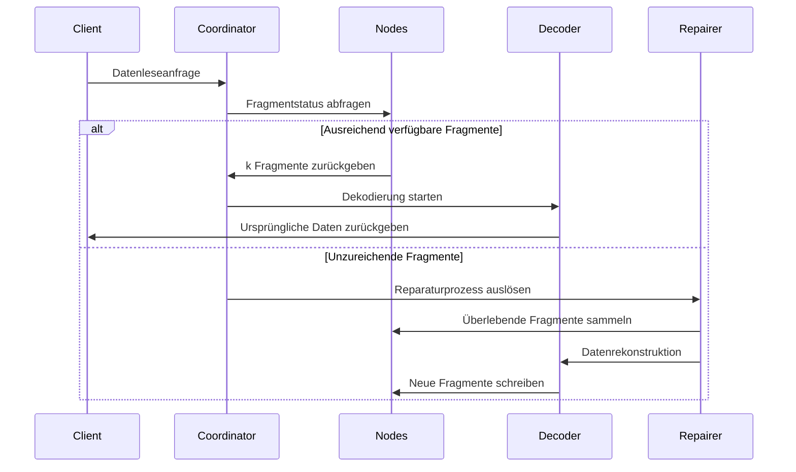

# Erasure-Coding-Prinzip

## I. Zentraler Algorithmus und Anwendungsbereich des zentralen Algorithmus

Der Reed-Solomon-Code (Reed-Solomon Code, RS Code) ist ein Erasure Code basierend auf der algebraischen Struktur endlicher Körper. Aufgrund seiner **effizienten Datenwiederherstellungskapazität** und **flexiblen Redundanzkonfiguration** wird er in verschiedenen Bereichen weit verbreitet angewandt. Nachfolgend eine detaillierte Erklärung seiner Hauptanwendungsszenarien aus zwei Dimensionen: technische Bereiche und praktische Anwendungen:

### 1.1. Verteilte Speichersysteme (wie RustFS)
- **Datenfragmentierung und Redundanz**
  Originaldaten in `k` Fragmente aufteilen, `m` Verifikationsfragmente generieren (insgesamt `n=k+m`). Jeder Verlust von ≤ `m` Fragmenten kann Daten wiederherstellen.
  **Beispiel**: Die RS(10,4)-Strategie erlaubt den gleichzeitigen Verlust von 4 Knoten (Speichernutzung 71%), spart 50% Speicherplatz im Vergleich zu drei Replikas (33%).

- **Ausfallwiederherstellungsmechanismus**
  Durch **Gauß-Eliminationsalgorithmus** oder **Fast Fourier Transform (FFT)** Algorithmus, überlebende Fragmente nutzen zur Rekonstruktion verlorener Daten, Wiederherstellungszeit ist umgekehrt proportional zur Netzwerkbandbreite.

- **Dynamische Anpassungsfähigkeit**
  Unterstützt Laufzeit-Anpassung der `(k,m)` Parameter, angepasst an Zuverlässigkeitsanforderungen verschiedener Speicherebenen (heiße/warme/kalte Daten).

### 1.2. Kommunikationsübertragung
- **Satellitenkommunikation**
  Behandlung von Problemen langer Latenz und hoher Fehlerrate in Deep-Space-Kanälen (wie NASA Mars-Rover mit RS(255,223) Code, Fehlerkorrekturkapazität erreicht 16 Bytes/Codewort).

- **5G NR Standard**
  Nutzt RS Code kombiniert mit CRC-Verifikation im Kontrollkanal, gewährleistet zuverlässige Übertragung kritischer Signalisierung.

- **Drahtloses Sensornetzwerk**
  Löst kumulative Paketverlustprobleme in Multi-Hop-Übertragung, typische Konfiguration RS(6,2) kann 33% Datenverlust tolerieren.

### 1.3. Digitale Medienspeicherung
- **QR-Code**
  Nutzt RS Code zur Implementierung der Fehlertoleranzniveau-Anpassung (L7%, M15%, Q25%, H30%), auch bei teilweiser Beschädigung kann korrekte Dekodierung erfolgen.

- **Blu-ray Disc**
  Nutzt RS(248,216) Code-Kombination mit Cross-Interleaving, korrigiert kontinuierliche Burst-Fehler durch Kratzer.

- **DNA-Datenspeicherung**
  Fügt RS-Verifikation bei der Synthese biomolekularer Ketten hinzu, widersteht Base-Synthese-/Sequenzierungsfehlern (wie Microsoft-Experimentprojekt mit RS(4,2)).

## II. Grundkonzepte des Erasure Coding

### 2.1 Evolution der Speicherredundanz
```rust
// Traditionelle Drei-Replik-Speicherung
let data = "object_content";
let replicas = vec![data.clone(), data.clone(), data.clone()];
```
Traditionelle Multi-Replik-Lösungen haben das Problem niedriger Speichereffizienz (Speichernutzung 33%). Erasure-Coding-Technologie teilt Daten in Blöcke und berechnet dann Verifikationsinformationen, erreicht Balance zwischen Speichereffizienz und Zuverlässigkeit.

### 2.2 Definition der Kernparameter
- **k**: Anzahl der ursprünglichen Datenfragmente
- **m**: Anzahl der Verifikationsfragmente
- **n**: Gesamtanzahl der Fragmente (n = k + m)
- **Wiederherstellungsschwelle**: Beliebige k Fragmente können ursprüngliche Daten wiederherstellen

| Lösungstyp | Redundanz | Ausfalltoleranz |
|------------|----------|------------|
| 3 Replikas | 200% | 2 Knoten |
| RS(10,4) | 40% | 4 Knoten |

## III. Mathematisches Prinzip des Reed-Solomon-Codes

### 3.1 Konstruktion endlicher Körper (Galois Field)
Nutzt GF(2^8) Körper (256 Elemente), erfüllt:
```math
α^8 + α^4 + α^3 + α^2 + 1 = 0
```
Generatorpolynom ist `0x11D`, entspricht binär `100011101`

### 3.2 Kodierungsmatrix-Konstruktion
Vandermonde-Matrix-Beispiel (k=2, m=2):
```math
G = \begin{bmatrix}
1 & 0 \\
0 & 1 \\
1 & 1 \\
1 & 2
\end{bmatrix}
```

### 3.3 Kodierungsprozess
Datenvektor D = [d₁, d₂,..., dk]
Kodierungsergebnis C = D × G

**Generatorpolynom-Interpolationsmethode**:
Konstruiere Polynom durch k Datenpunkte:
```math
p(x) = d_1 + d_2x + ... + d_kx^{k-1}
```
Verifikationswert-Berechnung:
```math
c_i = p(i), \quad i = k+1,...,n
```

## IV. Engineering-Implementierung in RustFS

### 4.1 Datenfragmentierungsstrategie
```rust
struct Shard {
    index: u8,
    data: Vec<u8>,
    hash: [u8; 32],
}

fn split_data(data: &[u8], k: usize) -> Vec<Shard> {
    // Fragmentierungslogik-Implementierung
}
```
- Dynamische Fragmentgrößenanpassung (64 KB-4 MB)
- Hash-Verifikationswert mit Blake3-Algorithmus

### 4.2 Parallele Kodierungsoptimierung
```rust
use rayon::prelude::*;

fn rs_encode(data: &[Shard], m: usize) -> Vec<Shard> {
    data.par_chunks(k).map(|chunk| {
        // SIMD-beschleunigte Matrixoperation
        unsafe { gf256_simd::rs_matrix_mul(chunk, &gen_matrix) }
    }).collect()
}
```
- Auf Rayon basierendes paralleles Berechnungsframework
- Nutzt AVX2-Befehlssatz zur Optimierung endlicher Körperoperationen

### 4.3 Dekodierungs-Wiederherstellungsablauf


