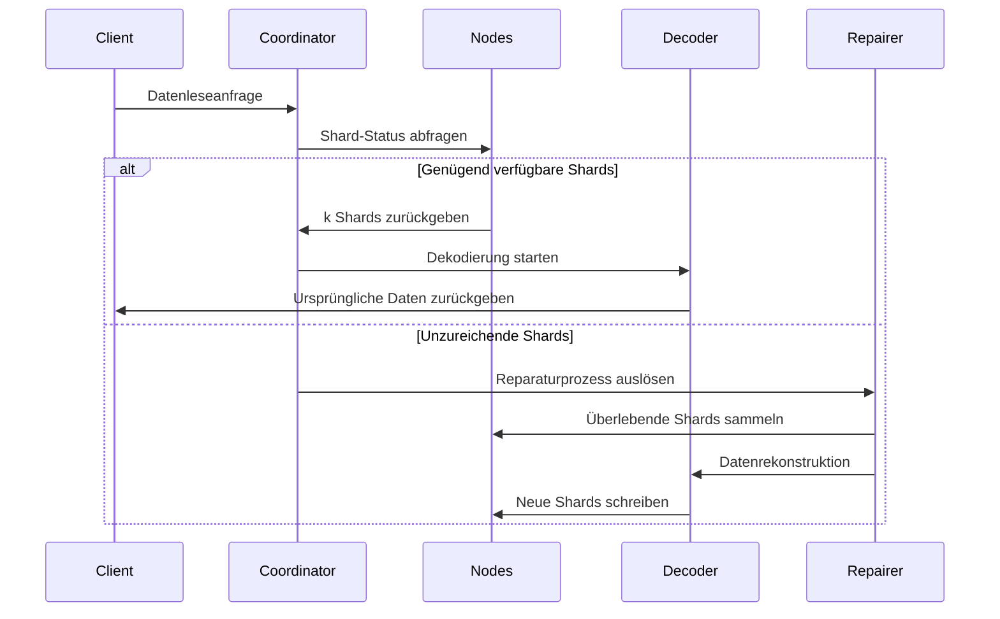

# Erasure-Coding-Prinzip

## I. Kernalgorithmus und Anwendungsbereich

Reed-Solomon-Code (RS-Code) ist ein auf algebraischen Strukturen endlicher Körper basierender Erasure-Code, der aufgrund seiner **effizienten Datenwiederherstellungsfähigkeiten** und **flexiblen Redundanzkonfiguration** in vielen Bereichen weit verbreitet ist. Im Folgenden werden die Kernanwendungsszenarien aus technischer und praktischer Sicht detailliert erklärt:

### 1.1 Verteilte Speichersysteme (wie RustFS)
- **Daten-Sharding und Redundanz**
  Teilt ursprüngliche Daten in `k` Fragmente auf und generiert `m` Prüffragmente (insgesamt `n=k+m`). Jeder Verlust von ≤ `m` Fragmenten kann wiederhergestellt werden.
  **Beispiel**: RS(10,4)-Strategie erlaubt gleichzeitigen Verlust von 4 Knoten (Speichernutzung 71%), spart 50% Speicherplatz gegenüber dreifacher Replikation (33%).

- **Fehlerbehebungsmechanismus**
  Durch **Gaußsche Eliminierung** oder **Fast Fourier Transform (FFT)**-Algorithmus werden verlorene Daten mithilfe überlebender Fragmente rekonstruiert. Wiederherstellungszeit ist umgekehrt proportional zur Netzwerkbandbreite.

- **Dynamische Anpassungsfähigkeit**
  Unterstützt Laufzeitanpassung der `(k,m)`-Parameter für verschiedene Speicherebenen (heiße/warme/kalte Daten).

### 1.2 Kommunikationsübertragung
- **Satellitenkommunikation**
  Behandelt lange Verzögerungen und hohe Fehlerrate in Tiefraum-Kanälen (z.B. NASA Mars-Rover verwendet RS(255,223)-Code mit 16-Byte-Fehlerkorrektur pro Codewort).

- **5G NR Standard**
  Verwendet RS-Code kombiniert mit CRC-Prüfung in Kontrollkanälen für zuverlässige kritische Signalübertragung.

- **Drahtlose Sensornetzwerke**
  Löst kumulative Paketverlustprobleme bei Multi-Hop-Übertragung. Typische RS(6,2)-Konfiguration toleriert 33% Datenverlust.

### 1.3 Digitale Medienspeicherung
- **QR-Code**
  Verwendet RS-Code für Fehlertoleranz-Level (L7%, M15%, Q25%, H30%). Korrekte Dekodierung auch bei teilweiser Beschädigung.

- **Blu-ray-Disc**
  Verwendet RS(248,216)-Code mit Cross-Interleaving zur Korrektur kontinuierlicher Burst-Fehler durch Kratzer.

- **DNA-Datenspeicherung**
  Fügt RS-Prüfung bei Synthese biologischer Molekülketten hinzu, um Base-Synthese-/Sequenzierungsfehler zu widerstehen (z.B. Microsoft-Experiment mit RS(4,2)).

## II. Grundkonzepte des Erasure Coding

### 2.1 Evolution der Speicherredundanz
```rust
// Traditionelle dreifache Replikation
let data = "object_content";
let replicas = vec![data.clone(), data.clone(), data.clone()];
```
Traditionelle Multi-Replikations-Ansätze haben niedrige Speichereffizienz (33% Speichernutzung). Erasure-Coding-Technologie berechnet Prüfinformationen nach Datenaufteilung und erreicht Balance zwischen Speichereffizienz und Zuverlässigkeit.

### 2.2 Kernparameter-Definition
- **k**: Anzahl ursprünglicher Datenfragmente
- **m**: Anzahl Prüffragmente
- **n**: Gesamtanzahl Fragmente (n = k + m)
- **Wiederherstellungsschwelle**: Beliebige k Fragmente können ursprüngliche Daten wiederherstellen

| Ansatztyp | Redundanz | Fehlertoleranz |
|-----------|-----------|----------------|
| 3 Replikas | 200% | 2 Knoten |
| RS(10,4) | 40% | 4 Knoten |

## III. Reed-Solomon-Code mathematisches Prinzip

### 3.1 Konstruktion endlicher Körper (Galois Field)
Verwendet GF(2^8)-Körper (256 Elemente), der erfüllt:
```math
α^8 + α^4 + α^3 + α^2 + 1 = 0
```
Generatorpolynom ist `0x11D`, entspricht binär `100011101`

### 3.2 Kodierungsmatrix-Konstruktion
Vandermonde-Matrix-Beispiel (k=2, m=2):
```math
G = \begin{bmatrix}
1 & 0 \\
0 & 1 \\
1 & 1 \\
1 & 2
\end{bmatrix}
```

### 3.3 Kodierungsprozess
Datenvektor D = [d₁, d₂,..., dk]
Kodierungsergebnis C = D × G

**Generatorpolynom-Interpolationsmethode**:
Konstruiert Polynom durch k Datenpunkte:
```math
p(x) = d_1 + d_2x + ... + d_kx^{k-1}
```
Prüfwert-Berechnung:
```math
c_i = p(i), \quad i = k+1,...,n
```

## IV. Engineering-Implementierung in RustFS

### 4.1 Daten-Sharding-Strategie
```rust
struct Shard {
    index: u8,
    data: Vec<u8>,
    hash: [u8; 32],
}

fn split_data(data: &[u8], k: usize) -> Vec<Shard> {
    // Sharding-Logik-Implementierung
}
```
- Dynamische Shard-Größenanpassung (64 KB-4 MB)
- Hash-Prüfwert mit Blake3-Algorithmus

### 4.2 Parallele Kodierungsoptimierung
```rust
use rayon::prelude::*;

fn rs_encode(data: &[Shard], m: usize) -> Vec<Shard> {
    data.par_chunks(k).map(|chunk| {
        // SIMD-beschleunigte Matrixoperationen
        unsafe { gf256_simd::rs_matrix_mul(chunk, &gen_matrix) }
    }).collect()
}
```
- Rayon-basiertes paralleles Computing-Framework
- AVX2-Instruktionssatz für endliche Körper-Operationen

### 4.3 Dekodierungs-Wiederherstellungsablauf


