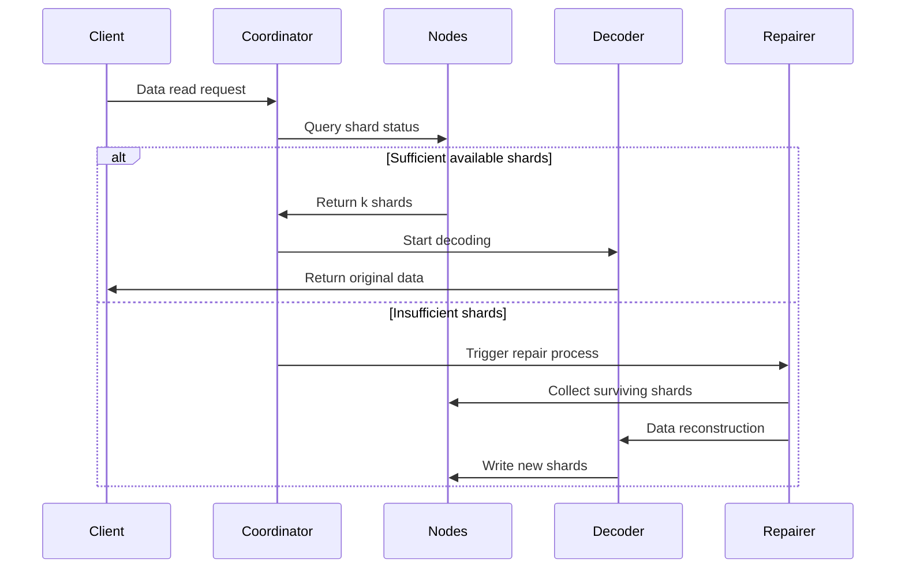

# Erasure Coding Principles

## 1. Core Algorithm and Application Scope

Reed-Solomon Code (RS Code) is an erasure code based on finite field algebraic structures. Due to its **efficient data recovery capability** and **flexible redundancy configuration**, it is widely used in multiple fields. Below, we detail its core application scenarios from two dimensions: technical fields and practical applications:

### 1.1. Distributed Storage Systems (such as RustFS)
- **Data Sharding and Redundancy**
  Divide original data into `k` shards, generate `m` parity shards (total `n=k+m`). Any loss of ≤ `m` shards can recover data.
 **Example**: RS(10,4) strategy allows simultaneous loss of 4 nodes (storage utilization 71%), saving 50% storage space compared to triple replication (33%).

- **Fault Recovery Mechanism**
  Through **Gaussian elimination** or **Fast Fourier Transform (FFT)** algorithms, use surviving shards to reconstruct lost data, with recovery time inversely proportional to network bandwidth.

- **Dynamic Adjustment Capability**
  Supports runtime adjustment of `(k,m)` parameters to adapt to different storage tiers' (hot/warm/cold data) reliability requirements.

### 1.2. Communication Transmission
- **Satellite Communication**
  Handle long delay, high bit error rate issues in deep space channels (e.g., NASA Mars rover uses RS(255,223) code with error correction capability up to 16 bytes/codeword).

- **5G NR Standards**
  Use RS codes combined with CRC checks in control channels to ensure reliable transmission of critical signaling.

- **Wireless Sensor Networks**
  Solve cumulative packet loss problems in multi-hop transmission, typical configuration RS(6,2) can tolerate 33% data loss.

### 1.3. Digital Media Storage
- **QR Codes**
  Use RS codes to implement fault tolerance level adjustment (L7%, M15%, Q25%, H30%), ensuring correct decoding even with partially damaged areas.

- **Blu-ray Discs**
  Use RS(248,216) code combined with cross-interleaving to correct continuous burst errors caused by scratches.

- **DNA Data Storage**
  Add RS checksums during synthetic biomolecular chain synthesis to resist base synthesis/sequencing errors (e.g., Microsoft experimental project uses RS(4,2)).

## 2. Basic Concepts of Erasure Coding

### 2.1 Evolution of Storage Redundancy
```rust
// Traditional triple replication storage
let data = "object_content";
let replicas = vec![data.clone(), data.clone(), data.clone()];
```
Traditional multi-replication schemes have low storage efficiency issues (storage utilization 33%). Erasure coding technology divides data into blocks and calculates checksum information, achieving a balance between storage efficiency and reliability.

### 2.2 Core Parameter Definitions
- **k**: Number of original data shards
- **m**: Number of parity shards
- **n**: Total number of shards (n = k + m)
- **Recovery threshold**: Any k shards can recover original data

| Scheme Type | Redundancy | Fault Tolerance |
|------------|----------|------------|
| 3 Replicas | 200% | 2 nodes |
| RS(10,4) | 40% | 4 nodes |

## 3. Mathematical Principles of Reed-Solomon Codes

### 3.1 Finite Field (Galois Field) Construction
Use GF(2^8) field (256 elements), satisfying:
```math
α^8 + α^4 + α^3 + α^2 + 1 = 0
```
Generator polynomial is `0x11D`, corresponding to binary `100011101`

### 3.2 Encoding Matrix Construction
Vandermonde matrix example (k=2, m=2):
```math
G = \begin{bmatrix}
1 & 0 \\
0 & 1 \\
1 & 1 \\
1 & 2
\end{bmatrix}
```

### 3.3 Encoding Process
Data vector D = [d₁, d₂,..., dk]
Encoding result C = D × G

**Generator polynomial interpolation method**:
Construct polynomial passing through k data points:
```math
p(x) = d_1 + d_2x + ... + d_kx^{k-1}
```
Parity value calculation:
```math
c_i = p(i), \quad i = k+1,...,n
```

## 4. Engineering Implementation in RustFS

### 4.1 Data Sharding Strategy
```rust
struct Shard {
 index: u8,
 data: Vec<u8>,
 hash: [u8; 32],
}

fn split_data(data: &[u8], k: usize) -> Vec<Shard> {
 // Sharding logic implementation
}
```
- Dynamic shard size adjustment (64 KB-4 MB)
- Hash checksum using Blake3 algorithm

### 4.2 Parallel Encoding Optimization
```rust
use rayon::prelude::*;

fn rs_encode(data: &[Shard], m: usize) -> Vec<Shard> {
 data.par_chunks(k).map(|chunk| {
 // SIMD-accelerated matrix operations
 unsafe { gf256_simd::rs_matrix_mul(chunk, &gen_matrix) }
 }).collect()
}
```
- Parallel computing framework based on Rayon
- Use AVX2 instruction set to optimize finite field operations

### 4.3 Decoding Recovery Process

