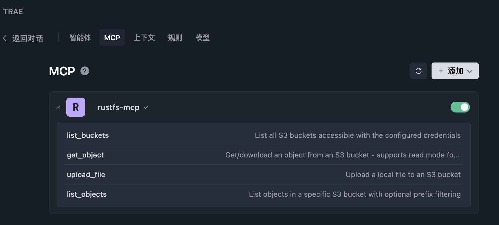
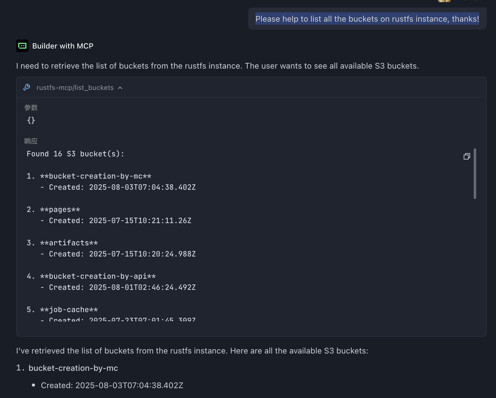

# RustFS MCP


**RustFS MCP Server** is a high-performance [Model Context Protocol (MCP)](https://spec.modelcontextprotocol.org) server that provides AI/LLM tools with seamless access to S3-compatible object storage operations. Built with Rust for maximum performance and safety, it enables AI assistants like Claude Desktop to interact with cloud storage through a standardized protocol.

### What is MCP?

The Model Context Protocol is an open standard that enables secure, controlled connections between AI applications and external systems. This server acts as a bridge between AI tools and S3-compatible storage services, providing structured access to file operations while maintaining security and observability.

## ✨ Features

### Supported S3 Operations

- **List Buckets**: List all accessible S3 buckets
- **List Objects**: Browse bucket contents with optional prefix filtering
- **Upload Files**: Upload local files with automatic MIME type detection and cache control
- **Get Objects**: Retrieve objects from S3 storage with read or download modes

## 🔧 Installation

### Prerequisites

- Rust 1.88+ (for building from source)
- AWS credentials configured (via environment variables, AWS CLI, or IAM roles)
- Access to S3-compatible storage service

### Build from Source

```bash
# Clone the repository
git clone https://github.com/rustfs/rustfs.git
cd rustfs

# Build the MCP server
cargo build --release -p rustfs-mcp

# The binary will be available at
./target/release/rustfs-mcp
```

## ⚙️ Configuration

### Environment Variables

```bash
# AWS Credentials (required)
export AWS_ACCESS_KEY_ID=your_access_key
export AWS_SECRET_ACCESS_KEY=your_secret_key
export AWS_REGION=us-east-1  # Optional, defaults to us-east-1

# Optional: Custom S3 endpoint (for MinIO, etc.)
export AWS_ENDPOINT_URL=http://localhost:9000

# Logging level (optional)
export RUST_LOG=info
```

### Command Line Options

```bash
rustfs-mcp --help
```

The server supports various command-line options for customizing behavior:

- `--access-key-id`: AWS Access Key ID for S3 authentication
- `--secret-access-key`: AWS Secret Access Key for S3 authentication
- `--region`: AWS region to use for S3 operations (default: us-east-1)
- `--endpoint-url`: Custom S3 endpoint URL (for MinIO, LocalStack, etc.)
- `--log-level`: Log level configuration (default: rustfs_mcp_server=info)

## 🚀 Usage

### Starting the Server

```bash
# Start the MCP server
rustfs-mcp

# Or with custom options
rustfs-mcp --log-level debug --region us-west-2
```

### Integration with chat client
#### Option 1: Using Command Line Arguments
```json
{
  "mcpServers": {
    "rustfs-mcp": {
      "command": "/path/to/rustfs-mcp",
      "args": [
        "--access-key-id", "your_access_key",
        "--secret-access-key", "your_secret_key",
        "--region", "us-west-2",
        "--log-level", "info"
      ]
    }
  }
}
```

#### Option 2: Using Environment Variables
```json
{
  "mcpServers": {
    "rustfs-mcp": {
      "command": "/path/to/rustfs-mcp",
      "env": {
        "AWS_ACCESS_KEY_ID": "your_access_key",
        "AWS_SECRET_ACCESS_KEY": "your_secret_key",
        "AWS_REGION": "us-east-1"
      }
    }
  }
}
```

### Use RustFS MCP with Docker

RustFS MCP provides the [official Dockerfile](https://github.com/rustfs/rustfs/tree/main/crates/mcp), which can be used to build docker image, then use the RustFS MCP with Docker.

```
# clone rustfs repo
git clone git@github.com:rustfs/rustfs.git

# build docker image
docker build -f crates/mcp/Dockerfile -t rustfs/rustfs-mcp .
```

After building successfully, you can use the docker to configure MCP in AI IDE.

#### RustFS MCP configuration in AI IDE

Both of the popular AI IDE or editor(Cursor, windsurf, Trae, ect) support MCP. For example, if you use Trae, add the following content to MCP configuration page:

```
{
  "mcpServers": {
    "rustfs-mcp": {
      "command": "docker",
      "args": [
        "run",
        "--rm",
        "-i",
        "-e",
        "AWS_ACCESS_KEY_ID",
        "-e",
        "AWS_SECRET_ACCESS_KEY",
        "-e",
        "AWS_REGION",
        "-e",
        "AWS_ENDPOINT_URL",
        "rustfs/rustfs-mcp"
      ],
      "env": {
        "AWS_ACCESS_KEY_ID": "rustfs_access_key",
        "AWS_SECRET_ACCESS_KEY": "rustfs_secret_key",
        "AWS_REGION": "cn-east-1",
        "AWS_ENDPOINT_URL": "rustfs_instance_url"
      }
    }
  }
}
```

Where `AWS_ACCESS_KEY_ID` and `AWS_SECRET_ACCESS_KEY` are rustfs access token, for more details, you can see [rustfs access token management](access-token.md).

If adding successfully, you can see the [available tools](#️-available-tools) on MCP page.



You can use MCP in Trea by input the corresponding prompt. For example, input below content in chat:

```
Please help to list all the buckets on rustfs instance, thanks!
```

Response returned:



Trae working with **Builder with MCP** mode calls `list_buckets` tool, and lists all the buckets on instance configured. You can try other calls with the same way.

## 🛠️ Available Tools

The MCP server exposes the following tools that AI assistants can use:

### `list_buckets`
List all S3 buckets accessible with the configured credentials.

**Parameters:** None

### `list_objects`
List objects in an S3 bucket with optional prefix filtering.

**Parameters:**
- `bucket_name` (string): Name of the S3 bucket
- `prefix` (string, optional): Prefix to filter objects

### `upload_file`
Upload a local file to S3 with automatic MIME type detection.

**Parameters:**
- `local_file_path` (string): Path to the local file
- `bucket_name` (string): Target S3 bucket
- `object_key` (string): S3 object key (destination path)
- `content_type` (string, optional): Content type (auto-detected if not provided)
- `storage_class` (string, optional): S3 storage class
- `cache_control` (string, optional): Cache control header

### `get_object`
Retrieve an object from S3 with two operation modes: read content directly or download to a file.

**Parameters:**
- `bucket_name` (string): Source S3 bucket
- `object_key` (string): S3 object key
- `version_id` (string, optional): Version ID for versioned objects
- `mode` (string, optional): Operation mode - "read" (default) returns content directly, "download" saves to local file
- `local_path` (string, optional): Local file path (required when mode is "download")
- `max_content_size` (number, optional): Maximum content size in bytes for read mode (default: 1MB)

## Architecture

The MCP server is built with a modular architecture:

```
rustfs-mcp/
├── src/
│   ├── main.rs          # Entry point, CLI parsing, and server initialization
│   ├── server.rs        # MCP server implementation and tool handlers
│   ├── s3_client.rs     # S3 client wrapper with async operations
│   ├── config.rs        # Configuration management and CLI options
│   └── lib.rs           # Library exports and public API
└── Cargo.toml           # Dependencies, metadata, and binary configuration
```
