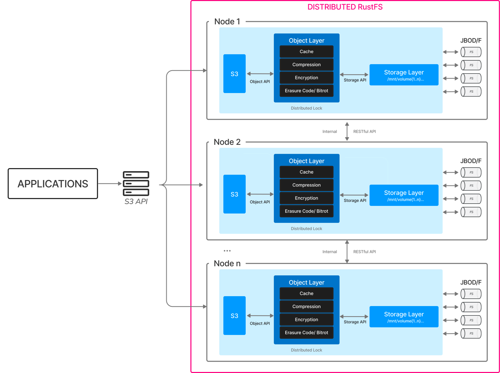

# Explicación de Disponibilidad y Escalabilidad

## Resumen del Plan de Expansión

RustFS admite escalado horizontal mediante la adición de nuevos pools de almacenamiento (Server Pool). Cada nuevo pool de almacenamiento agregado debe cumplir:

1. Los nodos en el pool de almacenamiento deben usar **nombres de host consecutivos** (como node5-node8)
2. Un solo pool de almacenamiento debe usar discos de **misma especificación** (tipo/capacidad/cantidad)
3. El nuevo pool de almacenamiento debe mantener **sincronización de tiempo** y **conectividad de red** con el clúster existente



---

## I. Preparación Antes de la Expansión

### 1.1 Requisitos de Planificación de Hardware

| Elemento | Requisito Mínimo | Configuración de Producción Recomendada |
|---------------|---------------------------|---------------------------|
| Número de Nodos | 4 nodos/pool de almacenamiento | 4 - 8 nodos/pool de almacenamiento |
| Memoria por Nodo | 128 GB | 128 GB |
| Tipo de Disco | SSD | NVMe SSD |
| Capacidad por Disco | ≥1 TB | ≥4 TB |
| Ancho de Banda de Red | 10 Gbps | 25 Gbps |

### 1.2 Verificación del Entorno del Sistema

```bash
# Verificar continuidad de nombres de host (ejemplo de nuevos nodos)
cat /etc/hosts
192.168.10.5 node5
192.168.10.6 node6
192.168.10.7 node7
192.168.10.8 node8

# Verificar estado de sincronización de tiempo
timedatectl status | grep synchronized

# Verificar reglas de firewall (todos los nodos deben abrir puertos 7000/7001)
firewall-cmd --list-ports | grep 7000
```

---

## II. Pasos de Implementación de la Expansión

### 2.1 Configuración Básica de Nuevos Nodos

```bash
# Crear usuario dedicado (ejecutar en todos los nuevos nodos)
groupadd rustfs-user
useradd -M -r -g rustfs-user rustfs-user

# Crear directorio de almacenamiento (ejemplo con 8 discos)
mkdir -p /data/rustfs{0..7}
chown -R rustfs-user:rustfs-user /data/rustfs*
```

### 2.2 Instalación del Servicio RustFS

```bash
# Descargar el último paquete binario (la versión debe ser consistente con el clúster existente)
wget https://dl.rustfs.com/rustfs/v2.3.0/rustfs -O /usr/local/bin/rustfs
chmod +x /usr/local/bin/rustfs

# Crear archivo de configuración (/etc/default/rustfs)
cat <<EOF > /etc/default/rustfs
RUSTFS_ROOT_USER=admin
RUSTFS_ROOT_PASSWORD=YourSecurePassword
RUSTFS_VOLUMES="/data/rustfs{0...7}"
RUSTFS_ADDRESS=":7000"
RUSTFS_CONSOLE_ADDRESS=":7001"
EOF
```

### 2.3 Operación de Expansión del Clúster

```bash
# Actualizar configuración en todos los nodos existentes (agregar nuevo pool de almacenamiento)
sed -i '/RUSTFS_VOLUMES/s|"$| http://node{5...8}:7000/data/rustfs{0...7}"|' /etc/default/rustfs

# Reinicio global del servicio (ejecutar simultáneamente en todos los nodos)
systemctl restart rustfs.service
```

---

## III. Verificación Después de la Expansión

### 3.1 Verificación del Estado del Clúster

```bash
# Verificar estado de unión de nodos
curl -s http://node1:7001/cluster/nodes | jq .poolMembers

# Verificar distribución de pools de almacenamiento
rc admin info cluster
```

### 3.2 Verificación del Equilibrio de Datos

```bash
# Ver proporción de distribución de datos (debería estar cerca de la proporción de capacidad de cada pool de almacenamiento)
watch -n 5 "rustfs-admin metrics | grep 'PoolUsagePercent'"
```

---

## IV. Puntos de Atención

1. **Reinicio en cascada prohibido**: Todos los nodos deben reiniciarse simultáneamente para evitar inconsistencia de datos
2. **Recomendación de planificación de capacidad**: Planificar la próxima expansión antes de que el uso de almacenamiento alcance el 70%
3. **Recomendaciones de optimización de rendimiento**:

```bash
# Ajustar parámetros del kernel (todos los nodos)
echo "vm.swappiness=10" >> /etc/sysctl.conf
echo "net.core.somaxconn=32768" >> /etc/sysctl.conf
sysctl -p
```

---

## V. Guía de Solución de Problemas

| Fenómeno | Punto de Verificación | Comando de Reparación |
|---------------------------|---------------------------------|-------------------------------|
| El nuevo nodo no puede unirse al clúster | Verificar conectividad del puerto 7000 | `telnet node5 7000` |
| Distribución de datos desequilibrada | Verificar configuración de capacidad del pool de almacenamiento | `rustfs-admin rebalance start`|
| La consola muestra estado de nodo anormal | Verificar estado de sincronización de tiempo | `chronyc sources` |

> Consejo: Este documento está escrito basado en la versión más reciente de RustFS. Por favor, realice una copia de seguridad completa de los datos antes de las operaciones de expansión. Para el entorno de producción, se recomienda contactar a los ingenieros de soporte técnico de RustFS para la evaluación del plan.

