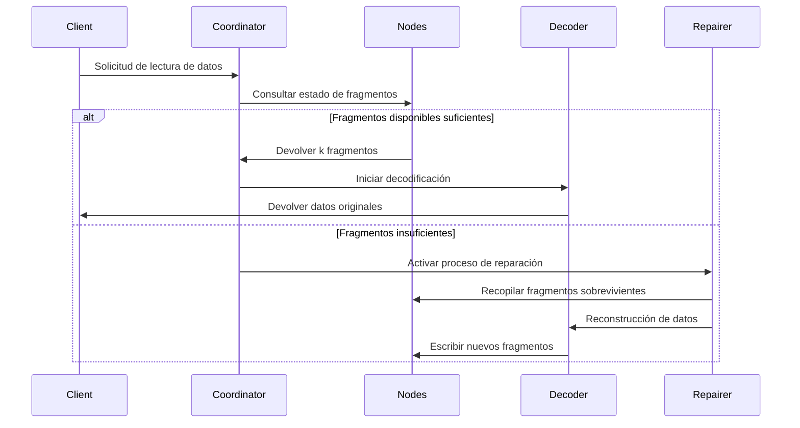

# Principio de Codificación de Borrado

## I. Algoritmo Central y Ámbito de Aplicación del Algoritmo Central

El Código Reed-Solomon (Reed-Solomon Code, Código RS) es un código de borrado (Erasure Code) basado en la estructura algebraica de campos finitos. Debido a su **capacidad eficiente de recuperación de datos** y **configuración de redundancia flexible**, se aplica ampliamente en múltiples campos. A continuación se explican detalladamente sus principales escenarios de aplicación desde dos dimensiones: campos técnicos y aplicaciones prácticas:

### 1.1. Sistemas de Almacenamiento Distribuido (como RustFS)
- **Fragmentación y Redundancia de Datos**
  Dividir los datos originales en `k` fragmentos, generar `m` fragmentos de verificación (total `n=k+m`). Cualquier pérdida ≤ `m` fragmentos puede recuperar los datos.
  **Ejemplo**: La estrategia RS(10,4) permite la pérdida simultánea de 4 nodos (tasa de utilización de almacenamiento 71%), ahorrando 50% de espacio de almacenamiento comparado con tres réplicas (33%).

- **Mecanismo de Recuperación de Fallos**
  A través del **algoritmo de eliminación de Gauss** o **algoritmo de Transformada Rápida de Fourier (FFT)**, utilizar fragmentos sobrevivientes para reconstruir datos perdidos, el tiempo de recuperación es inversamente proporcional al ancho de banda de red.

- **Capacidad de Ajuste Dinámico**
  Soporta ajuste de parámetros `(k,m)` en tiempo de ejecución, adaptándose a los requisitos de fiabilidad de diferentes niveles de almacenamiento (datos calientes/templados/fríos).

### 1.2. Transmisión de Comunicación
- **Comunicación por Satélite**
  Manejo de problemas de larga latencia y alta tasa de error en canales del espacio profundo (como el rover marciano de NASA usando código RS(255,223), capacidad de corrección de errores alcanzando 16 bytes/palabra código).

- **Estándar 5G NR**
  Adopta código RS combinado con verificación CRC en el canal de control, garantizando transmisión confiable de señalización crítica.

- **Red de Sensores Inalámbricos**
  Resuelve problemas de pérdida de paquetes acumulativa en transmisión multi-salto, configuración típica RS(6,2) puede tolerar 33% de pérdida de datos.

### 1.3. Almacenamiento de Medios Digitales
- **Código QR**
  Usa código RS para implementar ajuste de nivel de tolerancia a errores (L7%, M15%, Q25%, H30%), incluso si algunas áreas están dañadas, aún se puede decodificar correctamente.

- **Disco Blu-ray**
  Adopta combinación de código RS(248,216) con entrelazado cruzado, corrigiendo errores de ráfaga continua causados por rayones.

- **Almacenamiento de Datos de ADN**
  Agrega verificación RS al sintetizar cadenas de biomoléculas, resistiendo errores de síntesis/secuenciación de bases (como el proyecto experimental de Microsoft usando RS(4,2)).

## II. Conceptos Básicos de Codificación de Borrado

### 2.1 Evolución de Redundancia de Almacenamiento
```rust
// Almacenamiento tradicional de tres réplicas
let data = "object_content";
let replicas = vec![data.clone(), data.clone(), data.clone()];
```
Las soluciones tradicionales de múltiples réplicas tienen el problema de baja eficiencia de almacenamiento (tasa de utilización de almacenamiento 33%). La tecnología de codificación de borrado divide los datos en bloques y luego calcula información de verificación, logrando equilibrio entre eficiencia de almacenamiento y confiabilidad.

### 2.2 Definición de Parámetros Centrales
- **k**: Número de fragmentos de datos originales
- **m**: Número de fragmentos de verificación
- **n**: Número total de fragmentos (n = k + m)
- **Umbral de Recuperación**: Cualquier k fragmentos pueden recuperar los datos originales

| Tipo de Solución | Redundancia | Tolerancia a Fallos |
|------------|----------|------------|
| 3 réplicas | 200% | 2 nodos |
| RS(10,4) | 40% | 4 nodos |

## III. Principio Matemático del Código Reed-Solomon

### 3.1 Construcción de Campo Finito (Galois Field)
Adopta el campo GF(2^8) (256 elementos), satisfaciendo:
```math
α^8 + α^4 + α^3 + α^2 + 1 = 0
```
El polinomio generador es `0x11D`, correspondiente al binario `100011101`

### 3.2 Construcción de Matriz de Codificación
Ejemplo de matriz de Vandermonde (k=2, m=2):
```math
G = \begin{bmatrix}
1 & 0 \\
0 & 1 \\
1 & 1 \\
1 & 2
\end{bmatrix}
```

### 3.3 Proceso de Codificación
Vector de datos D = [d₁, d₂,..., dk]
Resultado de codificación C = D × G

**Método de Interpolación de Polinomio Generador**:
Construir polinomio que pase por k puntos de datos:
```math
p(x) = d_1 + d_2x + ... + d_kx^{k-1}
```
Cálculo de valor de verificación:
```math
c_i = p(i), \quad i = k+1,...,n
```

## IV. Implementación de Ingeniería en RustFS

### 4.1 Estrategia de Fragmentación de Datos
```rust
struct Shard {
    index: u8,
    data: Vec<u8>,
    hash: [u8; 32],
}

fn split_data(data: &[u8], k: usize) -> Vec<Shard> {
    // Implementación de lógica de fragmentación
}
```
- Ajuste dinámico de tamaño de fragmento (64 KB-4 MB)
- Valor de verificación hash usando algoritmo Blake3

### 4.2 Optimización de Codificación Paralela
```rust
use rayon::prelude::*;

fn rs_encode(data: &[Shard], m: usize) -> Vec<Shard> {
    data.par_chunks(k).map(|chunk| {
        // Operación de matriz acelerada por SIMD
        unsafe { gf256_simd::rs_matrix_mul(chunk, &gen_matrix) }
    }).collect()
}
```
- Framework de computación paralela basado en Rayon
- Usa conjunto de instrucciones AVX2 para optimizar operaciones de campo finito

### 4.3 Flujo de Recuperación por Decodificación


