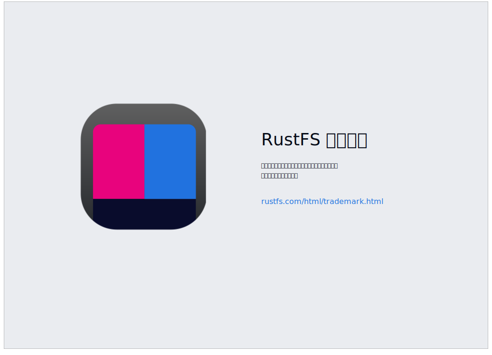

# Descarga y uso de marcas comerciales

Todas las imágenes en esta página solo pueden ser usadas para representar RustFS en sus diagramas de arquitectura de producto o listas de soporte. Al usar imágenes, por favor indique que la fuente de la imagen es el sitio web oficial de RustFS. Las imágenes pueden ser redimensionadas proporcionalmente, pero no pueden ser modificadas de ninguna otra manera.

RustFS® y rustfs logo® son marcas registradas de Beijing Henghesa Technology Co., Ltd. en China. Nadie puede usar estas imágenes para otros propósitos sin el consentimiento escrito de RustFS.

Para cualquier otra pregunta, por favor contáctenos por correo electrónico a <hello@rustfs.com>.

## Logo de RustFS

### Versión fondo blanco

### Versiones fondo diferente

| Fondo negro | Fondo gris | Fondo rosa |
|----------|----------|----------|
|  |  |  |

### Enlaces de descarga

🔗 [Descarga completa con un clic](https://rustfs.com/images/trademark/logo.zip)

## Directrices de uso de marcas

RustFS es un sistema de almacenamiento de objetos distribuido de alto rendimiento bajo licencia Apache 2.0. Estas directrices definen el uso apropiado de las marcas comerciales de RustFS.

