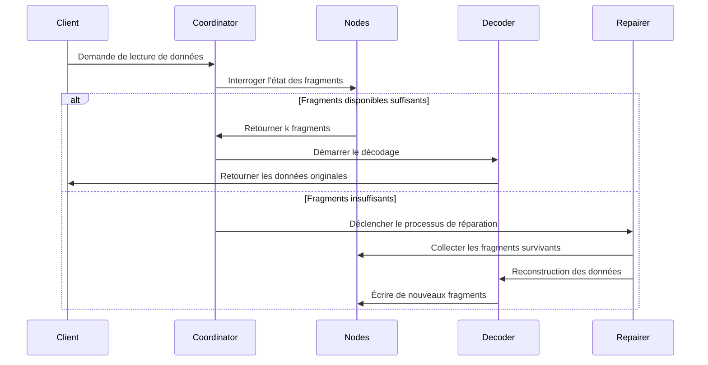

# Principe du codage d'effacement

## I. Algorithme central et domaine d'application de l'algorithme central

Le code Reed-Solomon (Code Reed-Solomon, Code RS) est un code d'effacement (Erasure Code) basé sur la structure algébrique des corps finis. Grâce à sa **capacité efficace de récupération de données** et sa **configuration de redondance flexible**, il est largement appliqué dans plusieurs domaines. Voici une explication détaillée de ses scénarios d'application principaux selon deux dimensions : domaines techniques et applications pratiques :

### 1.1. Systèmes de stockage distribué (comme RustFS)
- **Fragmentation et redondance des données**
  Diviser les données originales en `k` fragments, générer `m` fragments de vérification (total `n=k+m`). Toute perte ≤ `m` fragments peut récupérer les données.
  **Exemple** : La stratégie RS(10,4) permet la perte simultanée de 4 nœuds (taux d'utilisation du stockage 71%), économisant 50% d'espace de stockage par rapport à trois répliques (33%).

- **Mécanisme de récupération de panne**
  Grâce à l'**algorithme d'élimination de Gauss** ou à l'**algorithme de transformée de Fourier rapide (FFT)**, utiliser les fragments survivants pour reconstruire les données perdues, le temps de récupération est inversement proportionnel à la bande passante réseau.

- **Capacité d'ajustement dynamique**
  Prise en charge de l'ajustement des paramètres `(k,m)` en temps d'exécution, s'adaptant aux exigences de fiabilité de différents niveaux de stockage (données chaudes/tièdes/froides).

### 1.2. Transmission de communication
- **Communication par satellite**
  Traitement des problèmes de longue latence et de taux d'erreur élevé dans les canaux de l'espace profond (comme le rover martien de la NASA utilisant le code RS(255,223), capacité de correction d'erreur atteignant 16 octets/mot de code).

- **Standard 5G NR**
  Adopte le code RS combiné avec la vérification CRC dans le canal de contrôle, garantissant la transmission fiable de la signalisation critique.

- **Réseau de capteurs sans fil**
  Résout les problèmes de perte de paquets cumulée dans la transmission multi-saut, configuration typique RS(6,2) peut tolérer 33% de perte de données.

### 1.3. Stockage de médias numériques
- **Code QR**
  Utilise le code RS pour réaliser l'ajustement du niveau de tolérance aux erreurs (L7%, M15%, Q25%, H30%), même si certaines zones sont endommagées, le décodage correct est toujours possible.

- **Disque Blu-ray**
  Adopte la combinaison de code RS(248,216) avec entrelacement croisé, corrigeant les erreurs en rafale continues causées par les rayures.

- **Stockage de données ADN**
  Ajoute la vérification RS lors de la synthèse de chaînes de biomolécules, résistant aux erreurs de synthèse/séquençage de bases (comme le projet expérimental de Microsoft utilisant RS(4,2)).

## II. Concepts de base du codage d'effacement

### 2.1 Évolution de la redondance de stockage
```rust
// Stockage traditionnel à trois répliques
let data = "object_content";
let replicas = vec![data.clone(), data.clone(), data.clone()];
```
Les solutions traditionnelles de réplication multiple ont le problème d'une faible efficacité de stockage (taux d'utilisation du stockage 33%). La technologie de codage d'effacement divise les données en blocs puis calcule les informations de vérification, réalisant un équilibre entre efficacité de stockage et fiabilité.

### 2.2 Définition des paramètres centraux
- **k** : Nombre de fragments de données originales
- **m** : Nombre de fragments de vérification
- **n** : Nombre total de fragments (n = k + m)
- **Seuil de récupération** : N'importe quels k fragments peuvent récupérer les données originales

| Type de solution | Redondance | Tolérance aux pannes |
|------------|----------|------------|
| 3 répliques | 200% | 2 nœuds |
| RS(10,4) | 40% | 4 nœuds |

## III. Principe mathématique du code Reed-Solomon

### 3.1 Construction de corps fini (Galois Field)
Adopte le domaine GF(2^8) (256 éléments), satisfaisant :
```math
α^8 + α^4 + α^3 + α^2 + 1 = 0
```
Le polynôme générateur est `0x11D`, correspondant au binaire `100011101`

### 3.2 Construction de matrice de codage
Exemple de matrice de Vandermonde (k=2, m=2) :
```math
G = \begin{bmatrix}
1 & 0 \\
0 & 1 \\
1 & 1 \\
1 & 2
\end{bmatrix}
```

### 3.3 Processus de codage
Vecteur de données D = [d₁, d₂,..., dk]
Résultat de codage C = D × G

**Méthode d'interpolation polynomiale génératrice** :
Construire un polynôme passant par k points de données :
```math
p(x) = d_1 + d_2x + ... + d_kx^{k-1}
```
Calcul de valeur de vérification :
```math
c_i = p(i), \quad i = k+1,...,n
```

## IV. Implémentation d'ingénierie dans RustFS

### 4.1 Stratégie de fragmentation des données
```rust
struct Shard {
    index: u8,
    data: Vec<u8>,
    hash: [u8; 32],
}

fn split_data(data: &[u8], k: usize) -> Vec<Shard> {
    // Implémentation de la logique de fragmentation
}
```
- Ajustement dynamique de la taille des fragments (64 KB-4 MB)
- Valeur de vérification de hachage utilisant l'algorithme Blake3

### 4.2 Optimisation de codage parallèle
```rust
use rayon::prelude::*;

fn rs_encode(data: &[Shard], m: usize) -> Vec<Shard> {
    data.par_chunks(k).map(|chunk| {
        // Opération matricielle accélérée SIMD
        unsafe { gf256_simd::rs_matrix_mul(chunk, &gen_matrix) }
    }).collect()
}
```
- Framework de calcul parallèle basé sur Rayon
- Utilise le jeu d'instructions AVX2 pour optimiser les opérations de corps fini

### 4.3 Flux de récupération par décodage


