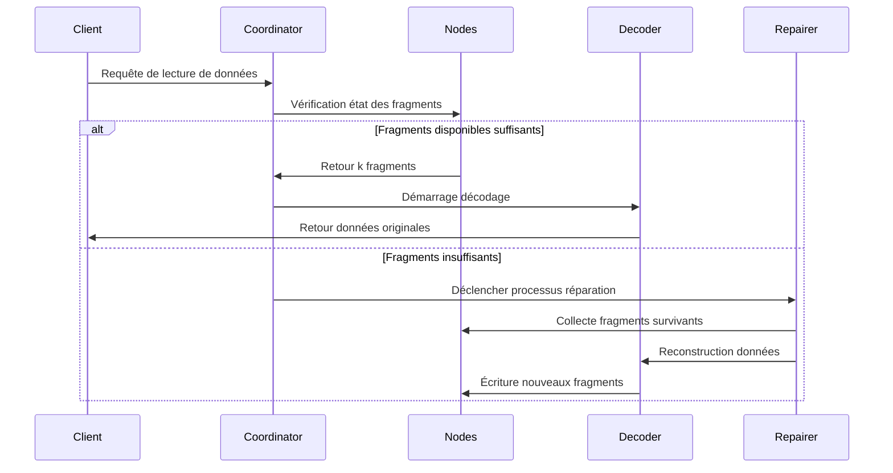

# Principe du Code d'Effacement

## I. Algorithme Central et Portée d'Application

Le Code Reed-Solomon (Reed-Solomon Code, code RS) est un code d'effacement (Erasure Code) basé sur la structure algébrique des corps finis. Grâce à sa **capacité efficace de récupération de données** et sa **configuration de redondance flexible**, il est largement appliqué dans de nombreux domaines. Les scénarios d'application centraux sont détaillés ci-dessous selon deux dimensions : les domaines techniques et les applications pratiques :

### 1.1. Systèmes de Stockage Distribué (comme RustFS)
- **Fragmentation et Redondance des Données**
Divise les données originales en `k` fragments, génère `m` fragments de vérification (total `n=k+m`). La perte de ≤ `m` fragments permet de récupérer les données.
**Exemple** : La stratégie RS(10,4) permet la perte simultanée de 4 nœuds (utilisation du stockage 71%), économisant 50% de l'espace de stockage comparé aux trois répliques (33%).

- **Mécanisme de Récupération de Pannes**
Via l'**élimination de Gauss** ou les algorithmes de **Transformation de Fourier Rapide (FFT)**, utilise les fragments survivants pour reconstruire les données perdues, le temps de récupération est inversement proportionnel à la bande passante réseau.

- **Capacité d'Ajustement Dynamique**
Supporte l'ajustement des paramètres `(k,m)` en temps d'exécution, s'adaptant aux exigences de fiabilité des différents niveaux de stockage (données chaudes/tièdes/froides).

### 1.2. Transmission de Communication
- **Communication Satellite**
Traite les problèmes de délai long et taux d'erreur élevé dans les canaux de l'espace lointain (comme les explorateurs Mars de la NASA utilisant le code RS(255,223), capacité de correction d'erreur atteignant 16 octets/mot de code).

- **Standard 5G NR**
Adopte le code RS combiné à la vérification CRC dans les canaux de contrôle, assurant la transmission fiable des signalisations critiques.

- **Réseaux de Capteurs Sans Fil**
Résout les problèmes de perte cumulative de paquets dans la transmission multi-saut, configuration typique RS(6,2) peut tolérer 33% de perte de données.

### 1.3. Stockage Média Numérique
- **QR Code**
Utilise le code RS pour réaliser l'ajustement du niveau de tolérance aux erreurs (L7%, M15%, Q25%, H30%), même avec des zones partiellement endommagées, le décodage reste correct.

- **Disque Blu-ray**
Adopte la combinaison de code RS(248,216) avec entrelacement croisé, corrigeant les erreurs d'éclat continu causées par les rayures.

- **Stockage de Données ADN**
Ajoute la vérification RS lors de la synthèse de chaînes biomoléculaires, résistant aux erreurs de synthèse/séquençage de bases (comme le projet expérimental Microsoft utilisant RS(4,2)).

## II. Concepts Fondamentaux du Code d'Effacement

### 2.1 Évolution de la Redondance de Stockage
```rust
// Stockage traditionnel à trois répliques
let data = "object_content";
let replicas = vec![data.clone(), data.clone(), data.clone()];
```
Les solutions multi-répliques traditionnelles souffrent d'une faible efficacité de stockage (utilisation du stockage 33%). La technologie de code d'effacement fragmente les données puis calcule les informations de vérification, réalisant un équilibre entre efficacité de stockage et fiabilité.

### 2.2 Définition des Paramètres Centraux
- **k** : Nombre de fragments de données originales
- **m** : Nombre de fragments de vérification
- **n** : Nombre total de fragments (n = k + m)
- **Seuil de récupération** : N'importe quels k fragments peuvent récupérer les données originales

| Type de Solution | Redondance | Tolérance aux Pannes |
|------------------|------------|---------------------|
| 3 répliques | 200% | 2 nœuds |
| RS(10,4) | 40% | 4 nœuds |

## III. Principe Mathématique du Code Reed-Solomon

### 3.1 Construction du Corps Fini (Galois Field)
Adopte le domaine GF(2^8) (256 éléments), satisfaisant :
```math
α^8 + α^4 + α^3 + α^2 + 1 = 0
```
Le polynôme générateur est `0x11D`, correspondant au binaire `100011101`

### 3.2 Construction de la Matrice d'Encodage
Exemple de matrice de Vandermonde (k=2, m=2) :
```math
G = \begin{bmatrix}
1 & 0 \\
0 & 1 \\
1 & 1 \\
1 & 2
\end{bmatrix}
```

### 3.3 Processus d'Encodage
Vecteur de données D = [d₁, d₂,..., dk]
Résultat d'encodage C = D × G

**Méthode d'interpolation polynomiale génératrice** :
Construire un polynôme passant par k points de données :
```math
p(x) = d_1 + d_2x + ... + d_kx^{k-1}
```
Calcul des valeurs de vérification :
```math
c_i = p(i), \quad i = k+1,...,n
```

## IV. Implémentation Technique dans RustFS

### 4.1 Stratégie de Fragmentation des Données
```rust
struct Shard {
 index: u8,
 data: Vec<u8>,
 hash: [u8; 32],
}

fn split_data(data: &[u8], k: usize) -> Vec<Shard> {
 // Logique d'implémentation de fragmentation
}
```
- Ajustement dynamique de la taille des fragments (64 KB-4 MB)
- Valeurs de vérification de hachage utilisant l'algorithme Blake3

### 4.2 Optimisation d'Encodage Parallèle
```rust
use rayon::prelude::*;

fn rs_encode(data: &[Shard], m: usize) -> Vec<Shard> {
 data.par_chunks(k).map(|chunk| {
 // Opération matricielle accélérée SIMD
 unsafe { gf256_simd::rs_matrix_mul(chunk, &gen_matrix) }
 }).collect()
}
```
- Framework de calcul parallèle basé sur Rayon
- Optimisation des opérations de corps fini utilisant le jeu d'instructions AVX2

### 4.3 Processus de Décodage et Récupération
