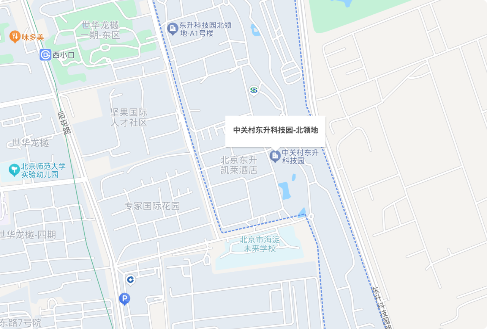

# 私たちについて

**RustFS は世界をリードするデータセキュリティとデータコスト削減企業になることを目指しています。**

百度、テンセント、好未来などの企業の優秀なストレージアーキテクトによって構成されるオープンソースストレージ組織（北京恒河沙科技有限公司）です。北京恒河沙の本社は中国の北京に位置しています。会社が奉じる価値観は：誠実、専心、シンプルです。

私たちのビジョンは、世界中に多言語で安全かつコスト削減の分散オブジェクトストレージ製品を提供することです。

RustFS は人工知能、ビッグデータ、ビデオ、クラウドコンピューティング、暗号化ストレージ、工業生産、クラウドネイティブ、データバックアップなどの全方面でデータセキュリティを保障し、データストレージコストを削減し続けています。

人類のグローバルストレージの実現に向けて、歩み続けています...

## 私たちのビジョンと価値観

### ビジョン

全人類のデータセキュリティとコスト削減を実現する

### 価値観

誠実、専心、シンプル

## オフィス所在地

📍 **住所**
北京市海淀区西小口路66号中関村東升科技園北領地C区

📞 **電話**
400-033-5363

📧 **メール**
<hello@rustfs.com>

## RustFS は世界に安全で信頼性の高い分散ストレージソリューションを提供

> Fortune Business Insights のレポートによると、グローバルデータストレージ市場は2024年の2,183.3億ドルから2032年の7,740億ドルに成長すると予測されており、この期間中の年平均成長率は17.1%です

### RustFS への投資

📧 **お問い合わせ**
<hello@rustfs.com>
