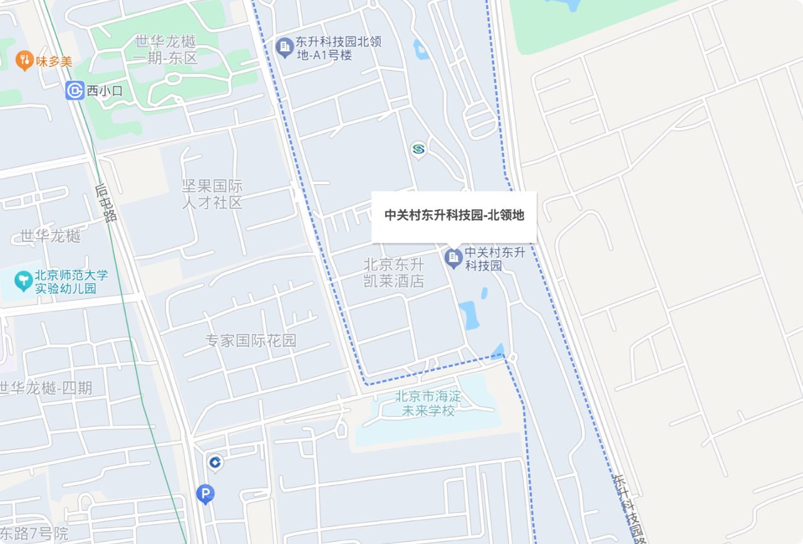
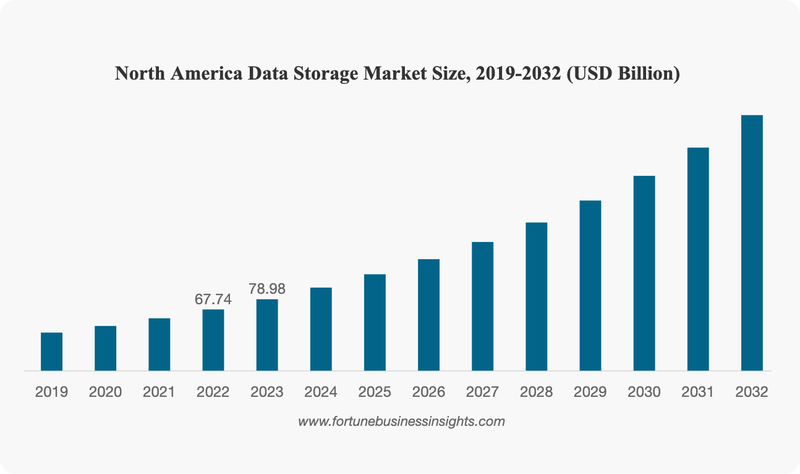

# 회사 소개

**RustFS는 세계 최고의 데이터 보안 및 데이터 비용 절감 회사가 되는 것을 목표로 합니다.**

바이두, 텐센트, 좋은미래 등 회사의 우수한 스토리지 아키텍트들로 구성된 오픈소스 스토리지 조직(북경항하사과기유한공사)입니다. 북경항하사의 본사는 중국 베이징에 위치해 있습니다. 회사가 추구하는 가치관은: 정직, 집중, 간단함입니다.

우리의 비전은 전 세계에 다국어로 안전하고 비용을 절감하는 분산 객체 스토리지 제품을 제공하는 것입니다.

RustFS는 인공지능, 빅데이터, 동영상, 클라우드 컴퓨팅, 암호화 스토리지, 산업 생산, 클라우드 네이티브, 데이터 백업 등 모든 방면에서 지속적으로 데이터 보안을 보장하고 데이터 스토리지 비용을 절감하고 있습니다.

인류의 글로벌 스토리지 실현을 돕는 여정에서...

## 우리의 비전과 가치관

### 비전

전 인류의 데이터 보안과 비용 절감 실현

### 가치관

정직, 집중, 간단함

## 사무실 주소

📍 **주소**
베이징시 하이디안구 서소구로 66호 중관촌동승과기원 북령지 C구

📞 **전화번호**
400-033-5363

📧 **이메일**
<hello@rustfs.com>

## RustFS는 전 세계에 안전하고 신뢰할 수 있는 분산 스토리지 솔루션을 제공합니다

> Fortune Business Insights 보고서에 따르면, 글로벌 데이터 스토리지 시장은 2024년 2,183.3억 달러에서 2032년 7,740억 달러로 성장할 것으로 예상되며, 이 기간 동안의 연평균 성장률은 17.1%입니다

### RustFS 투자

📧 **연락처**
<hello@rustfs.com>
