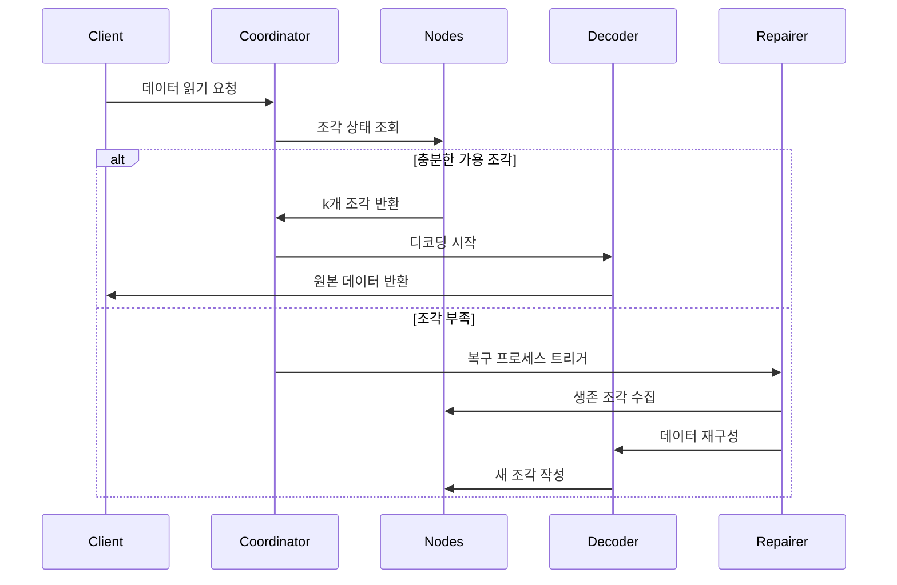

# 소거 부호화 원리

## I. 핵심 알고리즘과 핵심 알고리즘 적용 범위

Reed-Solomon 코드(Reed-Solomon Code, RS 코드)는 유한체 대수 구조를 기반으로 한 소거 부호(Erasure Code)입니다. **효율적인 데이터 복구 능력**과 **유연한 중복 구성**으로 인해 여러 분야에서 광범위하게 적용됩니다. 다음은 기술 분야와 실제 응용이라는 두 차원에서 주요 적용 시나리오를 자세히 설명합니다:

### 1.1. 분산 저장 시스템 (RustFS와 같은)
- **데이터 분할과 중복성**
  원본 데이터를 `k`개의 조각으로 나누고, `m`개의 검증 조각을 생성합니다 (총 `n=k+m`). ≤ `m`개의 조각이 손실되어도 데이터를 복구할 수 있습니다.
  **예시**: RS(10,4) 전략은 4개 노드의 동시 손실을 허용하며 (저장 이용률 71%), 3개 복제본(33%) 대비 50% 저장 공간을 절약합니다.

- **장애 복구 메커니즘**
  **가우스 소거법** 또는 **고속 푸리에 변환(FFT)** 알고리즘을 통해 생존한 조각을 이용해 손실된 데이터를 재구성하며, 복구 시간은 네트워크 대역폭과 반비례합니다.

- **동적 조정 능력**
  런타임에서 `(k,m)` 매개변수 조정을 지원하여 다양한 저장 계층(hot/warm/cold 데이터)의 신뢰성 요구사항에 적응합니다.

### 1.2. 통신 전송
- **위성 통신**
  심우주 채널에서의 긴 지연시간, 높은 오류율 문제를 처리합니다 (NASA 화성 탐사선이 RS(255,223) 코드 사용, 오류 정정 능력이 16바이트/코드워드에 달함).

- **5G NR 표준**
  제어 채널에서 RS 코드와 CRC 검증을 결합하여 중요한 신호의 신뢰할 수 있는 전송을 보장합니다.

- **무선 센서 네트워크**
  다중 홉 전송에서의 누적 패킷 손실 문제를 해결하며, 일반적인 RS(6,2) 구성은 33%의 데이터 손실을 견딜 수 있습니다.

### 1.3. 디지털 미디어 저장
- **QR 코드**
  RS 코드를 사용해 오류 허용 수준 조정을 구현합니다 (L7%, M15%, Q25%, H30%). 일부 영역이 손상되어도 정확한 디코딩이 가능합니다.

- **블루레이 디스크**
  RS(248,216) 코드 조합과 교차 인터리빙을 채택하여 스크래치로 인한 연속적인 버스트 오류를 정정합니다.

- **DNA 데이터 저장**
  생체분자 사슬 합성 시 RS 검증을 추가하여 염기 합성/시퀀싱 오류에 저항합니다 (Microsoft 실험 프로젝트에서 RS(4,2) 사용).

## II. 소거 부호화의 기본 개념

### 2.1 저장 중복성의 진화
```rust
// 전통적인 3개 복제본 저장
let data = "object_content";
let replicas = vec![data.clone(), data.clone(), data.clone()];
```
전통적인 다중 복제본 방안은 저장 효율이 낮은 문제가 있습니다 (저장 이용률 33%). 소거 부호화 기술은 데이터를 블록으로 나눈 후 검증 정보를 계산하여 저장 효율과 신뢰성의 균형을 실현합니다.

### 2.2 핵심 매개변수 정의
- **k**: 원본 데이터 조각 수
- **m**: 검증 조각 수
- **n**: 총 조각 수 (n = k + m)
- **복구 임계값**: 임의의 k개 조각으로 원본 데이터 복구 가능

| 방안 유형 | 중복도 | 장애 허용도 |
|------------|----------|------------|
| 3개 복제본 | 200% | 2개 노드 |
| RS(10,4) | 40% | 4개 노드 |

## III. Reed-Solomon 코드의 수학적 원리

### 3.1 유한체(Galois Field) 구축
GF(2^8) 체(256개 원소)를 채택하며 다음을 만족합니다:
```math
α^8 + α^4 + α^3 + α^2 + 1 = 0
```
생성 다항식은 `0x11D`이며, 이진수 `100011101`에 해당합니다.

### 3.2 부호화 행렬 구성
Vandermonde 행렬 예시 (k=2, m=2):
```math
G = \begin{bmatrix}
1 & 0 \\
0 & 1 \\
1 & 1 \\
1 & 2
\end{bmatrix}
```

### 3.3 부호화 과정
데이터 벡터 D = [d₁, d₂,..., dk]
부호화 결과 C = D × G

**생성 다항식 보간법**:
k개 데이터 점을 통과하는 다항식 구성:
```math
p(x) = d_1 + d_2x + ... + d_kx^{k-1}
```
검증값 계산:
```math
c_i = p(i), \quad i = k+1,...,n
```

## IV. RustFS에서의 엔지니어링 구현

### 4.1 데이터 분할 전략
```rust
struct Shard {
    index: u8,
    data: Vec<u8>,
    hash: [u8; 32],
}

fn split_data(data: &[u8], k: usize) -> Vec<Shard> {
    // 분할 로직 구현
}
```
- 동적 조각 크기 조정 (64 KB-4 MB)
- Blake3 알고리즘을 사용한 해시 검증값

### 4.2 병렬 부호화 최적화
```rust
use rayon::prelude::*;

fn rs_encode(data: &[Shard], m: usize) -> Vec<Shard> {
    data.par_chunks(k).map(|chunk| {
        // SIMD 가속 행렬 연산
        unsafe { gf256_simd::rs_matrix_mul(chunk, &gen_matrix) }
    }).collect()
}
```
- Rayon 기반 병렬 계산 프레임워크
- AVX2 명령어 세트를 사용한 유한체 연산 최적화

### 4.3 디코딩 복구 흐름


