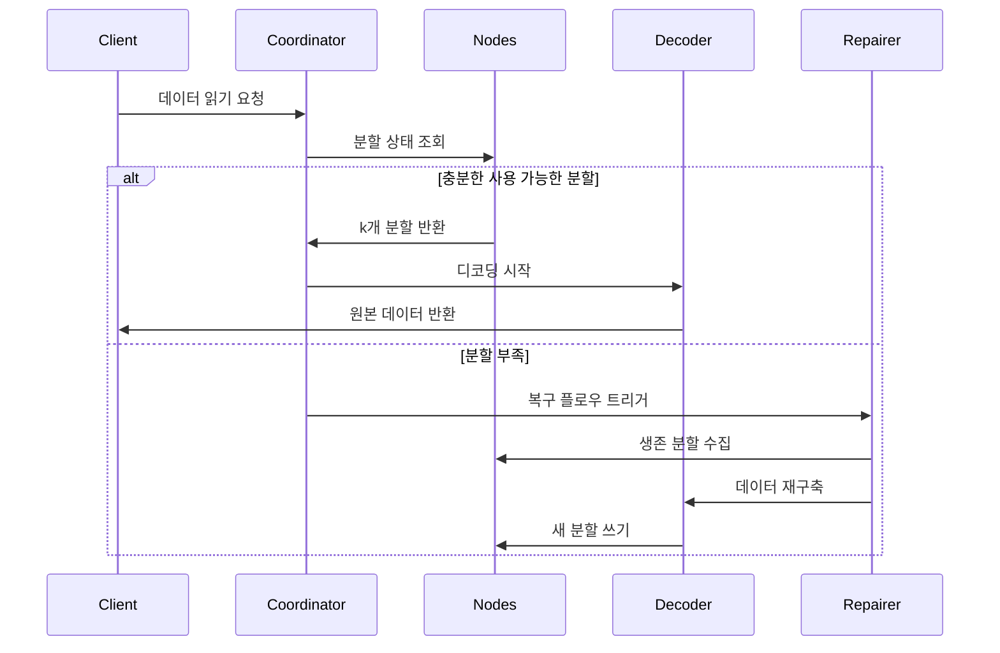

# 삭제 코딩 원리

## 1. 핵심 알고리즘과 핵심 알고리즘 적용 범위

Reed-Solomon 코드(Reed-Solomon Code, RS 코드)는 유한 체 대수 구조 기반의 삭제 코드(Erasure Code)로, **효율적인 데이터 복구 능력**과 **유연한 중복성 구성**으로 인해 여러 분야에서 광범위하게 적용되고 있습니다. 기술 분야와 실제 적용이라는 두 차원에서 핵심 적용 시나리오를 자세히 설명하겠습니다:

### 1.1. 분산 스토리지 시스템 (RustFS 등)
- **데이터 분할과 중복성**
 원본 데이터를 `k`개 분할로 나누고 `m`개의 검증 분할을 생성합니다(총 `n=k+m`개). 임의로 ≤ `m`개 분할을 잃어도 데이터를 복구할 수 있습니다.
 **예시**: RS(10,4) 전략은 4개 노드를 동시에 잃어도 허용됩니다(스토리지 활용률 71%). 3개 복제본(33%)과 비교하여 50% 스토리지 공간을 절약합니다.

- **장애 복구 메커니즘**
 **가우스 소거법** 또는 **고속 푸리에 변환(FFT)** 알고리즘을 통해 생존 분할을 이용해 손실 데이터를 재구축하며, 복구 시간은 네트워크 대역폭과 반비례합니다.

- **동적 조정 능력**
 런타임에 `(k,m)` 매개변수 조정을 지원하여 다양한 스토리지 계층(핫/웜/콜드 데이터)의 신뢰성 요구사항에 적응합니다.

### 1.2. 통신 전송
- **위성 통신**
 심우주 채널의 장기 지연, 높은 오류율 문제를 처리합니다(예: NASA 화성 탐사선은 RS(255,223) 코드를 사용하여 코드워드당 16바이트의 오류 수정 능력을 갖습니다).

- **5G NR 표준**
 제어 채널에서 CRC 검증과 결합된 RS 코드를 채택하여 중요한 시그널링의 신뢰할 수 있는 전송을 보장합니다.

- **무선 센서 네트워크**
 다중 홉 전송에서의 누적 패킷 손실 문제를 해결하며, 일반적인 구성인 RS(6,2)는 33%의 데이터 손실을 허용할 수 있습니다.

### 1.3. 디지털 미디어 스토리지
- **2차원 코드(QR Code)**
 RS 코드를 사용하여 내결함성 수준을 조정합니다(L7%, M15%, Q25%, H30%). 일부 영역이 손상되어도 정확한 디코딩이 가능합니다.

- **블루레이 디스크**
 RS(248,216) 코드 조합 교차 인터리빙을 채택하여 긁힘으로 인한 연속 버스트 오류를 수정합니다.

- **DNA 데이터 스토리지**
 합성 생체 분자 체인에 RS 검증을 추가하여 염기 합성/시퀀싱 오류에 저항합니다(예: Microsoft 실험 프로젝트는 RS(4,2) 사용).


## 2. 삭제 코딩 기본 개념

### 2.1 스토리지 중복성의 진화
```rust
// 전통적인 3개 복제본 스토리지
let data = "object_content";
let replicas = vec![data.clone(), data.clone(), data.clone()];
```
전통적인 다중 복제본 방식은 스토리지 효율성이 낮은 문제가 있습니다(스토리지 활용률 33%). 삭제 코딩 기술은 데이터를 블록으로 나눈 후 검증 정보를 계산하여 스토리지 효율성과 신뢰성의 균형을 실현합니다.

### 2.2 핵심 매개변수 정의
- **k**: 원본 데이터 분할 수
- **m**: 검증 분할 수
- **n**: 총 분할 수 (n = k + m)
- **복구 임계값**: 임의 k개 분할로 원본 데이터 복구 가능

| 방식 유형 | 중복도 | 장애 허용도 |
|------------|----------|------------|
| 3개 복제본 | 200% | 2개 노드 |
| RS(10,4) | 40% | 4개 노드 |

## 3. Reed-Solomon 코드 수학 원리

### 3.1 유한체(Galois Field) 구축
GF(2^8) 체(256개 요소)를 채택하며, 다음을 만족합니다:
```math
α^8 + α^4 + α^3 + α^2 + 1 = 0
```
생성원 다항식은 `0x11D`이며, 이진법 `100011101`에 해당합니다.

### 3.2 인코딩 행렬 구성
Vandermonde 행렬 예시 (k=2, m=2):
```math
G = \begin{bmatrix}
1 & 0 \\
0 & 1 \\
1 & 1 \\
1 & 2
\end{bmatrix}
```


### 3.3 인코딩 과정
데이터 벡터 D = [d₁, d₂,..., dk]
인코딩 결과 C = D × G

**생성 다항식 보간법**:
k개 데이터 점을 통과하는 다항식 구성:
```math
p(x) = d_1 + d_2x + ... + d_kx^{k-1}
```
검증값 계산:
```math
c_i = p(i), \quad i = k+1,...,n
```

## 4. RustFS에서의 엔지니어링 구현

### 4.1 데이터 분할 전략
```rust
struct Shard {
 index: u8,
 data: Vec<u8>,
 hash: [u8; 32],
}

fn split_data(data: &[u8], k: usize) -> Vec<Shard> {
 // 분할 로직 구현
}
```
- 동적 분할 크기 조정 (64 KB-4 MB)
- 해시 검증값은 Blake3 알고리즘 사용

### 4.2 병렬 인코딩 최적화
```rust
use rayon::prelude::*;

fn rs_encode(data: &[Shard], m: usize) -> Vec<Shard> {
 data.par_chunks(k).map(|chunk| {
 // SIMD 가속 행렬 연산
 unsafe { gf256_simd::rs_matrix_mul(chunk, &gen_matrix) }
 }).collect()
}
```
- Rayon 기반 병렬 계산 프레임워크
- AVX2 명령어 집합을 사용한 유한체 연산 최적화

### 4.3 디코딩 복구 플로우

