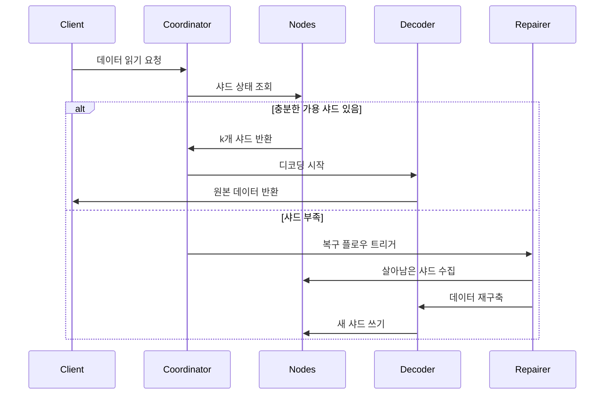

# 삭제 부호화 원리

## 1. 핵심 알고리즘과 핵심 알고리즘 적용 범위

Reed-Solomon 코드(Reed-Solomon Code, RS 코드)는 유한체 대수 구조를 기반으로 한 삭제 부호화(Erasure Code)로, **효율적인 데이터 복구 능력**과 **유연한 중복 구성** 덕분에 여러 분야에 광범위하게 적용됩니다. 다음은 기술 분야와 실제 적용 두 차원에서 그 핵심 적용 시나리오를 자세히 설명합니다:

### 1.1. 분산 스토리지 시스템 (RustFS 등)
- **데이터 샤딩과 중복**
 원본 데이터를 `k`개 샤드로 분할하여 `m`개의 검사 샤드를 생성합니다(총 `n=k+m`). ≤`m`개의 샤드가 손실되어도 데이터를 복구할 수 있습니다.
 **예시**: RS(10,4) 전략은 4개의 노드가 동시에 손실되어도 허용합니다(스토리지 이용률 71%). 3복제본(33%)에 비해 50% 스토리지 공간을 절약합니다.

- **장애 복구 메커니즘**
 **가우스 소거법** 또는 **고속 푸리에 변환(FFT)** 알고리즘을 통해 살아남은 샤드를 이용해 손실된 데이터를 재구축하며, 복구 시간은 네트워크 대역폭에 반비례합니다.

- **동적 조정 능력**
 실행 시 `(k,m)` 매개변수 조정을 지원하여 다양한 스토리지 계층(핫/웜/콜드 데이터)의 신뢰성 요구사항에 적응합니다.

### 1.2. 통신 전송
- **위성 통신**
 심우주 채널에서 장시간 지연, 높은 오류율 문제를 처리합니다(예: NASA 화성 탐사선은 RS(255,223) 코드를 사용하여 16바이트/코드워드의 오류 정정 능력 달성).

- **5G NR 표준**
 제어 채널에서 RS 코드와 CRC 검사를 결합하여 중요한 시그널링의 안정적인 전송을 보장합니다.

- **무선 센서 네트워크**
 멀티홉 전송에서 누적 패킷 손실 문제를 해결하며, 일반적인 구성인 RS(6,2)는 33%의 데이터 손실을 허용합니다.

### 1.3. 디지털 미디어 스토리지
- **QR 코드**
 RS 코드를 사용하여 내결함성 레벨을 조정합니다(L7%, M15%, Q25%, H30%). 일부 영역이 손상되어도 정확한 디코딩이 가능합니다.

- **블루레이 디스크**
 RS(248,216) 코드 결합 교차 인터리빙을 채택하여 긁힘으로 인한 연속 버스트 오류를 수정합니다.

- **DNA 데이터 스토리지**
 합성 생물 분자 체인에 RS 검사를 추가하여 염기 합성/시퀀싱 오류에 저항합니다(예: Microsoft 실험 프로젝트에서 RS(4,2) 사용).

## 2. 삭제 부호화 기초 개념

### 2.1 스토리지 중복의 진화
```rust
// 전통적인 3복제본 스토리지
let data = "object_content";
let replicas = vec![data.clone(), data.clone(), data.clone()];
```
전통적인 다중 복제본 방안은 스토리지 효율성이 낮다는 문제가 있습니다(스토리지 이용률 33%). 삭제 부호화 기술은 데이터를 블록으로 분할한 후 검사 정보를 계산하여 스토리지 효율성과 신뢰성의 균형을 달성합니다.

### 2.2 핵심 매개변수 정의
- **k**: 원본 데이터 샤드 수
- **m**: 검사 샤드 수
- **n**: 총 샤드 수 (n = k + m)
- **복구 임계값**: 임의의 k개 샤드로 원본 데이터 복구 가능

| 방안 유형 | 중복도 | 장애 허용도 |
|------------|----------|------------|
| 3복제본 | 200% | 2노드 |
| RS(10,4) | 40% | 4노드 |

## 3. Reed-Solomon 코드 수학적 원리

### 3.1 유한체(Galois Field) 구축
GF(2^8) 필드(256개 원소)를 채택하여 다음을 만족합니다:
```math
α^8 + α^4 + α^3 + α^2 + 1 = 0
```
생성원 다항식은 `0x11D`이고, 이진수로는 `100011101`에 해당합니다.

### 3.2 인코딩 행렬 구축
반데르몬드 행렬 예시 (k=2, m=2):
```math
G = \begin{bmatrix}
1 & 0 \\
0 & 1 \\
1 & 1 \\
1 & 2
\end{bmatrix}
```

### 3.3 인코딩 과정
데이터 벡터 D = [d₁, d₂,..., dk]
인코딩 결과 C = D × G

**생성 다항식 보간법**:
k개 데이터 포인트를 통과하는 다항식 구축:
```math
p(x) = d_1 + d_2x + ... + d_kx^{k-1}
```
검사값 계산:
```math
c_i = p(i), \quad i = k+1,...,n
```

## 4. RustFS에서의 엔지니어링 구현

### 4.1 데이터 샤딩 전략
```rust
struct Shard {
 index: u8,
 data: Vec<u8>,
 hash: [u8; 32],
}

fn split_data(data: &[u8], k: usize) -> Vec<Shard> {
 // 샤딩 로직 구현
}
```
- 동적 샤드 크기 조정 (64 KB-4 MB)
- 해시 검사값은 Blake3 알고리즘 사용

### 4.2 병렬 인코딩 최적화
```rust
use rayon::prelude::*;

fn rs_encode(data: &[Shard], m: usize) -> Vec<Shard> {
 data.par_chunks(k).map(|chunk| {
 // SIMD 가속 행렬 연산
 unsafe { gf256_simd::rs_matrix_mul(chunk, &gen_matrix) }
 }).collect()
}
```
- Rayon 기반 병렬 컴퓨팅 프레임워크
- AVX2 명령어 집합을 사용한 유한체 연산 최적화

### 4.3 디코딩 복구 플로우
