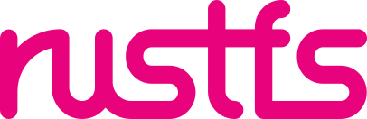

# 상표 다운로드 및 사용

이 페이지의 모든 이미지는 제품 아키텍처 다이어그램이나 지원 목록에서 RustFS를 표시하기 위한 용도로만 사용할 수 있습니다. 이미지를 사용할 때는 RustFS 공식 웹사이트를 출처로 명시해 주세요. 이미지는 비율을 유지한 크기 조정만 허용되며, 그 외 임의의 수정은 금지됩니다.

RustFS® 및 rustfs logo®는 중국에서 Beijing Hengheshake Technology Co., Ltd.가 등록한 등록 상표입니다. RustFS의 서면 동의 없이 다른 용도로 사용할 수 없습니다.

기타 문의는 <hello@rustfs.com> 으로 연락해 주세요.

## RustFS 로고

### 흰색 배경 버전

### 다양한 배경 버전

| 검은색 배경 | 회색 배경 | 분홍색 배경 |
|---|---|---|
|  |  |  |

### 다운로드 링크

🔗 [한 번에 모두 다운로드](https://rustfs.com/images/trademark/logo.zip)

## 상표 사용 가이드라인

## 상표 사용 가이드 문서

### 버전 정보

v1.0

### 소개

RustFS는 고성능 분산 객체 스토리지 시스템입니다. 소프트웨어 정의 방식으로 표준 산업 하드웨어에서 동작하며, Apache 2.0 오픈소스 라이선스에 따라 100% 상업적 친화성을 제공합니다.

본 문서는 RustFS 프로젝트의 상표 사용 정책을 요약합니다. RustFS 상표의 모든 사용은 본 정책을 준수해야 합니다. 여기서 “상표”란 RustFS의 워드마크, 서비스마크, 로고, 트레이드 드레스, 제품/서비스/비즈니스/회사 명칭을 의미합니다.

RustFS 상표에는 RustFS 및 파생 서브 브랜드 등이 포함됩니다.

자유 소프트웨어 정신을 지지하는 커뮤니티 일원으로서, 우리는 사용자·배포자·커뮤니티 구성원이 오픈소스 라이선스에 따라 광범위하게 코드를 사용·개선하기를 바랍니다. 코드는 오픈이지만, 상표는 품질과 출처의 신뢰 지표로 남아야 합니다. 또한 상표를 악용한 사기에 대비해 권리를 엄격히 집행할 필요가 있습니다. 따라서 코드를 재배포·수정할 자유가 있더라도(오픈소스 포함) 상표법과 본 정책을 준수해야 합니다.

### 일반 원칙

RustFS 상표 정책은 상표법의 일반 원칙을 따릅니다.

RustFS는 사용 및 확장을 염두에 두고 설계되었습니다. 커뮤니티 구성원이 제품 식별을 위해 상표를 사용할 수 있으나, 공식 승인 여부에 대해 혼동을 일으켜서는 안 됩니다.

항상 혼동을 야기하지 않는 방식으로 사용해야 합니다. 사용자는 누구와 상호작용하는지, 소프트웨어의 출처가 어디인지 명확히 알 수 있어야 합니다. RustFS가 제작·공식 승인하지 않은 웹사이트나 소프트웨어는 이를 암시해서는 안 됩니다.

문의: <hello@rustfs.com>

### 허용되는 사항

- <https://rustfs.com/download>에서 내려받은 변경되지 않은 공식 바이너리를 관련 법과 라이선스 조건을 준수하여 자유롭게 재배포할 수 있습니다. 단, RustFS 상표를 삭제·변경할 수 없습니다. 또한 본 문서의 가이드라인을 준수하며 “변경되지 않은 RustFS 버전”임을 사실대로 알릴 수 있습니다. 더 빠르고 안정적인 다운로드를 위해 공식 사이트 링크 제공을 권장합니다.
- 마케팅 및 홍보 자료에서 RustFS 상표 사용이 가능합니다(예: RustFS 제품의 유통 또는 판매 표기). 단, 혼동을 유발해서는 안 됩니다.
- RustFS 관련 서비스를 제공하는 경우, 서비스 설명·홍보 시 상표를 사용할 수 있습니다. 단, 본 가이드라인을 준수하고 RustFS와의 제휴·승인·보증을 오해하게 해서는 안 됩니다.
- 로고 굿즈: 개인적 용도(유상 아님)에 한해 로고가 포함된 티셔츠·배경화면·모자 등을 제작할 수 있습니다.
- 변경되지 않은 RustFS 프로그램·제품·서비스·기술을 진실되게 인용/링크할 수 있습니다.

### 허용되지 않는 사항

1. 상업적으로 생산되는 제품에 RustFS 로고를 부착할 수 없습니다.
2. RustFS 상표를 변형·축약·다른 기호/문구/이미지와 결합하거나 슬로건에 포함할 수 없습니다.
3. 어떤 목적으로든 수정된 로고 버전을 만들 수 없습니다.
4. 제휴·스폰서·승인·보증 등과 같은 잘못된 인상을 줄 수 있는 방식으로 상표를 사용할 수 없습니다.
5. 기술적 서술을 위한 정직하고 묘사적인 인용을 제외한 모든 상업적 사용은 금지됩니다.
6. 소셜 미디어 계정명 등에 RustFS 상표를 사용할 수 없습니다.

오픈소스 라이선스에 따라 RustFS 소프트웨어를 수정할 수 있지만, 수정본을 RustFS 상표로 재배포할 수는 없습니다. 예: “RustFS 기반” 대신 “RustFS 기술 기반” 또는 “RustFS 소스코드 포함”이라고 표기해야 합니다. 또한 사용자 혼동을 줄이기 위해 제품·바이너리 명칭을 변경해야 합니다.

### 사전 허가가 필요한 경우

- 웹사이트 아이콘(파비콘)으로 상표를 사용하려는 경우
- 도메인: 도메인 이름에 상표 전체/일부를 포함하려면 RustFS의 서면 허가가 필요합니다. 이는 소비자 혼동을 일으킬 소지가 큽니다.

### 상표 사용 방식

1. 올바른 표기 — 축약하거나 다른 단어와 결합하지 않습니다.
2. 표기 기호 — 첫 번째 또는 가장 두드러진 표기에는 등록(®) 또는 미등록(™) 표기를 동반합니다.
3. 귀속 문구 — 같은 페이지 내 적절한 위치에 다음 문구를 표시합니다: “[상표]는 RustFS의 [등록, 해당 시] 상표입니다.”
4. 식별성 — 대문자, 이탤릭, 볼드, 밑줄 등으로 주변 텍스트와 구분되도록 합니다.

로고는 크기 조정 외 변경할 수 없습니다. 장식 요소 추가, 색상/비율 변경, 왜곡, 타 로고와의 결합은 금지합니다. 단, 맥락상 흑백 그래픽이 필요한 경우 컬러 로고를 흑백으로 재현할 수 있습니다.

### 문의

정책에 포함되지 않은 사용 계획에 대해 의문이 있다면 <hello@rustfs.com> 으로 문의해 주세요. RustFS는 본 정책 위반으로 판단될 경우 사용 허가를 철회할 수 있으며, 이 경우 즉시 사용을 중단해야 합니다.

정책은 수시로 업데이트될 수 있으며, 최신 내용은 이 페이지를 확인해 주세요.

